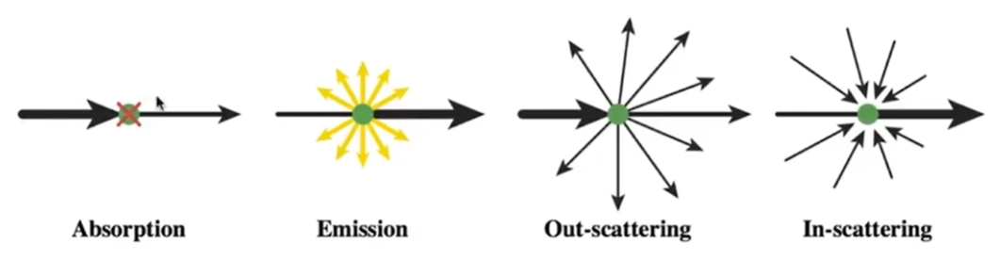
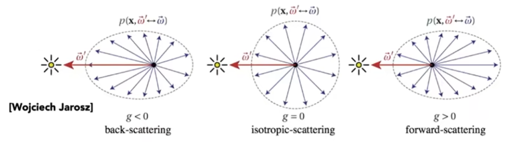
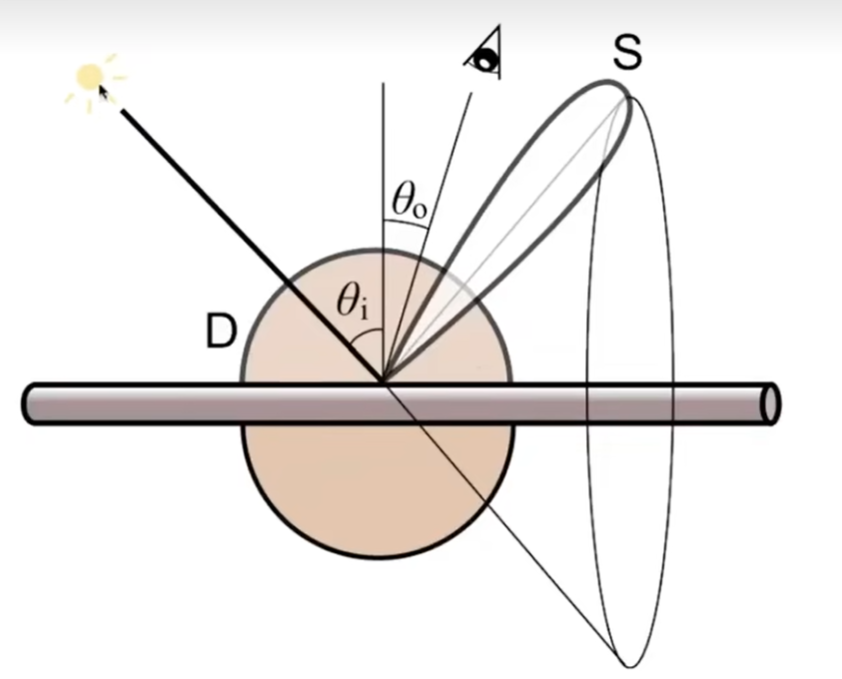
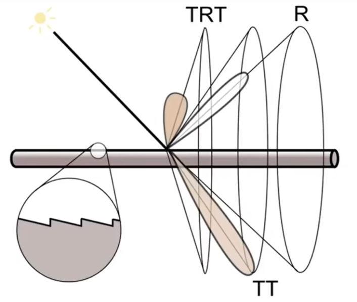
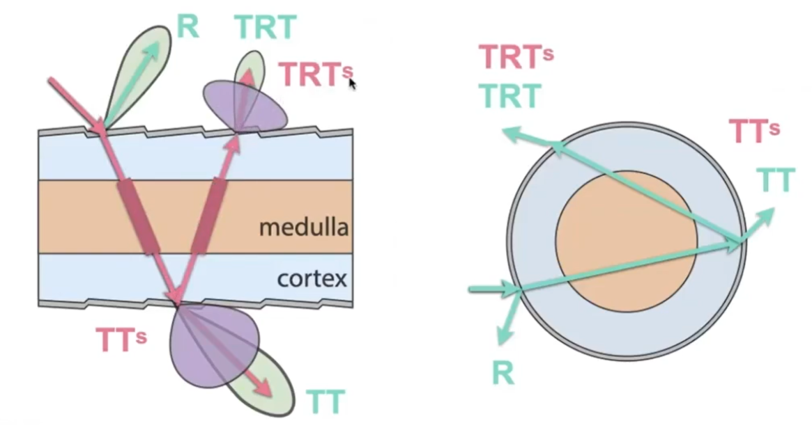
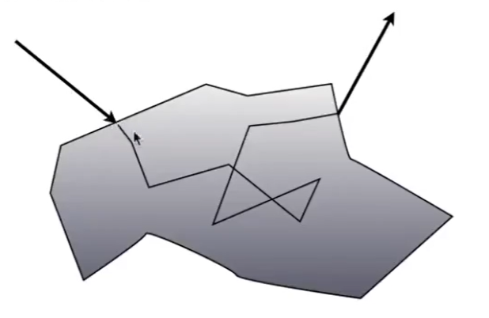
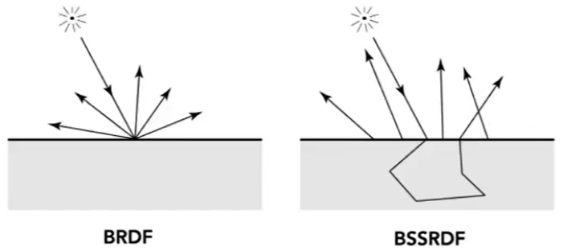
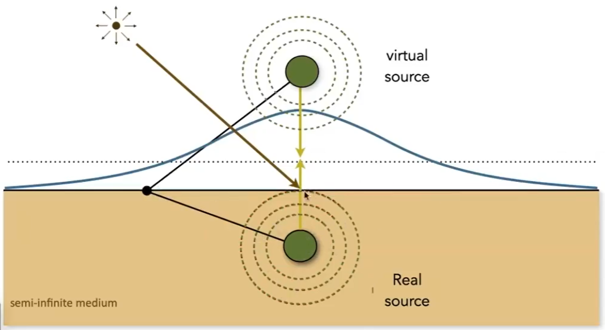

# 高级 Appreance 建模

## 非表面模型 [38：38]

### 反射介质

例如：雾、云

特点：
光线打到一个介质颗粒上，会被分散（散射）至到各个方向上（图3），也会接受到来自其它方向散射而来的光（图4）
  

怎么散射：  
光线打到介质上后，散射的分布由Phase Function决定。以下是几种不同的Phase Function的例子：  
  
光线在介质中走多远由介质对光线吸收呈度决定。  

怎么生成 path? [42：07]
1. 根据 phase function 决定 bounce 方向
2. 根据 吸收率决定 distance
3. 形成 ray path

### Hair 表面 [45:45]

无色高光，有色高光

#### kajiya-Kay 模型

把每一根头发看成是圆柱，会把光线产生圆雉形的反射和各个方向的散射
效果：[47：05]

  

#### Marahner 模型

除了考虑反射、散射，还考虑折射。  

光线现头发的作用可以有这几种：  
  
1. 反射，圆锥形方向。 R
2. 进入（折射） + 出去（折射），圆雉， T T
3. 进入（折射） + 内壁（反射） + 出去（折射）， TRT
[49：24右]  

对每一根头发都考虑以上的过程
效果：[49：46]

### Fur 表面

Hair 模型缺少 Medulla 的模拟，因此用在动物上效果不好。

#### Double Cylinder 模型 [55：13]

增加 TTs 和 TRTs

  

### Granular 颗粒材质

[58：37] 颗粒物质的建模，非常耗时

## 表面模型

### 半透明材质

例如：玉、水母  

物理特点：光线从一个地方进去，从内部经过散射，然后从另一个地方出来 
  

次表面反射BSSRDF，是BRDF的延伸：

|BRDF|BSSRDF|
|---|---|
|入射点=出射点|入射点 \\(\ne\\) 出射点 (BSSRDF)|
|各个方向积分|各个方向积分各个入射点积分|

$$
L(x_o, \omega_o) = \int_A \int_{H^2}S(x_i, \omega_i, x_o, \omega_o) L_i(x_i, \omega_i) \cos\theta_i d\omega_i dA
$$

 

#### Dipole 近似

用两个光源照射表面，能得到类似次表面映射的结果.[1:05:07]

 

### 布料 Cloth

布料结构[1：09：24]
纤维(fiber) → 股(ply) → 线(yarn) → 布(cloth)

#### Rendering as Surface

根据编织的形状计算
适用场景：[1：11：28左] 布料表面是平面  
不适用场景：[1：11：28右] 布料表面不是平面

#### Render as Participating Media

把 cloth 看作是空间体积，划分为细小的格子.  
用渲染云的方式来渲染cloth。  

#### Render as Fiber

暴力计算

### 细节模型

渲染效果过于完美因此不真实。因为实际上不可能这么完美，多少会有些微小的划痕。

# 程序化生成外观 [1:27:21]

定义函数f(x, y, z)，用于查询空间中某一点的纹理

------------------------------

> 本文出自CaterpillarStudyGroup，转载请注明出处。  
> https://caterpillarstudygroup.github.io/GAMES101_mdbook/