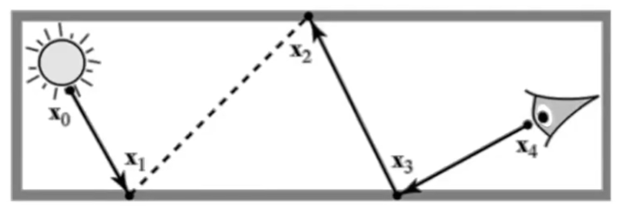
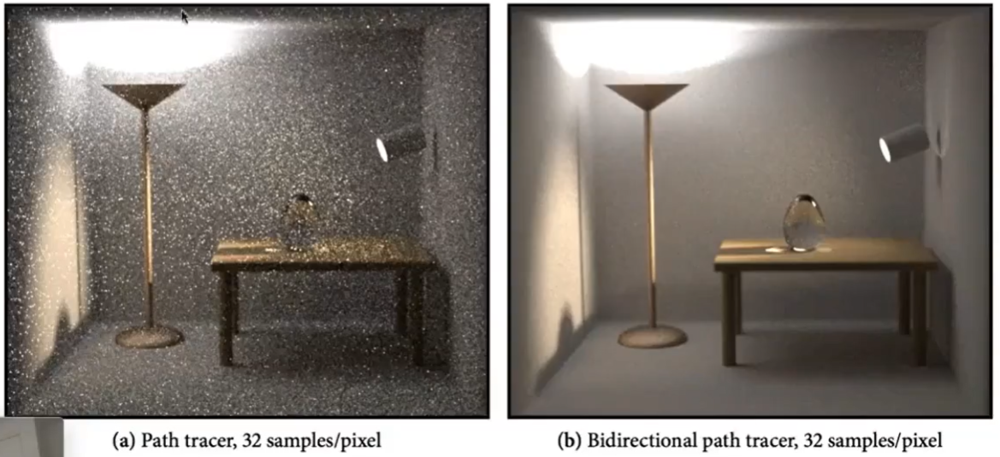
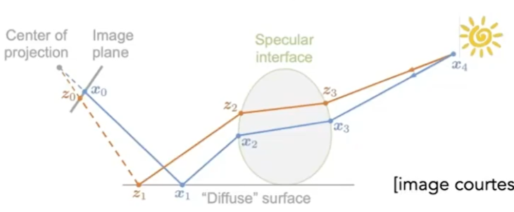
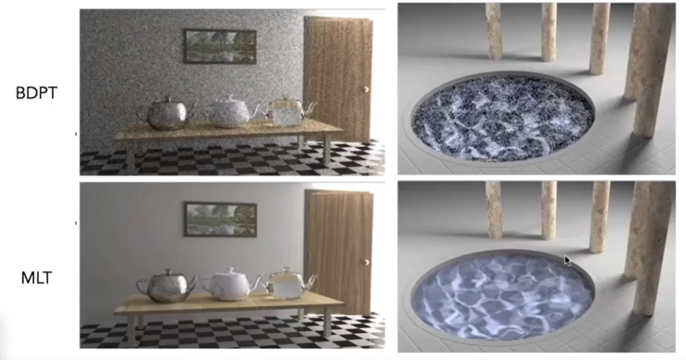
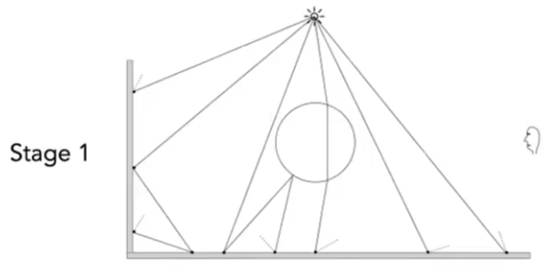
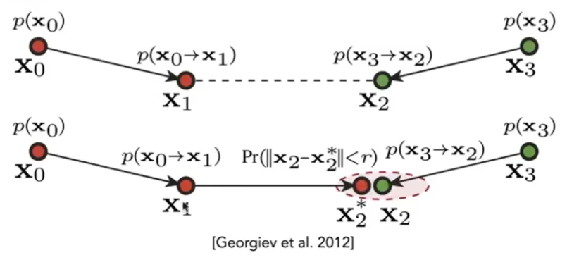
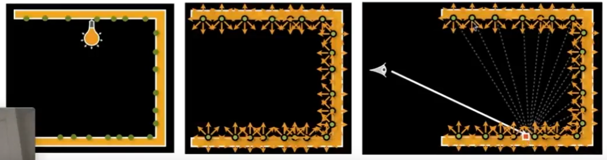
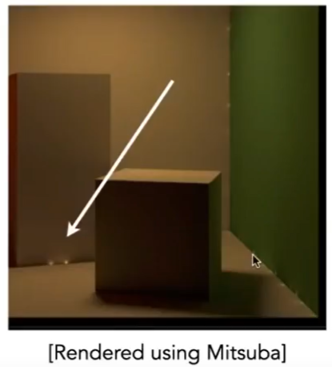

# 高级光线传播

## 无偏 unbiased Vs 有偏 biased

Path tracing 中使用 Monte Carlo 计算积分项的估计值。
不管采样多少样本，都满足E（估计值） = 真实值，称为无偏估计，否则为有偏估计。少量样本时有偏而极限情况下无偏，则称为consistence，这是有偏估计的一种特殊情况。

## 双向路经追踪 BDPT

Baseline方法：从眼睛发出一条光路，追踪这个光路直到光源。  
BDPR方法：  
  
1. 从眼睛（即摄像机）打出一条半路经
2. 从光源打出一条半路经
3. 把两条路往连起来，形成一条完整的路径。   

缺点：  
实现非效复杂、速度非常慢

效果：  
  
由于光源向上，场景大部分光来自间接光。因此大多数情况下 path tracing 的第1个 bounce 是 diffuse，导致不好控制它打到能量集中的区域去。

> &#x1F4A1; 分析常规方法的局限场景，针对局限场景做优化。  

## Metropolis(人名) Light Transport (MLT)

### 原理：

用"马尔可夫链"采样。  
Monto Carlo 性质：当f(x)与 p(x) 形状一致时， bias 最小，
马尔可夫链性质：可以使得采样样本符合特定的 p(x)     
结合两者的特点，可使得定积分的估计值与真实值的bias最小。  

### 方法：

当找到一个合适的path，会在这个path周围生成新的样本，这个新的样本大概率也是一个合适的path。  

  

### 效果： 

  

适用于复杂困难的光路传播。因为只要找到一条，就能比较容易地找到更多。      

### 缺点:  

难以估计算法的收敛速度。  
每个像素的收敛情况都不一样，多帧画面效果为抖动。  

## Photon Mapping光子映射

适用于渲染 caustics.   
是有偏算法  
caustics： 由于光线聚集形成非常强的图案。适于用 specular-diffuse-specular­

### 具体方法

- Stage 1

光源向外辐射光子，光子 bounce 直到遇到diffuse表面，计算光子最后停留的位置

  

- Stage 2

从 camera 出发，打出 sub path, bounce,直到遇­到 diffuse 表面。计算sub path最后停留的位置。  

- Stage 3,

计算 local density estimation，光子越集中的地方应该越亮  
对于任意一个着色点，取最近N个光子，计算 N 个光子所占的面积 A，可算出光子密度为­N/A。  

### 特点

N 太小会有噪声，N太大会糊  
由于光子密度是通过 N/A 估计出来的，不是真实的密度，因此该算法是有偏算法  
当 Stage 1中的光子数趋于\\(\inf\\)时， Stage 3的A趋于0，密度估计趋于正确值。因此该算法是bias but consistent 算法。  
如果通过固定A数光子数量来计算密度，那么光子数再多也是有偏算法。  

> &#x1F4A1; 共同目的都是找到最能体现光线传播特点的路径。  

## VCM: Vertex Connection and Merging 双向路经追踪 + 光子映射

原理：   

  

1. 将光子停留位置（红）与 ray 停留位置（绿）连成一条 ray path.
2. 如果红点和绿点非常接近，就把它们合并

> &#x2753; [?] 怎么理解合并这个概念。

## IR: Instant Radiosity

### 原理：

已被照亮的这些地方，也被认为是光源，并用这些光源再照亮其它地方。最终相当于光线弹射了多次。  

### 具体做法：  

  

1. 从光源打出很多sub Path，最终停在某些地方
2. 停住的地方会成为新的光源
3. 从当 camera 看某个着色点时，用新的光源照这­个着色点

### 特点

优点：速度快  
缺点：  
1. 有一些地方莫名其妙地发光    
  
2. 不能处理 glossy 物体

> &#x1F4A1; 这是与光追不同的另一套简化的建模思想，因为是简化模拟的方法，所以有Artifacts.  

---------------------------------------

> 本文出自CaterpillarStudyGroup，转载请注明出处。  
> https://caterpillarstudygroup.github.io/GAMES101_mdbook/