# Ambient Occlusion

P3   
|AO Off|AO On|
|---|---
||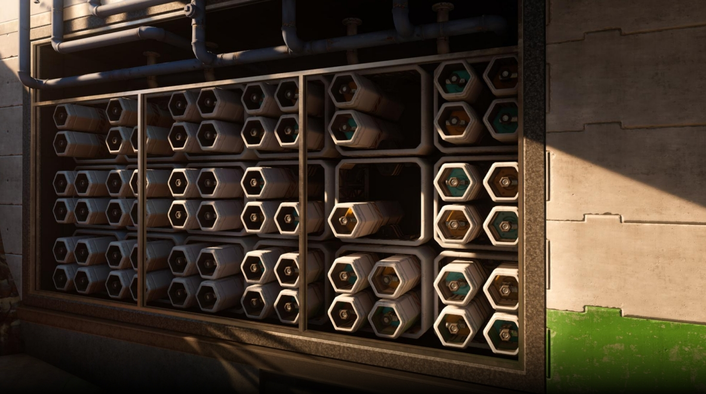 |

> 大脑对光影变化很敏感，因此可以通过光影构造空间理解。  

> 由于附近几何的遮挡，有些点朝某些方向的光被挡住，产生了光影的效果。    

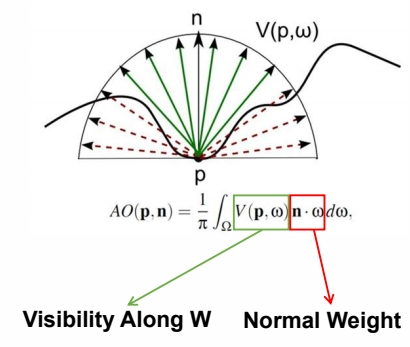   

P6    
## Precomputed AO

Using ray tracing to compute the AO offline and store the result into texture, which is widely used in object modeling process   
- Extra storage cost    
- Only apply to static object    

   

> 对于有特点的角色，可以预计算 AO    

P7    
## Screen Space Ambient Occlusion (SSAO)

> 对于一个场景，场景中对象的位置不固定，不能预计算。利用一个点周边的采样情况来估算它的被遮挡情况。

- Generate N random samples in a sphere around each pixel p in view space   
- Test sample occlusions by comparing depth against depth buffer   
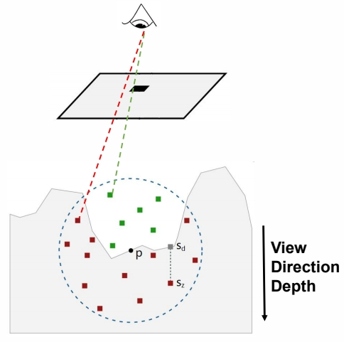   

- Average visibility of sample points to approximate AO   

$$
A(p)=1-\frac{Occlusion}{N} 
$$

公式不重要，重要的是思想：局部采样。   

P8    
## SSAO+

> 改进版：只采样半球。   

- Recall the AO equation is acutally done on the normal-oriented hemisphere    

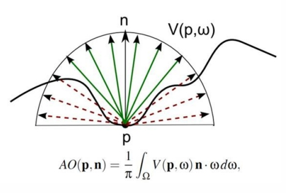   

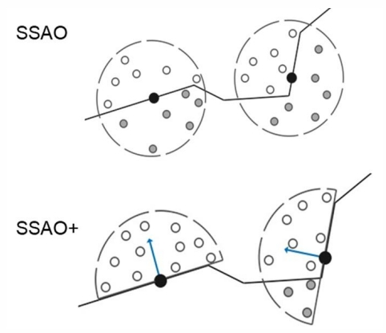   

P11    
## HBAO - Horizon-based Ambient Occlusion

> 采样改成积分。  

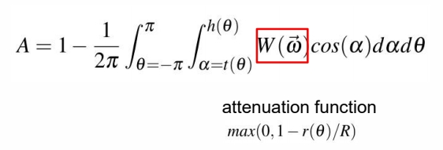   

- Use the depth buffer as a heightfield on 2D surface   
- Rays that below the horizon angle are occluded   

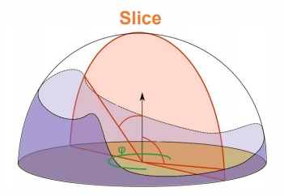   

  
先计算一圈每个方向的仰角，可以估算出有多大面积的天顶是可见的。   
Attenuation Trik：如果遮挡物离当前点比较远，就不产生影响。   

P12    
- Trace rays directly in 2D and approximate AO from horizon angle   

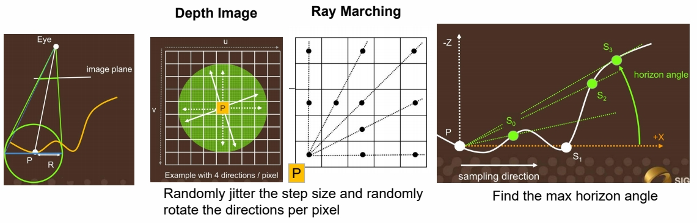   

> 实际算法中有很多细节。   

P13    
## GTAO - Ground Truth-based Ambient Occlusion

### 贡献1
> HBAO 没有考虑到角度的因素。因为从不同角度射下来的光，对点的影响是不一样的。    

GTAO introduces the missing cosine factor, removes the attenuation function, and add a fast approximation of multi bounce    

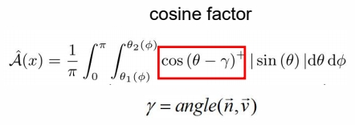   

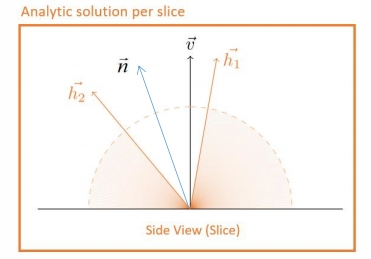   

### 贡献2

Add **multiple bounces** by fitting a cubic polynomial per albedo   

   

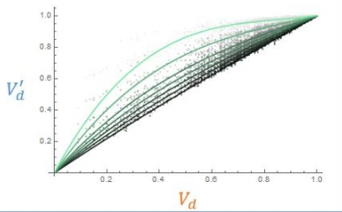   

> 用真实数据拟合了 Single Bounce AO 与 Multi Bounce AO 的关系(假设为三阶多项式)    

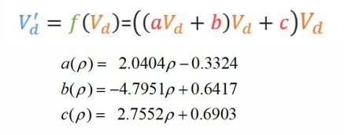   

### Result

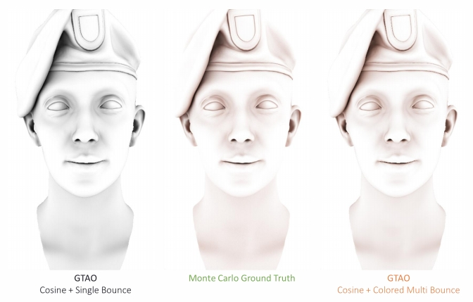   

P15    
## Ray-Tracing Ambient Occlusion

- Casting rays from each screen pixel using RTT hardware    
  - 1 spp(sample per-pixel) works well for far-field occlusion    
  - With 2-4 spp, can recover detailed occlusion in contact region   

> (1) 利用 GPU 的 ray casting 能力    
(2) 每帧只 sample 一个方向，在时序上持续收集遮挡信息。    

