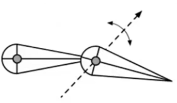
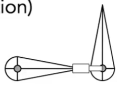
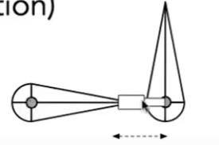
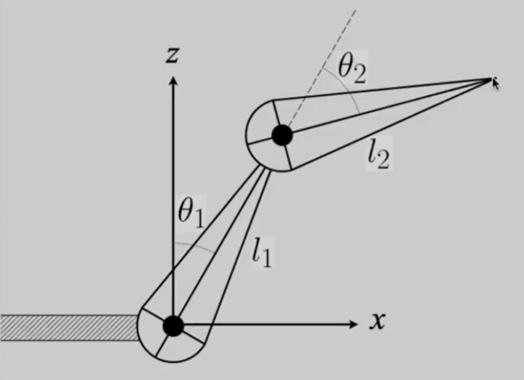

# 正向运动学 Forward kinematic [1:00:06]

## 关节的定义

|name|degree|example|
|---|---|---|
|Pin| 1D旋转 | |
|Ball|2D旋转||
|Prismatic joint|旋转 + 平移||

## Fk 要解决的问题。[1：02：19]

已知每个关节的旋转角度，求末端结点的位置。在本例中，已知\\(\theta_1\\)和\\(\theta_2\\)，求p。   
> &#x2705; 视频上给了这个例子的计算公式，如果关节多了就会很复杂。实际上用旋转矩阵来算会非常方便。  

优点：定义直观，实现简单  
缺点：通过角度来控制不直观

# 逆向运动学

已知末端的位置，调整关节角度，使末端处于预期的位置。在本例中，已知p，求\\(\theta_1\\)和\\(\theta_2\\)。[1:04：40] 

局限性：计算复杂、解不唯一、可能无解。    
通常被当作优化问题来解决。

------------------------------

> 本文出自CaterpillarStudyGroup，转载请注明出处。  
> https://caterpillarstudygroup.github.io/GAMES101_mdbook/