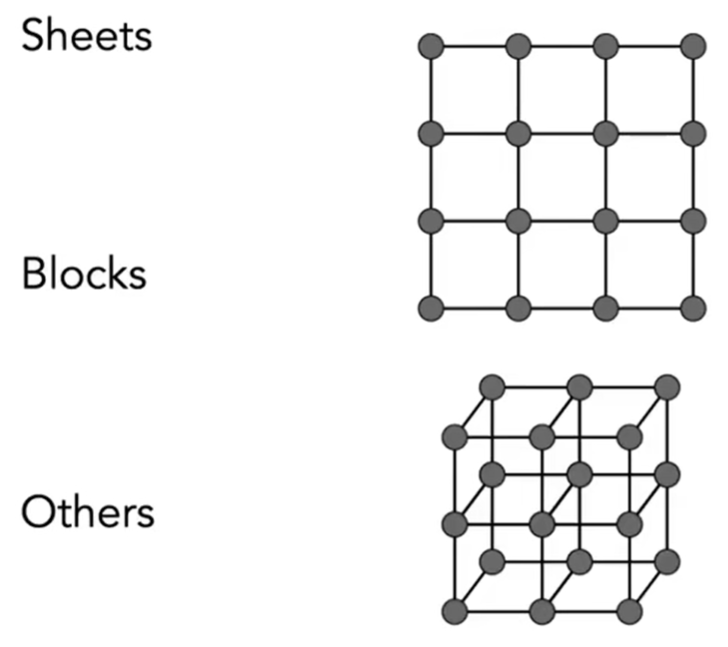

> &#x1F4CC; Film：24fps，video： 30 fps, VR: 90fps，否则会晕  
> &#x1F4CC; 前面动画基础部分和关键帧部分跳过了。直接进入物理仿真   
> 物理仿真：Physical Simulation 
通过推导或实现物理公式，来计算出物体的形状和位置的变化。

# 质点弹簧系统 Mass Spring System

Mass：质点， Sping：弹簧

MSS可以用于模拟绳子、头发、布料。  

## A simple Spring

$$
f_{a\rightarrow b} = k_s(b - a)
$$

\\(f_{a\rightarrow b}\\)代表弹簧应用在a上，使得a受到的往 b 方向去的力。  
假设rest length = 0，a和b之间只要有距离就会有力。  
\\(k_s\\)为弹簧系数。  

胡克定律： 

$$
f_{b\rightarrow a} =  - f_{a\rightarrow b}
$$

## Non-zero Length Spring

$$
f_{a\rightarrow b} =  k_s \frac{b-a}{||b-a||}(||b-a||-l)
$$

说明：  
\\(\frac{b-a}{||b-a||}\\)：归一化之后的受力方向。  
\\(||b-a||-l\\)：弹簧受力的大小，与长度有关。  
\\(l\\)：rest length，弹簧长度为\\(l\\)时不受力，与方向无关

公式中没有提到摩擦力。没有摩擦力的弹簧会永远震荡下去。  

## 有摩擦力的弹簧

> &#x2705; 符号：  
\\(x\\)：位置   
\\(\dot x\\)：速度   
\\(\ddot x\\)：加速度

### 简单的摩擦力定义

摩擦力的大小与方向都与弹簧的速度相反。  

$$
f_b = -k_d \dot b
$$

> &#x1F4A1; 摩擦力是由于物理微表面的不平整引起的，但这样很难模拟。是否可以参考微表面模型的统计方法来建模？  

这种方式只能描述来自外部的摩擦力，不能描述来自弹簧内部的损耗。  

### 更合理的摩擦力定义

$$
f_b = -k_d (\frac{b-a}{||b-a||}\cdot(\dot b - \dot a)) \frac{b-a}{||b-a||}
$$

说明：  
\\(fb\\)：摩擦力。可将弹簧恢复到正常长度。    
第一项\\(k_d\\)：弹性系数  
第二项\\(\frac{b-a}{||b-a||}\cdot(\dot b - \dot a)\\)：在弹簧力的方向上的速度分量的大小。与a和b的相对速度有关。在特定方向上的相对速度的大小，向量点乘，得到的是一个标量。  
第三项\\(\frac{b-a}{||b-a||}\\)：力的方向与b和a的相对位置，并做了归一化。  

> &#x2753; 为什么是b相对a的速度而不是相对运动表面的速度？  

摩擦力与弹簧本身长度没有关系。

## 多个弹簧的组合

### Sheets 用于布料

增加用于抵抗切变的力：

局限性：各项异性，且不能对抗弯折

增加用于对抗弯折的力：

> &#x1F4A1; 我的想法：可以增加质点对抗旋转的力

# 有限元方法 Finite Element Method

用于模拟汽车碰撞，考虑碰撞体内力的传导。

------------------------------

> 本文出自CaterpillarStudyGroup，转载请注明出处。  
> https://caterpillarstudygroup.github.io/GAMES101_mdbook/

