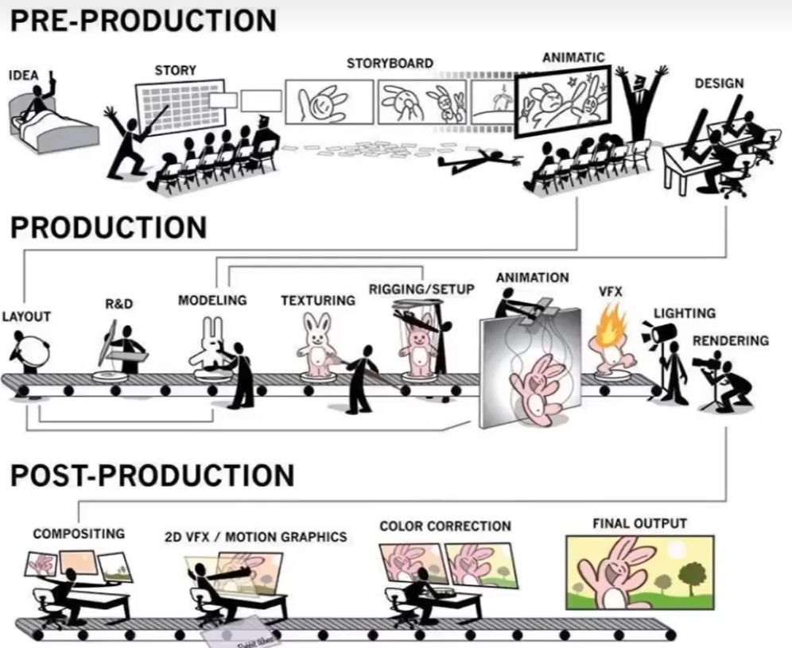

# 给角色添加指定的动作

## Rigging 绑定

给角色定义控制点，通过拉动控制点控制角色的动作。

## Blend Shape 

通过混合控制点来控制角色

## Moton Capture 动捕

从真人提取控制点上的动作，再把动作用于角色的控制点

# Pipeline

------------------------------

> 本文出自CaterpillarStudyGroup，转载请注明出处。  
> https://caterpillarstudygroup.github.io/GAMES101_mdbook/