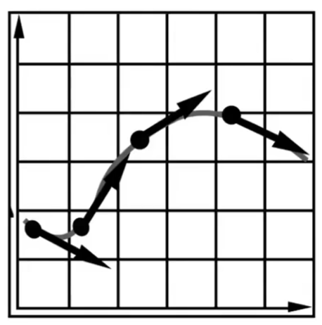
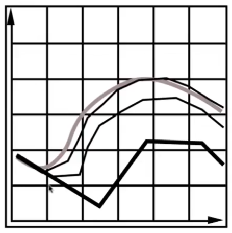
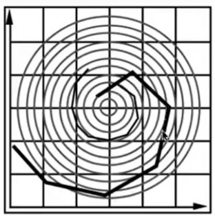
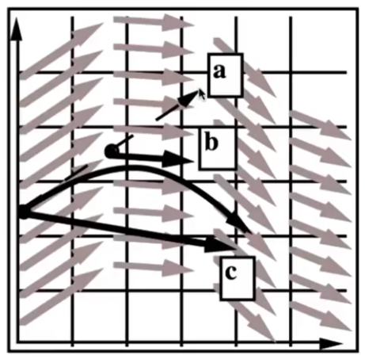

# 粒子系统 Particle System [49:38]

基于粒子系统的动画的主要过程：  
- 创建粒子
- （难点）计算每个粒子受到的力  
- （难点）更新粒子的位置和速度
- 移除不需要的粒子
- 渲染粒子

粒子建模要考虑的力有：  
- 动力：重力、吸引力、电磁力、斥力  
- 阻力：摩擦力、粘滞力
- 碰撞

> &#x2705; 模拟和渲染是两个独立的步骤[56：31]

粒子系统的更多应用场景：水、星系、鸟群、分子结构

> &#x1F4CC; 具体内容在Lecture 22

# 单个粒子系统

## 要解决的问题

- 场景一：

已知：初始的 position x0，任意时刻的速度  
求：某个时间刻的 position

- 场景二：

已知：初始的 position X0，速度场，即在任意 position 上的速度 [06：40]  
求：某时刻的 position

## 常微分方程  

ODE = Ordinary Differential Equation

$$
\frac{dx}{dt} = \dot x =  v(x, t)
$$

已知\\(\dot x\\)，求x

一阶常微分方程的特点：  
- 只涉及一阶微分
- 不存在对其它变量的微分

## 欧拉方法

根据上一时刻的位置、速度、加速度，根据定义求这一时刻的位置、速度、加速度。

$$
x^{t+\Delta t} = x^t + \Delta t \dot x^t \\\\    
\dot x^{t+\Delta t} = \dot x^t + \Delta t \ddot x^t
$$

> &#x2757; 公式中=左边和右边使用相同的符号，但是表达的含义中。=右边的都是上一时刻的量。=左边的都是当前时刻的量。  

> &#x1F4A1; 连续问题离散化，这种思想在课程中大量运用  

> &#x2753; [?]为什么有第二个公式？如果是问题一，\\(\dot x^t\\)已知。如果是问题二，\\(\dot x^t\\)跟\\(x^t\\)有关，应该用不到\\(\ddot x^t\\)。而且\\(\ddot x^t\\)未知，用到了也没法算  

特点：  
- 简单，直观迭代。  
- 误差：用不同大小的步长\\(\Delta t\\)会得到不同的结果。步长越小越精确。  

- [1：18：54] 不稳定，且不稳定性与步长无关  
  
> &#x1F446; 不管取多大的步长，最后一定会离开这个螺旋形的速度场。  

> &#x2705; 误差不是严重的问题，因为可以通过减小步长来降低误差。但不稳定性是严重的问题，因为不管取什么步长，最后结果一定会离真实情况越来越远。  

用数值方法解微分方程的共性问题：
1. 误差 VS 精度
2. 不稳定， **divergence**

> &#x1F4A1; 我的思考：  
有点像花书里的"病态问题'。输入的微小改变导到输出的巨大变化。  
也可以理解为函数在不同方向上的敏感度差着很大.

**后面介绍的这些方法都是在对抗前面提到的不稳定性。**  

## 中点法 Midpoint Method

  

1. 当前点为\\(x^t\\)，用欧拉方法计算\\(x^{t+\Delta t}\\)
2. 取中点\\(x_{mid} = x^t + x^{t+\Delta t}\\)
3. 取电点位置的速度\\(\dot x_{mid}\\)
4. 把\\(\dot x_{mid}\\)当成\\(\dot x^t\\),再算一次\\(x^{t+\Delta t}\\)，

直观上看，很奇怪中点法更准确。展开后发现，中点法比原方法多了二次项函\\(\frac{(\Delta t)^2}{2}\\)

### Adaptive Step Size

1. 定义初始的\\(delta t\\)为\\(delta_0\\)
2. 用欧拉方法计算\\(x^{t+\Delta_0}\\)。←用\\(delta_0\\)算一遍欧拉方法
3. 用欧拉方计算\\(x^{t+2*\frac{1}{2}\Delta_0}\\)。 ←用\\(2*\frac{1}{2}delta_0\\)算两遍欧拉方法
4. 如果\\(x^{t+\Delta_0}\\)与\\(x^{t+2*\frac{1}{2}\Delta_0}\\)差别比较大，取后者，且将\\(delta_0\\)更新为\\(\frac{1}{2}delta_0\\)。

### Implicit （隐式的） Euler Method

原问题：已知\\(x^t\\)和\\(\dot x^t\\)，求\\(x^{t+\Delta t}\\)   
转化为新问题：\\(x^t\\)和\\(\dot x^{t+\Delta t}\\)，求\\(x^{t+\Delta t}\\)  

部分已知，部分未知，变成了一个优化问题。

我的思考：  
显式和隐式，有种FK和IK的感觉。利用被依顿现计算依赖项，用数学公式。利用依顿现计算被依赖项，用优化问题，近似

优点：稳定。

## 衡量欧拉方法的稳定性

指标：局部截断误差、全局积累误差

计算误差与\\(\Delta t\\)的关系，例如 Implicit 方法为O(h)，即1阶。阶数越高越好。

### Runge-kutta 方法

欧拉方法用于解线性ODE（常微分方程）
Rk 4. 4代表4阶

已知：  

\\[
\frac{dy}{dt} = f(t, y)
\\]

\\[
y(t_0) = y_0
\\]

RK 4解法:

\\[
y_{n+1} = y_n + \frac{1}{6}h(k_1 + 2k_2 + 2k_3 + k_4)    
\\]

说明： 
这个公式里的h就是\\(\Delta t\\)  
()中的四个加法项是基于中点法的中间结果，系数是精心设计的  

\\[
t_{n+1} = t_n + h
\\]

如果说中点法是泰勒展开的即视感，那么这里的公式是对泰勒展开更精确的模拟

问：为什么说RK系列擅长非线性呢？都是以欧拉方法为基础，在哪里引入的非线性的设计？
答：1阶是处理线性问题，高于1阶才能处理非线性。理解类似泰勒公式的近似截断。

### Position Based / Verlet 积分

原理：只是通过调整位置使得能够满足某些限制，简化化弹簧的物理推导过程
优点：快、简单
缺点：不是基于真实的物理过程可自绘有错误

------------------------------

> 本文出自CaterpillarStudyGroup，转载请注明出处。  
> https://caterpillarstudygroup.github.io/GAMES101_mdbook/