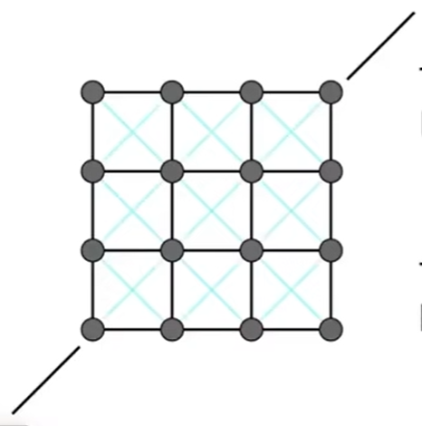

物理仿真：Physical Simulation [21：10]
通过推导或实现物理公式，来计算出物体的形状和位置的变化。

# 质量弹簧系统 Mass Spring System

Mass：质量， Sping：弹簧

## A simple Spring

\\[
f_{a->b} = K_s(b - a)
\\]
相当于rest length = 0

\\[
f_{b->a} =  - f_{a->b}
\\]

\\(f_{a->b}\\)代表a 点受到的往 b 方向去的力

## Non-zero Length Spring

\\[
f_{b->a} =  K_s \frac{b-a}{||b-a||}(||b-a||-l)
\\]

说明：  
分母||b-a||：归一化
l：rest length，弹簧长度为1时不受力，与方向无关

符号：  
\\(x\\)：位置 \\(\dot x\\)：速度 \\(\ddot x\\)：加速度

## 有摩擦力的弹簧

\\[
f_b = -K_d \frac{b-a}{||b-a||}(\dot b - ]dot a) \frac{b-a}{||b-a||}
\\]

说明：  
fb：摩擦力  
第一项Kd：弹性系数  
第二项：在弹簧力的方向上的速度分量  
第三项：力的大小与b相对于a的速度有关  
第四项：力的方向
第二、三项：在特定方向上的相对速度的大小，向量点乘，得到的是一个标量

摩擦力与弹簧本身长度没有关系。

## Sheets 用于布料

增加用于切变的力：

局限性：各项异性，且不能对抗弯折

# 有限元方法 Finite Element

用于模拟汽车碰撞，考虑碰撞体内力的传导。

# 粒子系统 particle System [49:38]

分别对每一个粒子建模

动力：重力、吸引力、电磁力、斥力  
阻力：摩擦力、粘滞力
碰撞

说明：
模拟和渲染是两个独立的步骤[56：31]

粒子系统的更多应用场景：水、星系、鸟群、分子结构

------------------------------

> 本文出自CaterpillarStudyGroup，转载请注明出处。
>
> https://caterpillarstudygroup.github.io/GAMES101_mdbook/

