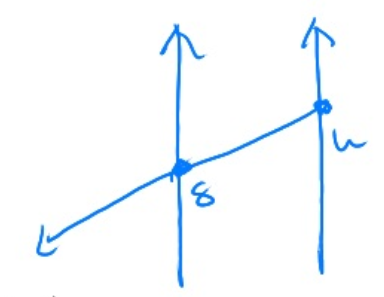
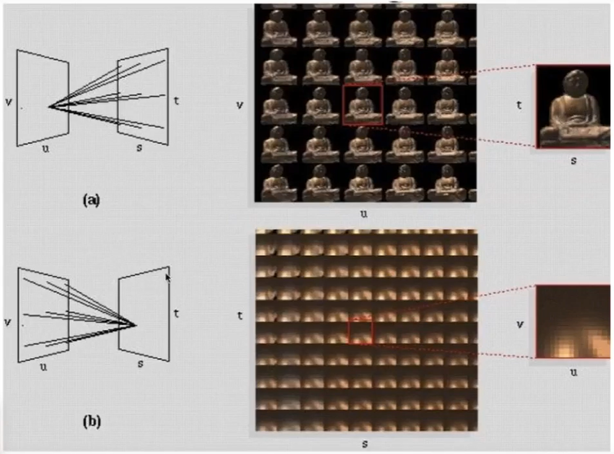

# 光场 Light Field / lumigraph­

## 定义
Plenptic Function（全光函数）：
用于描述 the set of all things that we can ever see.

函数定义：

\\[
P(\theta, \phi, \lambda, t, V_x, V_y, V_z)
\\]

说明：  
\\(\theta, \phi\\)：朝某个方向看  
\\(\lambda\\)：颜色  
t：时间  
\\(V_x, V_y, V_z\\)：在某个位置器  

光场：在任意一个位置，朝任一个方向，发出的光的强度、

把光场信息提前算好.存储于一个包围盒中。  

## 光场参数化

方式一：

参数为2D position和2D direction

方式二：[25：04]

  

参数为2D position (u, v)和2D position (s, t)

[27:41]
  
怎么理解这两个图？

# Fly's Eye 光线

[32：49] 左图三个颜色代表来自三个方向的光，不是代表光的三元色成分
通过 f 将像素接收到的 irradiane 分­解成 radiance 分别存储，

# Physical Basis of Color 

白光分解原理：不同颜色的光有不同的波长和折射率  
谱功率密度= Spectral Power Distribution = SPD，用于描述混合光中不同波长的光的分布[51：41]  
SPD 的特点： 线性，可相加
不关心眼睛的是呈像原理，跳过，结论是：[1：10：43]

\\[
y = \int r(\\lambda)s(\lambda)d\lambda
\\]

说明：  
y:人看到的某光线的结果  
r:从眼对不同波长光线的感受
s:某种光线的SPD

应用：  
根据公式可知，不同的\\(s(\lambda)\\)（可得到相同的 y（同色异谱）
color matching：人为调和出\\(s(\lambda)\\)，使得到的效果与 real world 相同.
[?] 为什么不直接用 real world 的\\(s(\lambda)\\)？

# Additive Color 加色系统

[1：11：44]

\\[
R = \int  s(\\lambda)r(\lambda)d\lambda
\\]

说明：  
s:SPD  
r: 某个频谱的RGB primary    
d：某种光线的所有频谱

**基于人眼的 color matching 和基于加色系统的 color matching，公式相似，但原理不同**

# 颜色空间

## CIE XYZ [1：13：02]

一套人造的 color system，色域为颜色空间中所有可表示的颜色

## sRGB

[1：18：28]

这部分内容对我不太重要。有一项内容值得借鉴。
如何在二维空间中可视化三维信息。

1. 归一化
任何可视化都是要先归一化的。在一个标准的尺度如分析才有意义
2. 固定一个维度。
选择固定哪个维度是有策略的。可以选择影响最小的维度或最便于观察的维度。也可以画多张图，每次分别固定一个维度.

## HSV [1：20：46]

## CIELAB [1:22:21]

------------------------------

> 本文出自CaterpillarStudyGroup，转载请注明出处。
>
> https://caterpillarstudygroup.github.io/GAMES101_mdbook/