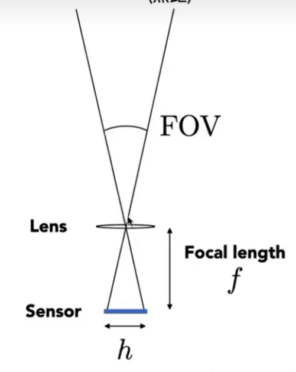
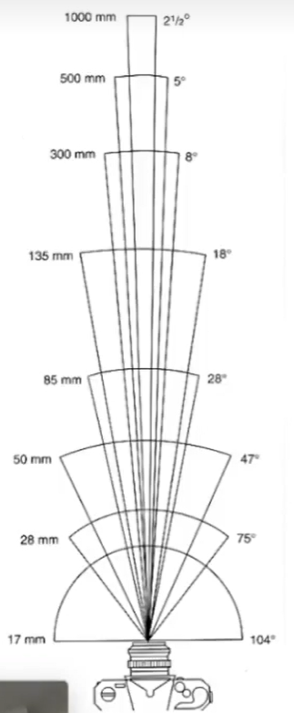

> &#x1F4CC; 本节课大部分跟器件相关的部分都会被跳过，主要关注概念。  

# 视场 FOV

FOV = Field of View，指能看到的范围

$$
FOV = 2(\frac{h}{2f})
$$

以竖直的FOV为例，h为传感器的高度，f为焦距。

通常以35mm大小的传感器为标准来定义相机的的FOV。  

# Exposure 爆光

Exposure = Time * irradiance，简写为H = T * E

------------------------------

> 本文出自CaterpillarStudyGroup，转载请注明出处。  
> https://caterpillarstudygroup.github.io/GAMES101_mdbook/