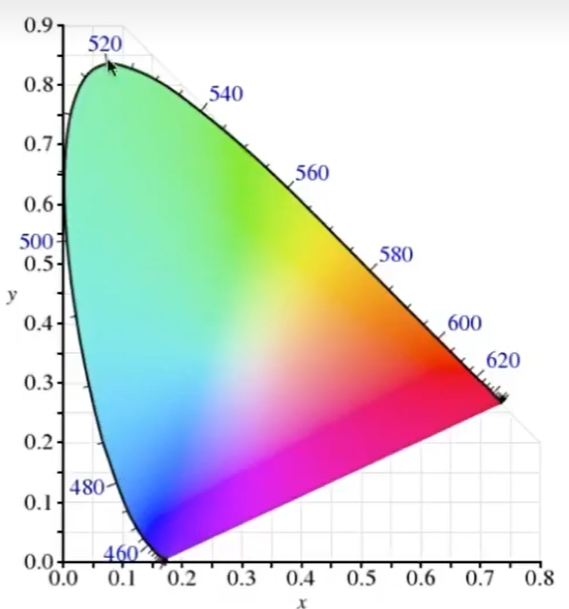
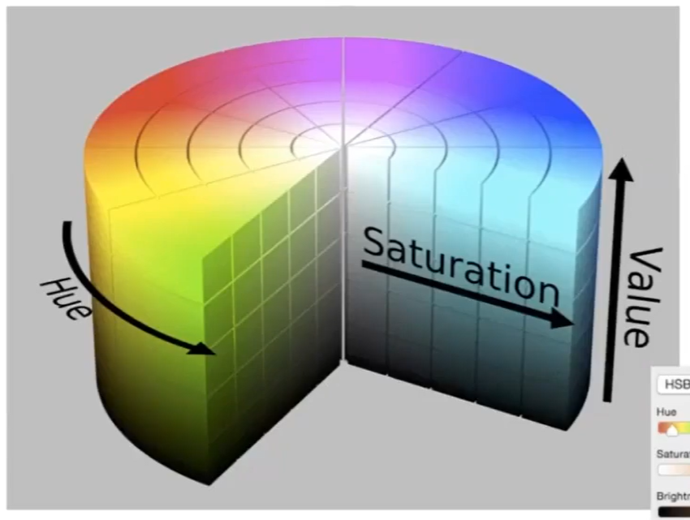
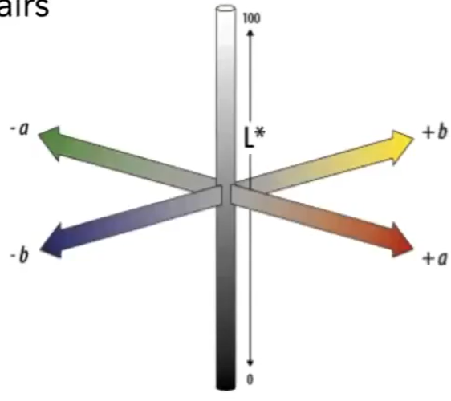

# Physical Basis of Color 

白光分解原理：不同颜色的光有不同的波长和折射率  

## 原理

谱功率密度 = Spectral Power Distribution = SPD，用于描述混合光中不同波长的光的分布 
SPD 的特点： 线性，可相加  

> &#x1F4CC; 不关心眼睛的是呈像原理，跳过，结论是： 

$$
y = \int r(\lambda)s(\lambda)d\lambda
$$

说明：  
y:人看到的某光线的结果  
r:人眼对不同波长光线的感受  
s:某种光线的SPD

## 应用

根据公式可知，不同的\\(s(\lambda)\\)（可得到相同的 y（同色异谱）  
color matching：人为调和出\\(s(\lambda)\\)，使得到的效果与 real world 相同.  
> &#x2753; [?] 为什么不直接用 real world 的\\(s(\lambda)\\)？   
> &#x2753; 不同的人都不同的r，怎么针对不同的r调出同样效果的s？  

# Additive Color 加色系统

$$
R = \int  s(\lambda)r(\lambda)d\lambda
$$

说明：  
s:SPD  
r: 某个频谱的RGB primary    
d：某种光线的所有频谱

**基于人眼的 color matching 和基于加色系统的 color matching，公式相似，但原理不同**

# 颜色空间

## CIE XYZ  

一套人造的 color system，色域为颜色空间中所有可表示的颜色

## sRGB
 
  

> &#x1F4A1;这部分内容对我不太重要。有一项内容值得借鉴。
> 如何在二维空间中可视化三维信息。  
> 1. 归一化   
> 任何可视化都是要先归一化的。在一个标准的尺度如分析才有意义
> 2. 固定一个维度。  
> 选择固定哪个维度是有策略的。可以选择影响最小的维度或最便于观察的维度。也可以画多张图，每次分别固定一个维度。  

## HSV  

  

## CIELAB  

  

------------------------------

> 本文出自CaterpillarStudyGroup，转载请注明出处。  
> https://caterpillarstudygroup.github.io/GAMES101_mdbook/