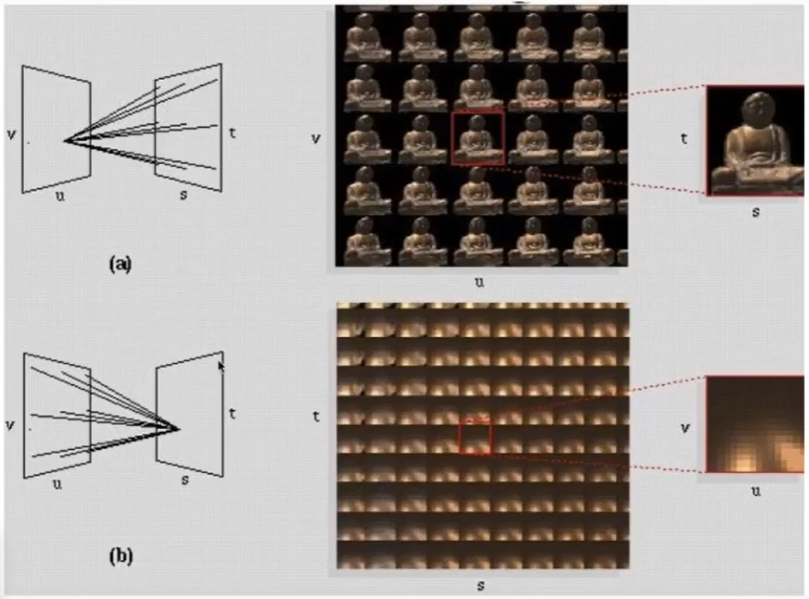

# 光场 Light Field / lumigraph­

## 定义

  

把人能看到的东西记录下来，然后放在眼前代替真实世界，可以得到一样的视觉效果。这个提前记录下来的东西，就是简易版的光场。  

## 全光函数

Plenptic Function（全光函数）：
用于描述前面提到的“提前记录好的人能看到的东西” ，the set of all things that we can ever see.

函数定义：

$$
P(\theta, \phi, \lambda, t, V_x, V_y, V_z)
$$

说明：  
\\(\theta, \phi\\)：朝某个方向看  
\\(\lambda\\)：颜色  
t：时间  
\\(V_x, V_y, V_z\\)：在某个位置器  
返回值：在任意一个位置，任意的时刻，朝任一个方向，所接收到的任意波长的光的强度。 

## 光场

光场是从全光函数的一个子集。即在任意一个位置，朝任一个方向，去（光线可逆）的光的强度。   

  

> &#x2757; 光场同的位置和方向都是2D的。
> &#x2705; 物体表面的任意一个位置，可以用纹理坐标(u, v)表示。3D空间中的方向可以用\\(\theta, \phi\\)表示，因此都是2D的。  

因此得到了这样的结果：  

  

通过光场可以得到物体从任意位置的观测。  

## 记录光场

实际上可以不关心到底是什么物体，只需要物体的光场。 

  

但在记录的时候，描述每一根光线的方式有点不同。这里面使用2D position和2D position来描述“任意一个位置，朝任一个方向”。  

  

> &#x2753; [?] 前面提到用“2D位置+2D方向”，这里提到用“2D位置和2D位置”，其实是同一个目的，都是用于描述光场中的一根光线，为什么会需要两个不同的参数化方式呢？

### 光场参数化

方式一：

参数为2D position和2D direction

方式二：[25：04]

  

参数为2D position (u, v)和2D position (s, t)

### 参数化效果

[27:41]
  

图a)：从同一个位置，看向目标的不同位置，得到的是原图  
图b)：站在不同位置，看向目标的同一位置。  

# Fly's Eye 光线

苍蝇眼睛的呈像原理就是光场。 

  
> &#x1F446; 左图三个颜色代表来自三个方向的光，不是代表光的三元色成分  

通过 f 将像素接收到的 irradiane 分­解成 radiance 分别存储

------------------------------

> 本文出自CaterpillarStudyGroup，转载请注明出处。  
> https://caterpillarstudygroup.github.io/GAMES101_mdbook/