# 矩阵

## 矩阵运算性质 [45：00]

- \\(AB\ne BA\\)
- \\(\left( AB \right) C=A\left( BC \right) \\)
- \\(\left( A+B \right) C=AC+BC\\)
- \\(\left( AB \right) ^T=B^TA^T\\)
- \\(AA^{-1}=A^{-1}A=I\\)
- \\(\left( AB \right) ^{-1}=B^{-1}A^{-1}\\)

## 2D变换(2D Transformation)[06：52]

### 缩放变换(Scale)

 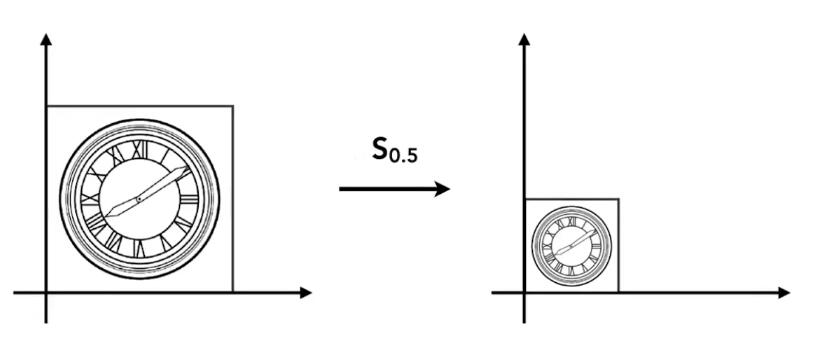 

图中，横轴和纵轴都缩小了\\(\frac{1}{2}\\)，用数学形式表达：

\\[
x'=sx\\\\
y'=sy
\\]
其中，\\(x'\\) 是缩放后的坐标，\\(s\\) 是缩放尺度，\\(x\\) 是原坐标。

将该式子写成矩阵的形式为：

\\[
\left[ \begin{array}{c}
	x'\\\\
	y'\\\\
\end{array} \right]  =\left[ \begin{matrix}
	s&		0\\\\
	0&		s\\\\
\end{matrix} \right] \left[ \begin{array}{c}
	x\\\\
	y\\\\
\end{array} \right] 
\\]

如果缩放不是均匀的，例如 \\(x\\) 轴缩小0.5，\\(y\\) 不变，则用矩阵表示为：

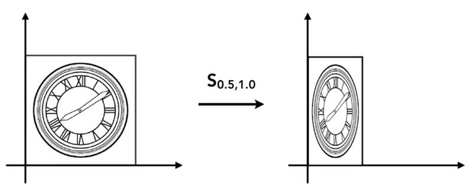

\\[
\left[ \begin{array}{c}
	x'\\\\
	y'\\\\
\end{array} \right]  =\left[ \begin{matrix}
	s_x&		0\\\\
	0&		s_y\\\\
\end{matrix} \right] \left[ \begin{array}{c}
	x\\\\
	y\\\\
\end{array} \right] 
\\]

### 反射(Reflection) 
反射也称对称。

上图中，原图相对于 \\(y\\) 轴做了反转，用等式表示为：

\\[
x'=-x\\\\
y'=y
\\]

该等式可以用矩阵表示为：

\\[
\left[ \begin{array}{c}
	x'\\\\
	y'\\\\
\end{array} \right]  =\left[ \begin{matrix}
	-1&		0\\\\
	0&		1\\\\
\end{matrix} \right] \left[ \begin{array}{c}
	x\\\\
	y\\\\
\end{array} \right] 
\\]

### 切变(Shear)

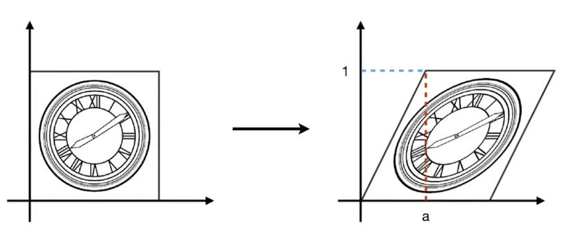

上图是切变的例子。可以看到，图像上任意一点的 \\(y\\) 轴坐标值并未改变，仅 \\(x\\) 轴坐标改变了。则可以确定的是 \\(y'=y\\)，继续观察，当 \\(y\\) 为0时， \\(x\\) 没有变化，当 \\(y\\) 为1时， \\(x\\) 都水平右移了 \\(a\\) 长度，当 \\(y\\) 为1/2时， \\(x\\) 移动了 \\(\frac{a}{2}\\)，所以，找到了规律， \\(x\\) 移动距离为 \\(ay\\)。用矩阵表示为：

\\[
\left[ \begin{array}{c}
	x'\\\\
	y'\\\\
\end{array} \right]  =\left[ \begin{matrix}
	1&		a\\\\
	0&		1\\\\
\end{matrix} \right] \left[ \begin{array}{c}
	x\\\\
	y\\\\
\end{array} \right] 
\\]

> **&#x1F4CC;补充：** 找到变化规律，就能写出变换的表达式

### 旋转(Rotate)

> &#x2705;旋转默认是绕原点(0,0)旋转；默认旋转方向是逆时针旋转。

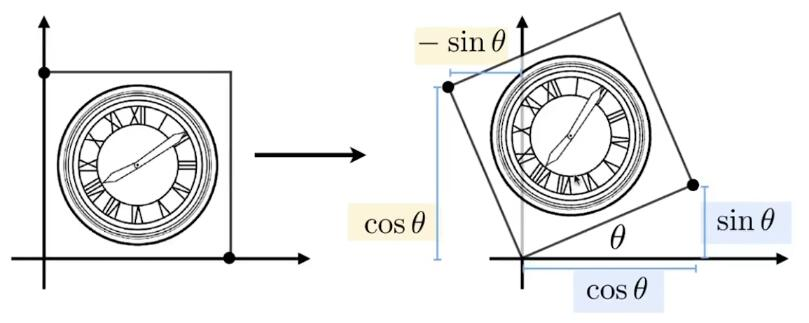

**旋转的矩阵表达式推导：**
> **&#x1F4A1;思路：** 旋转的图像每一点都需要符合表达式，那么，特殊的点也必须符合，所以从特殊点入手，找出旋转的规律，从而推导出旋转的矩阵形式表达。

假设有一个正方形，如图所示。

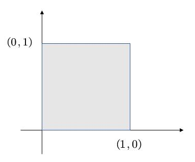

将其旋转 \\(\theta\\) 角度。

我们的目的是得到 \\(\left( x,y \right) ->\left( x',y' \right) \\)

矩阵的形式为：
\\(\left[ \begin{array}{c}
	x'\\\\
	y'\\\\
\end{array} \right]  =\left( \begin{matrix}
	A&		B\\\\
	C&		D\\\\
\end{matrix} \right) \left( \begin{array}{c}
	x\\\\
	y\\\\
\end{array} \right) \\)

只要找出规律，求出ABCD即可。

我们将目光先聚集在下图中的红点。

最基本的，我们可以知道一些信息，例如，原本的(1,0)点被旋转成为(\\(sin\theta，cos\theta\\))，

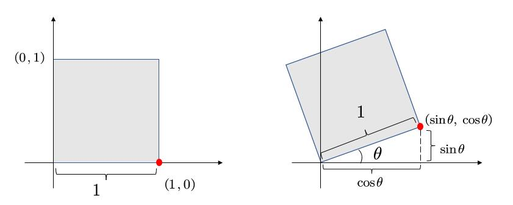

于是，我们就可以初步得到：

\\(
\left( \begin{array}{c}
	\cos \theta\\\\
	\sin \theta\\\\
\end{array} \right) =\left( \begin{matrix}
	A&		B\\\\
	C&		D\\\\
\end{matrix} \right) \left( \begin{array}{c}
	1\\\\
	0\\\\
\end{array} \right) 
\\)

也就是：

\\(\cos \theta =A\cdot 1+B\cdot 0 = A\\)

\\(\sin \theta =C\cdot 1+D\cdot 0 =C\\)

现在，已经得到了A和C。接着，我们选择另一个点。

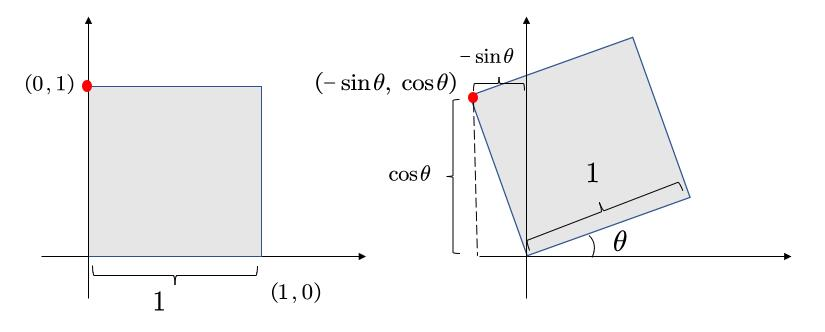

不难得到，\\( B=-sin\theta, D=cos\theta \\)

所以有

\\(
\left( \begin{array}{c}
	\cos \theta\\\\
	\sin \theta\\\\
\end{array} \right) =\left( \begin{matrix}
	cos\theta&		-sin\theta\\\\
	sin\theta&		cos\theta\\\\
\end{matrix} \right) \left( \begin{array}{c}
	1\\\\
	0\\\\
\end{array} \right) 
\\)

上述缩放、反射、切变和旋转，都称为**线性变换**，可以统一由下面的表达式来表达：

\\[
x'=ax+by\\\\
y'=cx+dy
\\]

\\[
\left[ \begin{array}{c}
	x'\\\\
	y'\\\\
\end{array} \right] =\left[ \begin{matrix}
	a&		b\\\\
	c&		d\\\\
\end{matrix} \right] \left[ \begin{array}{c}
	x\\\\
	y\\\\
\end{array} \right] 
\\]

\\[
X'=MX
\\]

> **&#x2757;注意：** 要用相同维度的向量，去和X相乘

### 齐次坐标

我们先看平移变换：

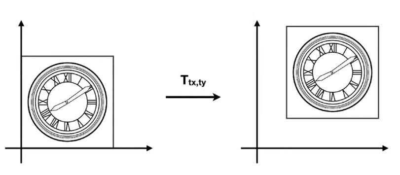

平移变换非常简单，可以由下面的式子表示：

\\[
x'=x+t_x\\\\
y'=y+t_y
\\]

但是有一个问题，我们不能把上述式子直接用矩阵的形式表达，需要在矩阵运算后再加一个偏移量：

\\[
\left[ \begin{array}{c}
	x'\\\\
	y'\\\\
\end{array} \right] =\left[ \begin{matrix}
	a&		b\\\\
	c&		d\\\\
\end{matrix} \right] \left[ \begin{array}{c}
	x\\\\
	y\\\\
\end{array} \right] +\left[ \begin{array}{c}
	t_x\\\\
	t_y\\\\
\end{array} \right] 
\\]

> &#x1F4CC;如果只有平移，则 \\(a,b,c,d\\) 是一个单位矩阵

> **&#x1F4A1;思考：** 平移不是线性变换，不满足\\(X'=MX\\)

为了解决平移变换能够线性表示的问题，将坐标或向量添加一项(2D)
- 2D point = \\((x, y, 1)^T\\)
- 2D vector = \\((x, y, 0)^T\\)

于是，就有了矩阵表达式：

\\[
\left( \begin{array}{c}
	x'\\\\
	y'\\\\
	w'\\\\
\end{array} \right) =\left( \begin{matrix}
	1&		0&		t_x\\\\
	0&		1&		t_y\\\\
	0&		0&		1\\\\
\end{matrix} \right) \cdot \left( \begin{array}{c}
	x\\\\
	y\\\\
	1\\\\
\end{array} \right) =\left( \begin{array}{c}
	x+t_x\\\\
	y+t_y\\\\
	1\\\\
\end{array} \right) 
\\]

> &#x1F4A1; 为point增加一项1，因为point移动后不再是原来的point。为vector添加一项0，是因为向量具有平移不变性，向量平移后仍然是原向量。

> &#x1F4CC; \\((x, y, w)^T\\) 如果用于表达2D点，等同于\\(\frac{x}{w}, \frac{y}{w}, 1\\)

添加项是否存在，不影响point与vector之间运算的意义：

\\[
vector + vector = vector\\\\
point + vector = point\\\\
point - point = vector\\\\
point + point = 两点的中点（齐次坐标下）
\\]

### 仿射变换(Affine transformation)

线性变换 + 平移 = 仿射变换

\\[
\left[ \begin{array}{c}
	X'\\\\
	1\\\\
\end{array} \right] =\left[ \begin{matrix}
	SR&		T\\\\
	0&		1\\\\
\end{matrix} \right] \left[ \begin{array}{c}
	X\\\\
	1\\\\
\end{array} \right] 
\\]

所有的仿射变换，可以变成齐次坐标的形式：

仿射变换：

\\[
\left[ \begin{array}{c}
	x'\\\\
	y'\\\\
\end{array} \right] =\left[ \begin{matrix}
	a&		b\\\\
	c&		d\\\\
\end{matrix} \right] \left[ \begin{array}{c}
	x\\\\
	y\\\\
\end{array} \right] +\left[ \begin{array}{c}
	t_x\\\\
	t_y\\\\
\end{array} \right] 
\\]

齐次坐标：

\\[
\left( \begin{array}{c}
	x'\\\\
	y'\\\\
	1\\\\
\end{array} \right) =\left( \begin{matrix}
	a&		b&		t_x\\\\
	c&		d&		t_y\\\\
	0&		0&		1\\\\
\end{matrix} \right) \cdot \left( \begin{array}{c}
	x\\\\
	y\\\\
	1\\\\
\end{array} \right) =\left( \begin{array}{c}
	x+t_x\\\\
	y+t_y\\\\
	1\\\\
\end{array} \right) 
\\]

### 逆变换(Inverse transform)

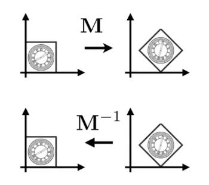

> &#x1F4A1; 当一个变换是通过\\(M\\)得到的，那么可以通过\\(M\\)的逆\\(M^-1\\)来恢复变换。 

- 复杂变换可以通过简单变换一步一步达到
- 变换顺序非常重要，ABC不等于ACB（矩阵乘法性质）

变换合成：

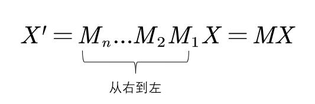

变换分解：

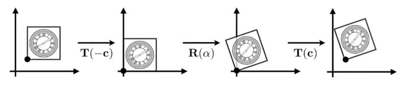

以C点为中心的旋转，可以分解为：
1. 从C点平移到原点
2. 旋转
3. 再从原点平移到C点

即：\\(X'=MX=T\left( c \right) \cdot R\left( \alpha \right) \cdot T\left( -c \right) \cdot X\\)
