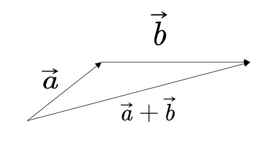
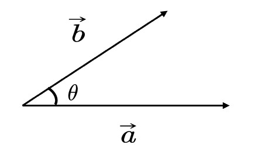
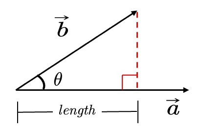
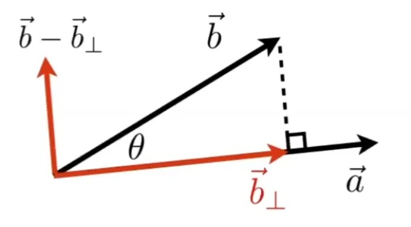
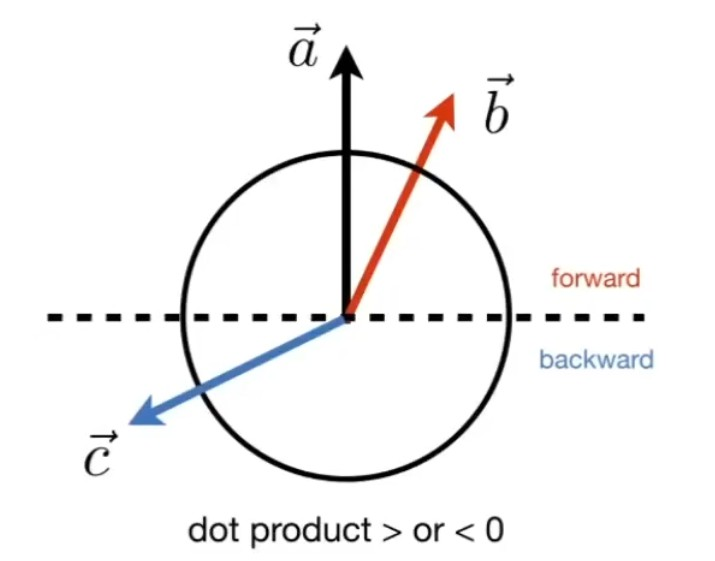
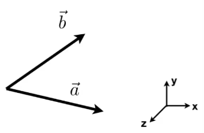
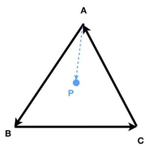

# 向量

## 向量性质

[07：54]

- 方向:  \\( B - A \\) 或 \\( \vec{a} \\) 

- 长度：\\( ||B-A || \\) 或 \\( ||\vec{a}|| \\)  (与起点无关)

- 单位向量：\\( \vec{e}=\frac{\vec{a}}{||\vec{a}||} \\)，模长为1

> **&#x1F4CC;补充：** 向量一般默认为列向量，所以书写公式时，一个向量写为 \\(\vec{a}=\left( x_1, y_1 \right) ^T\\)

## 向量加法

### 代数意义

$$
\vec{a}=\left( x_1, y_1 \right) ^T  ,  \vec{b}=\left( x_2, y_2 \right) ^T
$$

$$
\vec{a}+\vec{b}=\left( x_1+x_2, y_1+y_2 \right) ^T
$$

### 几何意义

  

## 向量点乘

### 几何意义

  

$$
\vec{a}\cdot \vec{b}=||\vec{a}||\cdot ||\vec{b}||\cdot \cos <\vec{a}, \vec{b}>
$$

- \\( \vec{a}\cdot\vec{b} \\)  是标量

> **&#x1F4CC;补充：** 由 \\( \vec{a} \\) 到 \\( \vec{b} \\) 的夹角 \\( <\vec{a},\vec{b}> \\) 是 \\( \theta \\) , 如果是由 \\( \vec{b} \\) 到 \\( \vec{a} \\) 的夹角 \\( <\vec{b}, \vec{a}> \\) , 则为 \\( -\theta \\) 。

### 代数意义

$$
\vec{a}=\left( x_1, y_1 \right) ^T  ,  \vec{b}=\left( x_2, y_2 \right) ^T
$$

$$
\vec{a}\cdot \vec{b}=x_1y_1+x_2y_2
$$

### 性质

- 交换律：\\( \vec{a}\cdot \vec{b}=\vec{b}\cdot \vec{a} \\)

- 分配律： \\( \vec{a}\cdot(\vec{b}+\vec{c})=\vec{a}\cdot \vec{b}+\vec{a}\cdot \vec{c} \\)

- 结合律： \\( (k\cdot \vec{a})\cdot \vec{b}=\vec{a}\cdot (k\cdot \vec{b})=k\cdot(\vec{a}\cdot \vec{b}) \\)

### 作用

1. 找到两个向量之间的夹角
   
   \\( \cos \theta =\frac{\vec{a}\cdot \vec{b}}{||\vec{a}||\cdot ||\vec{b}||} \\)

2. 一个向量投影到另一个向量
   
   
  

   
   > **&#x1F4CC;补充：** \\( length=||\vec{b}||\cos \theta =||\vec{b}||\frac{\vec{a}\cdot \vec{b}}{||\vec{b}||\cdot ||\vec{a}||}=\frac{\vec{a}}{||\vec{a}||}\vec{b}=\hat{a}\cdot \vec{b}\\)

3. 把向量分解成垂直和平行的两个向量
   
   
   
   > **&#x1F4CC;补充：** \\( \vec{b}_{\bot}=\frac{\vec{a}}{||\vec{a}||}\cdot length=\frac{\vec{a}\cdot ||\vec{b}||\cdot \cos \theta}{||\vec{a}||}=\hat{a}\cdot \vec{b}\cdot \hat{a} \\)

4. 计算两个向量有多接近
   
   两个向量做点乘，可以反映二者的“接近”程度
   
   
   
   > **&#x1F4A1;思考：** 我们假设 \\( \vec{a} \\) 已给定，如果一个向量的终点落在虚线上半部分，例如 \\( \vec{b} \\) ，则可以认为该向量在方向上与 \\( \vec{a} \\) 是相同的或是说都是向前的；如果一个向量，例如 \\( \vec{c}\\)，终点落在虚线下半部分，则可以认为 \\( \vec{a} \\) 和 \\( \vec{c}\\) 两个向量的方向基本是相反的。且点乘结果落在 \\([-1, 1]\\) 上，可以表示接近程度。
   
   > **&#x1F4CC;补充：**（点乘： \\( \vec{a}\cdot \vec{b} > 0 \\) ，方向相同；   \\( \vec{a}\cdot \vec{c} < 0 \\) ，方向相反）

## 向量叉乘

### 几何意义

\\( \vec{c}=\vec{a}\times \vec{b} \\)

\\(\vec{c}\\) 是一个向量，方向同时与 \\(\vec{a}\\) 和 \\(\vec{b}\\) 垂直（右手法则），大小为 \\(||\vec{a}||\cdot ||\vec{b}||\cdot \sin \theta \\)  (\\(\theta\\) 是a到b的夹角)

> **&#x2705;右手螺旋法则**：  
> 
>    \\(\vec{c}=\vec{a}\times \vec{b}\\) 
> 
>   右手手指指向 \\(\vec{a}\\) 方向，然后沿着去往 \\(\vec{b}\\) 的方向握紧四指，此时大拇指指向的方向，就是 \\(\vec{c}\\) 的方向。

### 性质

[34：15]

- \\( \vec{x}\times \vec{y}=+\vec{z} \\)
- \\( \vec{y}\times \vec{x}=-\vec{z} \\)
- \\( \vec{y}\times \vec{z}=+\vec{x} \\)
- \\( \vec{z}\times \vec{y}=-\vec{x} \\)
- \\( \vec{z}\times \vec{x}=+\vec{y} \\)
- \\( \vec{x}\times \vec{z}=-\vec{y} \\)
- \\( \vec{a}\times \vec{b}=-\vec{b}\times \vec{a} \\) (不满足交换律)
- \\( \vec{a}\times \vec{a}=\vec{0} \\)
- \\( \vec{a}\times \left( \vec{b}+\vec{c} \right) =\vec{a}\times \vec{b}+\vec{a}\times \vec{c} \\)  （分配律）
- \\( \vec{a}\times \left( k\vec{b} \right) =k\left( \vec{a}\times \vec{b} \right)  \\)  （结合律）

左手则符号相反

> **&#x1F4CC;** 在一个三维坐标系中，如果\\( \vec{x}\times \vec{y}=\vec{z}\\)，那么这个坐标系称为右手坐标系。

### 代数意义 

[36:11]

\\[
\vec{a}\times \vec{b}=\left( \begin{array}{c}
    y_az_b-y_bz_a\\\\
    z_ax_b-x_az_b\\\\
    x_ay_b-y_ax_b
\end{array} \right) 
\\]

> **&#x1F4A1;思考：** 这个式子中，\\( x_a,y_a,z_a \\) 是\\( \vec{a}\\) 在三维坐标系中的三个坐标分量的代数表示。 叉乘只用于3D中，在2D中没有定义。

### 在图形学中的作用

1. 判定左和右
   
   
   
   如果\\( \vec{a}\times \vec{b} \\) 的结果是正值，即与 \\(Z\\) 轴方向相同，就表示 \\(\vec{b}\\) 在 \\(\vec{a}\\) 的左侧。
   
   > **&#x1F4CC;左右：** 目标向量逆时针旋转指向的区域，是目标向量的左侧，反之是右侧。

2. 判断内和外
   
   
   
   > **&#x2705;如何判断P点在A、B、C的内部？**
   > 
   > \\( AB\times AP \\)，可以得到 \\(AP\\) 在 \\(AB\\) 的左侧。\\( BC\times BP \\)，可以得到 \\(BP\\) 在 \\(BC\\) 的左侧。\\( CA\times CP \\)，可以得到 \\(CP\\) 在 \\(CA\\) 的左侧。这样，就可以判断出P点在A、B、C的内部（P点在这三条边的同一侧）。

3. 构建右手坐标系
   
   有三个单位向量，两两垂直：
   
   \\(||\vec{u}||=||\vec{v}||=||\vec{w}||=1\\)
   
   \\(\vec{u}\cdot \vec{v}=\vec{v}\cdot \vec{w}=\vec{u}\cdot \vec{w}=0\\)
   
   且 \\(\vec{w}=\vec{u}\times \vec{v}\\)
   
   则这三个向量构成一个右手坐标系。
   
   可以把任意一个向量分解到轴上去：
   
   \\(\vec{p}=\left( \vec{p}\cdot \vec{u} \right) \vec{u}+\left( \vec{p}\cdot \vec{v} \right) \vec{v}+\left( \vec{p}\cdot \vec{w} \right) \vec{w}\\)
   
   - \\(\left( \vec{p}\cdot \vec{u} \right)\\) 是投影长度
   - \\(\vec{u}\\) 是方向

 
 

----------------

> 本文出自CaterpillarStudyGroup，转载请注明出处。
>
> https://caterpillarstudygroup.github.io/GAMES101_mdbook/