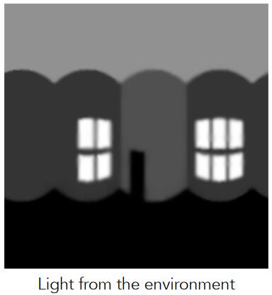

# 用纹理记录环境光照

以一个点出发，向其四周都能看到光，把这些光记录下来，就是环境光照。用纹理来描述环境光照，并环境光照渲染其他物体。

例如：这是某个点的环境光照

用这个环境光照来渲染茶壶，就得到了这样的效果

用纹理记录环境光照时，对光做了一些假设和简化：  
   
- 假设环境光的光源无限远，只记录某个方向上的光的信息（强度、颜色等），不记录光源的深度。  
- 在记录光照信息时，不区分光照的种类。

> &#x2753; 光源的深度信息对效果有什么影响？

## [12:35] Spherical 环境图：

如果对一个点的周围均匀采样，得到的是一个球。因此，记录环境光照的纹理图是一个球面的图（左）。

但把球面的环境光照纹理图展开，会出现扭曲：

> &#x2753; 展开后扭曲会有什么影响？渲染正常不就行了？
 
## Cube Map 

球表面点和立方体表面点可以一一对应。只要计算出这种对应关系，就能把球面上的光照信息存储到立方体表面。

Cube Map展开后不会扭曲

