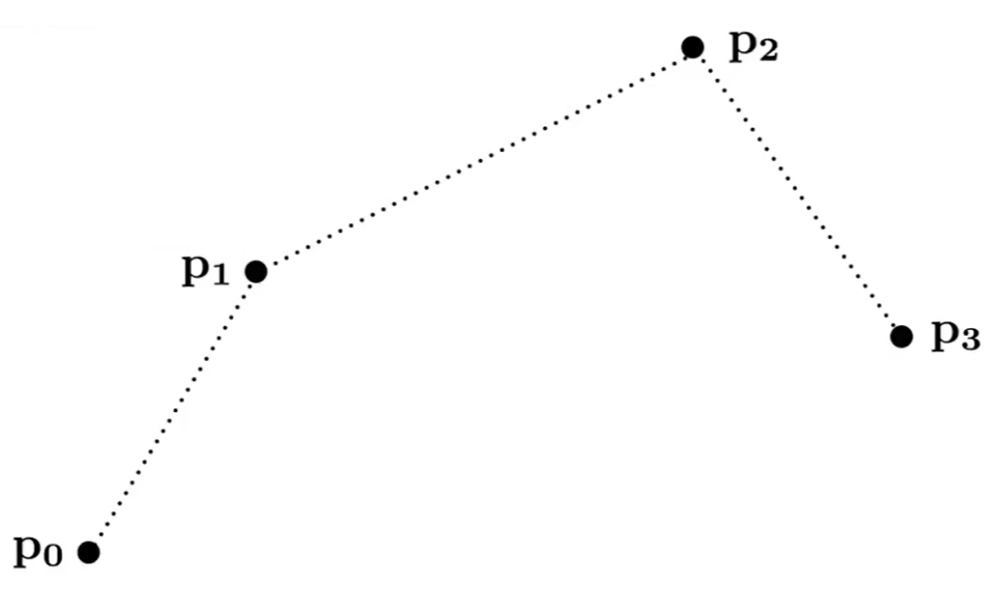
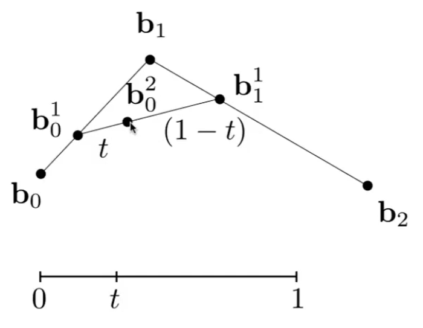
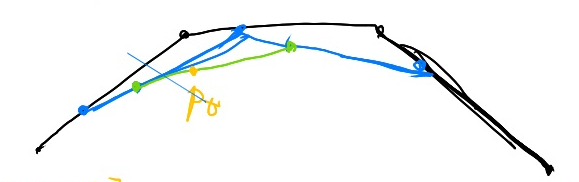
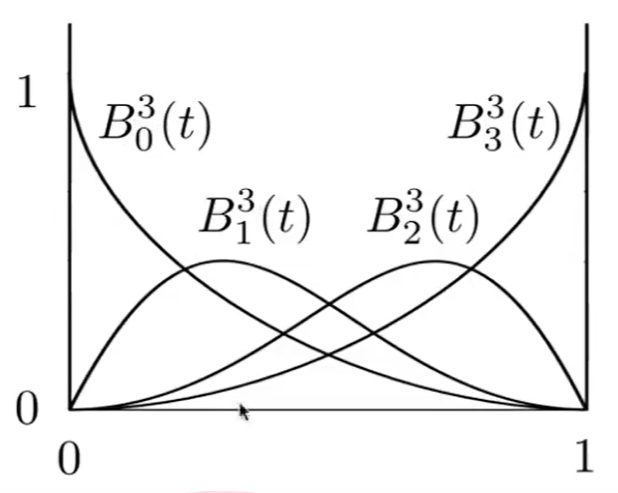
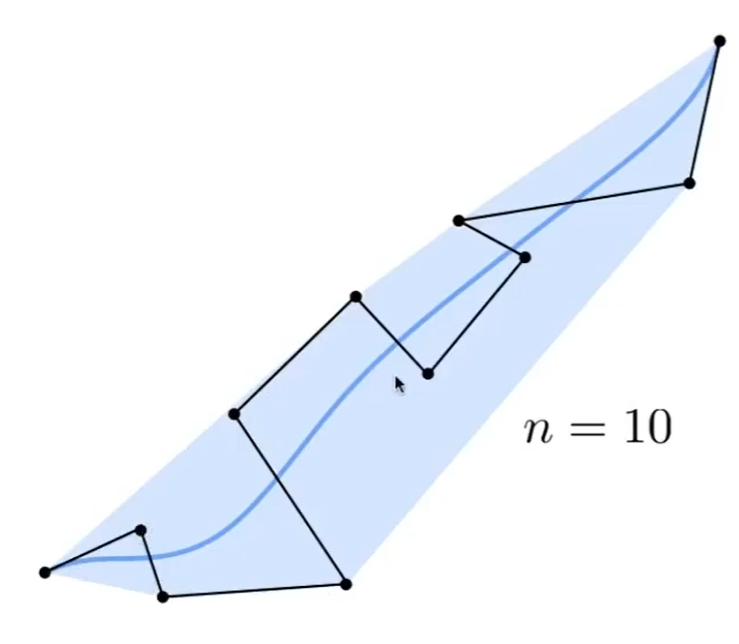
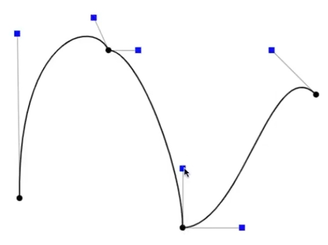
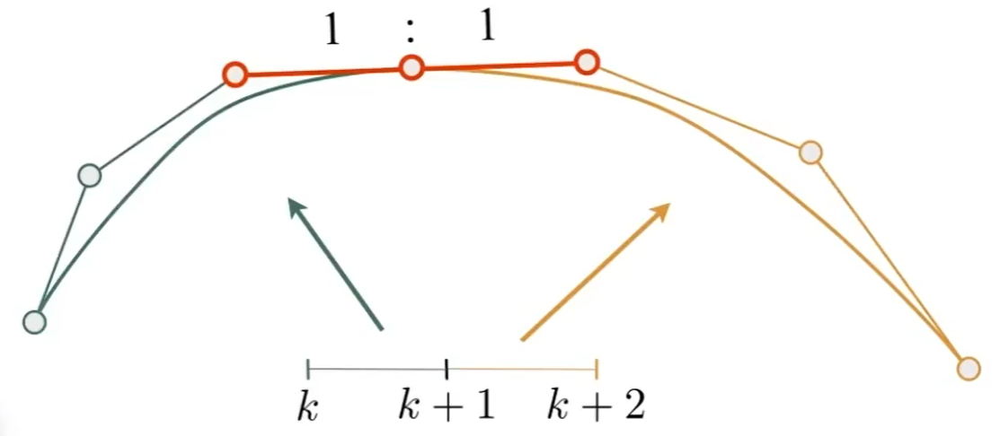

# Bezier曲线（显示表达）

## 定义
[13：24] 用一系列控制点定义曲线

例如定义这样一组控制点：  
  
要求所生成的曲线满足这样的性质：  
- 起始点同p0位置
- 起点处的切线方向同\\(\vec{p_0p_1}\\)
- 终点同为p3位置
- 终点处的切线方向同\\(\vec{p_2p_3}\\)

## de Casteliau算法

根据给定点序列画Bezier曲线

### 给定3个点，画Bezier曲线

把起点看作是t=0时刻，终点看作是t=1时刻，画Bezier曲线，相当于求t=[0,1]区间时pt所在的位置。把范围所有时刻的pt连起来就是Bezier曲线。

1. 算出b0b1中的t位置的点为\\(b^1_0\\)  
2. 算出b1b2中的t位置的点为\\(b^1_1\\)  
3. ab连成一条线，算是ab中的t位置的点为\\(b^2_0\\)  
4. \\(b^2_0\\)是 Pt 的位置，

### 给定4个点，画Bezier曲线

[23:24]

## Bezier曲线的代数表示

推导过程省略，最后的结论是：

$$
b^n(t) = b_0^n(t) = \sum^n_{j=0} b_j B^n_j(t)
$$

- \\(b^n(t)\\) 表示最终结果，在Bezier曲线上t时刻的点的位置。  
- \\(b_0^n(t)\\)的上标n表示这个点在第n层线段上的点。初始控制点组成的线段为第0层。第n层为最后一层。下标0代表这一层的第0个线段。由于第n层只有一个线段，因此下标只能是0。\\(b_0^n(t)\\)是第n层的线段上的t时刻的点，其实就是对应最终结果了。   
- \\(b_j\\) 是初始控制点，也可以表示为\\(b_0^n(0)\\)及\\(b_0^n(1)\\)，其实是第0层的上一层。  
- 从公式可以看出，\\(b^n(t)\\) 是一组控制点的线性组合，组合的系数是B，即与t有关的多项式

> &#x2705; 以上公式对3D控制点同样适用

### Berstein多项式

$$
B^n_j(t) = \begin{pmatrix}n \\
 j \end{pmatrix} t^j(1-t)^{n-j}
$$

## 性质

1. 在给4个控制点的情况下，b(0)的切线方向为3(b_1 - b_0)，b(1)的切线方向为3(b_3 - b_2)。

> &#x2753; 问：为什么会有系数3？既然是方向，3(b_1 - b_0)和(b_1 - b_0)都是同一个方向。  
> 答：（来自弹幕）切线也是有值的，值越大原来曲线变得越快。  

2. 用控制点画出曲线，再把曲线做仿射变换 = 对控制点做仿射变换，用变换后的点画曲线

3. 画出的曲线，一定在控制点形成的凸包内。  

# Piece-wise Bezier曲线

- Why

  

[38:23] 当控制点比较多时，Bezier曲线不利于控制

- How

把多个点分段，每4个点画一条曲线，例如photoshop中的钢笔功能。  

- What

  

## 光滑的Piece-wise Bezier曲线

C0连续：数值上连续

C1连续：切线连续（**方向和大小都要一致**），即光滑

C2连续：曲率连续

要使分段的Bezier曲线光滑（C1连续），需要让上一段的终点和下一段的起点切线一致。这可以通过控制点的位置来实现。   

  

# Splint 样条

定义： 一条曲线，由一系列控制点来控制，且满足一定的连续性

## B-spines

B: basis，基函数，即与以一定方式将基函数组合，得到一个复杂函数

局部性：移到一个控制点，只在一定范围内影响这个曲线

（这个内容比较复杂，本课不展开了

----------------------------

> 本文出自CaterpillarStudyGroup，转载请注明出处。  
> https://caterpillarstudygroup.github.io/GAMES101_mdbook/
