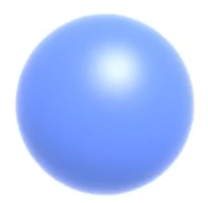

# 几何的表达方式

几何的表达方式分为隐式表达和显式表达。  

隐式表达[46:35]是指，不提供点的具体位置，只提供点应满足的约束f(x,y,z)=0。  
隐式表达可以快速判断一个点在不在物体表面上。但是难以列举所有在表面上的点。  

显式表达有两种方式：  
1. 直接给出所有点的具体位置
2. 给出一些点，以及这些点到另一些点的映射关系，例如\\(f:R^2 \rightarrow R^3\\)
显式表达可以快速地列出所有在表面上的点，但难以判断一个点在不在表面上。  

实际场景中，会根据需要使用不同的表达方式

# 隐式表达举例

【P10，1:02:05】

|类型|举例|表达方式|
|---|---|---|
|Algebraic Surface|| \\(x^2 + y^2 + z^2 = 1\\)|
|Constructive solid Geometry|| 通过基本几何之间的运算来定义新的几何 |
|Distinct Function| [1:01:23]|定将一个函数，来描述任意一个点到物体表面的最近的距离。可对距离函数做blending|
|level Set Method| [1:10:22]||
|Fractals 分形 |[1：12：44]|

优点：  
- 容易描述
- compact 表达
- 容易计算离表面的距离
- 容易计算光线与表面的夹角
缺点：
- 难以描述复杂对象

# 显式几何

## 点云 point cloud

list of points

可以表示任意的几何形状

常用于扫描输出

常被转换为其它方式的使用

## Polygon Mesh

应用最广泛。

以三角形、四边形为主

**obj 文件格式**：
- v：顶点坐标
- vn:顶点法向量，数量同v
- vt：纹理坐标，最多为（顶点数 * 面片数）个

----------------------------

> 本文出自CaterpillarStudyGroup，转载请注明出处。  
> https://caterpillarstudygroup.github.io/GAMES101_mdbook/
