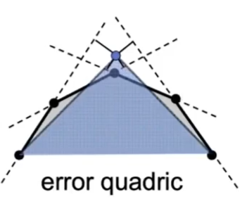
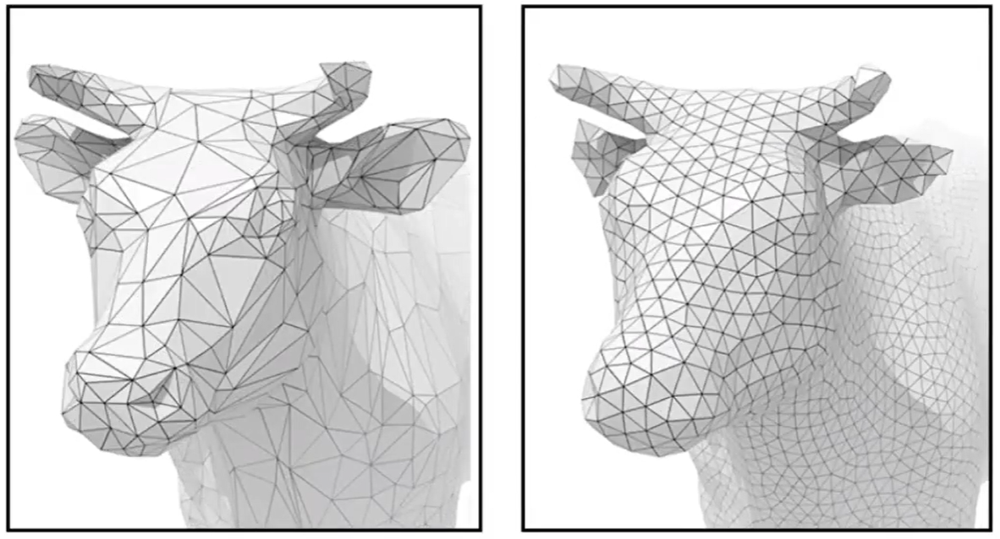

# Mesh 简化

### 衡量坍缩后的形状与坍缩前的接近程度

**Quadris Error Matrics 二次误差度量**

二次误差度量用于衡量“坍缩后的形状与坍缩前的接近程度”，使算法可以基于此标准选择要坍缩的边及确定坍缩点的位置。

二次误差来度量[41：17]  = new point 到 old edge（或old face） 的距离平方和。  

> &#x2753; 为什么以这种方式定义距离。不太直观。  
> &#x2705; 这种度量也是local度量，大部分情况下local就够用了。  
 
### 确定坍缩点的位置

例子：  

坍缩点的位置应该在使二次度量误差最小的地方。  

找到坍缩点转化为一个优化问题。

### 选择要坍缩的边
  
把所有边都尝试坍缩，评估一下每条边如果要做坍缩并选择了最好的坍缩点位置，会得到多少误差。最后选择造成误差最少的边。

即：遍历-计算-排序-选择-坍缩

每次选择当前最优，这是贪心的思想。不一定最终是最优，但是至少效果可用。

- 存在的问题：

计算一条边的坍缩点及坍缩误差是一个优化问题，用迭代法来解。因此“遍历-计算”是一个比较耗时的过程。  
尤其是使用“遍历-计算-排序-选择-坍缩”的过程坍缩了一条边之后，坍缩过程对被坍缩的边周围的边造成影响，上一轮的“遍历-计算”的结果已经不适用了，不能直接基于此结果做排序和选择。

- 解决方法：

优先队列。动态更新受影响的边。

预处理：遍历-计算-生成队列  
循环：取队列top - 坍缩 - 部分点重新计算 - 更新队列部分点

> &#x1F4A1; 计算出new point的位置后可以再调整一下old point的位置。  

# 网格 Regularization

----------------------------

> 本文出自CaterpillarStudyGroup，转载请注明出处。  
> https://caterpillarstudygroup.github.io/GAMES101_mdbook/