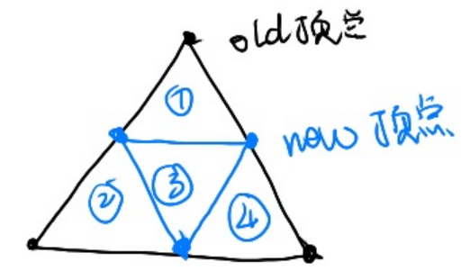
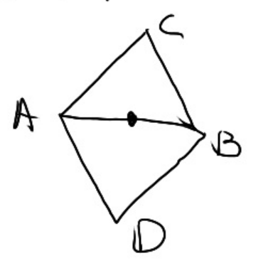
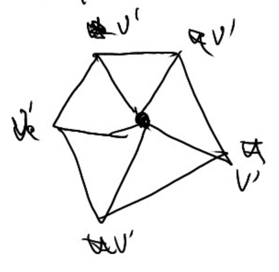
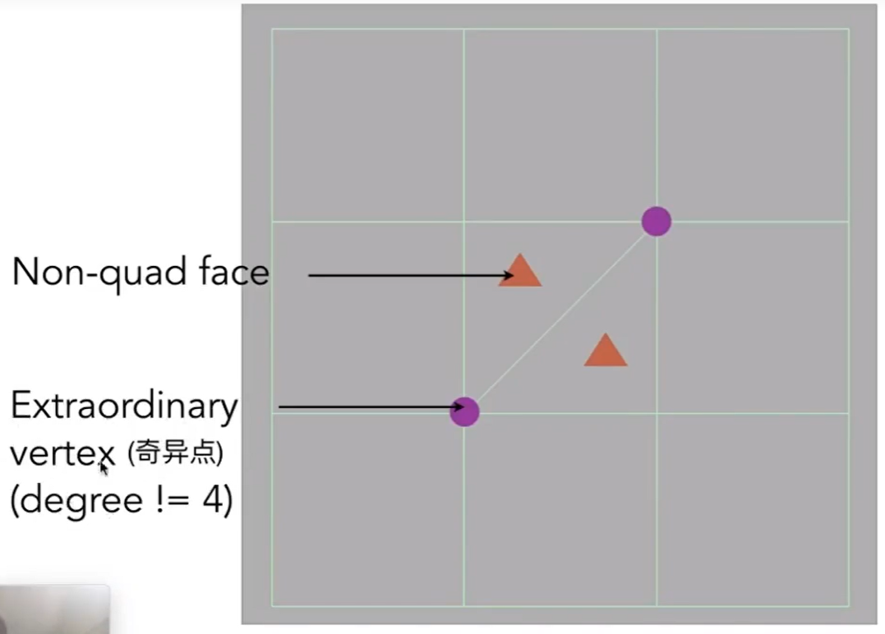
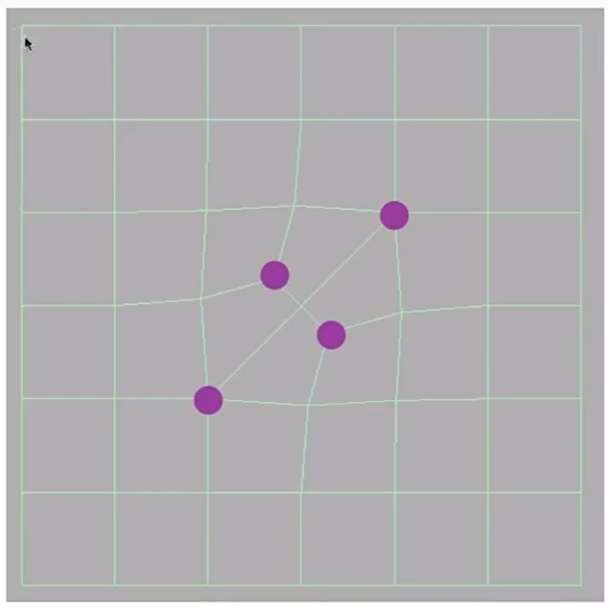
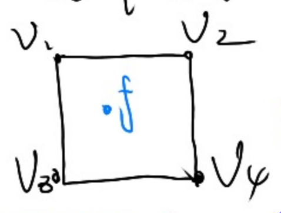
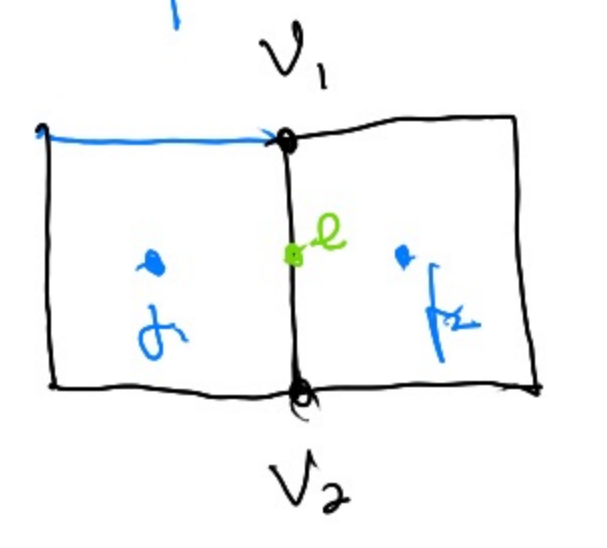
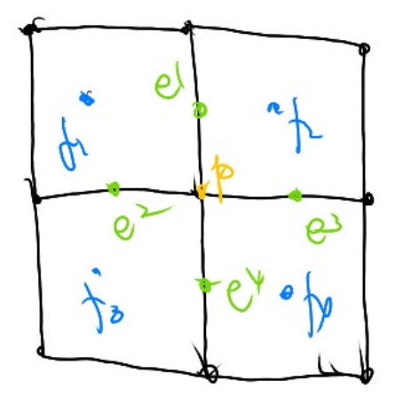
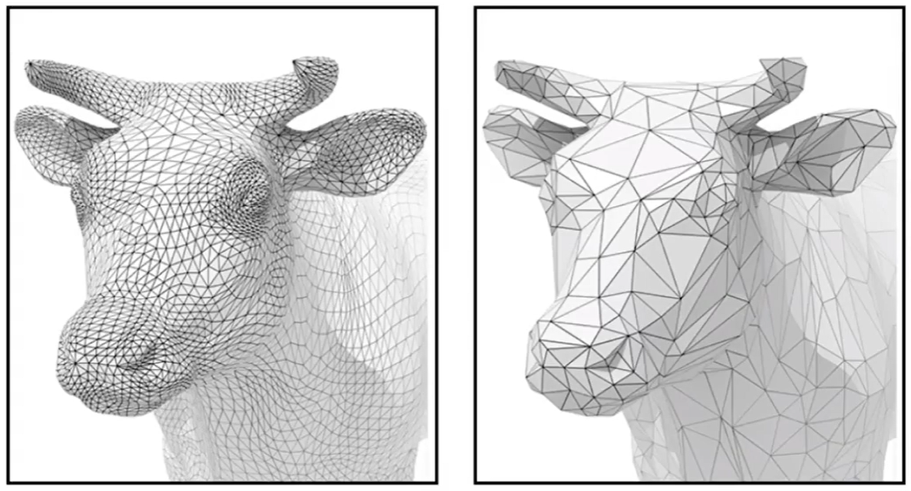
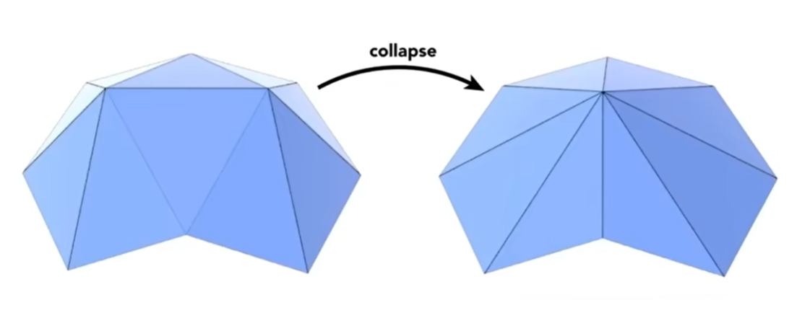

# Basic

通过定义点的位置和点之间的连续关系，来描述一个曲面。

在mesh上的操作有：  
- 网速细分：引入更多三角形，并调整顶点坐标。使表面更光滑
- 网格简化：在保持基本形状的情况下，用更少的三角形  
- 网格 Regularization：使网格更接近正三角形，这样对渲染更友好

# 网格细分 [09：26]

目的：引入更多三角形，并调整顶点坐标。使表面更光滑

基本方法都是通过平均的方式让平面的局部得到平滑，类似图像的模糊操作。

## Loop 细分算法

[11:30] (*loop 是人名，不代表循环*）

### 第一步： 划分三角形

### 第二步：更新new顶点的位置

new顶点被两个old三角形共享，更新公式为：

\\[
p = \frac{3}{8}(A+B) + frac{1}{8}(C+D)
\\]

### 第三步：更新old顶点的位置

old 顶贞被多个 old 三角形共享

更新公式为：  

\\[
p = (1 - n * u) * pos + n * neighbor
\\]

n:与old顶点连接的边数

u:一个经验值

pos: old顶点更新前的位置

neighbor: old顶点的所有邻居的位置之和

## Catmull-Clark 细分

loop 细分只能用于三角形面片，而此算法则更通用

### 定义

Quad face：四边形面片

Non-quad face：非四边形面片

奇异点： degree不为4的点，degree 表示与点相邻的边数

### 第一步：取所有边上的中点与面上的中点

把边中点与面中总用一条线连起来  

  

操作后，**增加的**奇异点个数与 操作前的non-quad face 数相同，且所有的面都变为 quad face

   

### 第二步： 更新面中心的新增点，

更新公式为：

\\[
f = \frac{v_1 + v_2 + v_3 + v_4}{4}
\\]

> &#x2753; 如果是在一个三角形面片的中心呢？
 
### 第三步： 更新边中心的新增点

更新公式为：

\\[
e = \frac{v_1 + v_2 + f_1 + f_2}{4}
\\]

### 更新 old 顶点

更新公式为：

\\[
p' = \frac{f_1 + f_2 + f_3 + f_4 + 2(e_1 + e_2 + e_3 + e_4) + 4p}{16}
\\]

# Mesh 简化

1. 由于计算能力不足，需要简化模型
2. 有些场景中，不需要足够精细的模型

## 边坍缩 Edge Collapse

- 原理：
1. 选择一条边，把边坍缩成点
2. 建立边周围的点到新点之间的边
3. 使坍缩后的形状与坍缩前尽量接近

- 要解决的问题：
1. 要坍缩哪些边？
2. 边坍缩成点以后，这个点应该放在什么位置？
3. 怎么衡量坍缩后的形状与坍缩前的接近程度？

### 衡量坍缩后的形状与坍缩前的接近程度

**Quadris Error Matrics 二次误差度量**

二次误差度量用于衡量“坍缩后的形状与坍缩前的接近程度”，使算法可以基于此标准选择要坍缩的边及确定坍缩点的位置。

二次误差来度量[41：17]  = new point 到 old edge（或old face） 的距离平方和。  

> &#x2753; 为什么以这种方式定义距离。不太直观。

### 确定坍缩点的位置

例子：  

坍缩点的位置应该在使二次度量误差最小的地方。  

找到坍缩点转化为一个优化问题。

### 选择要坍缩的边
  
把所有边都尝试坍缩，评估一下每条边如果要做坍缩并选择了最好的坍缩点位置，会得到多少误差。最后选择造成误差最少的边。

即：遍历-计算-排序-选择-坍缩

每次选择当前最优，这是贪心的思想。不一定最终是最优，但是至少效果可用。

- 存在的问题：

计算一条边的坍缩点及坍缩误差是一个优化问题，用迭代法来解。因此“遍历-计算”是一个比较耗时的过程。  
尤其是使用“遍历-计算-排序-选择-坍缩”的过程坍缩了一条边之后，坍缩过程对被坍缩的边周围的边造成影响，上一轮的“遍历-计算”的结果已经不适用了，不能直接基于此结果做排序和选择。

- 解决方法：

优先队列。动态更新受影响的边。

预处理：遍历-计算-生成队列  
循环：取队列top - 坍缩 - 部分点重新计算 - 更新队列部分点

# 网格 Regularization

----------------------------

> 本文出自CaterpillarStudyGroup，转载请注明出处。  
> https://caterpillarstudygroup.github.io/GAMES101_mdbook/