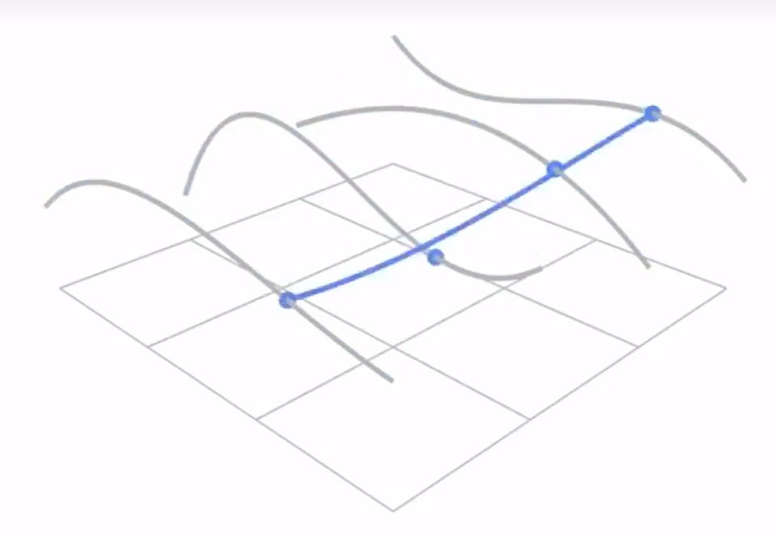

# Bezier 曲面[54：40]

在两个方向上分别应用插值

以4*4个控制点为例

1. 在水平方向上计算得到4个曲线
2. 以曲线上的点作为竖直方向的控制点，再算一次曲线

  

----------------------------

> 本文出自CaterpillarStudyGroup，转载请注明出处。  
> https://caterpillarstudygroup.github.io/GAMES101_mdbook/
