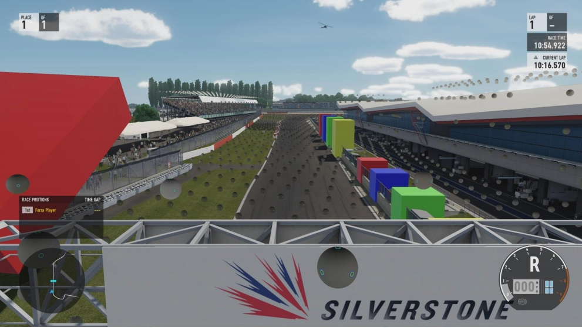
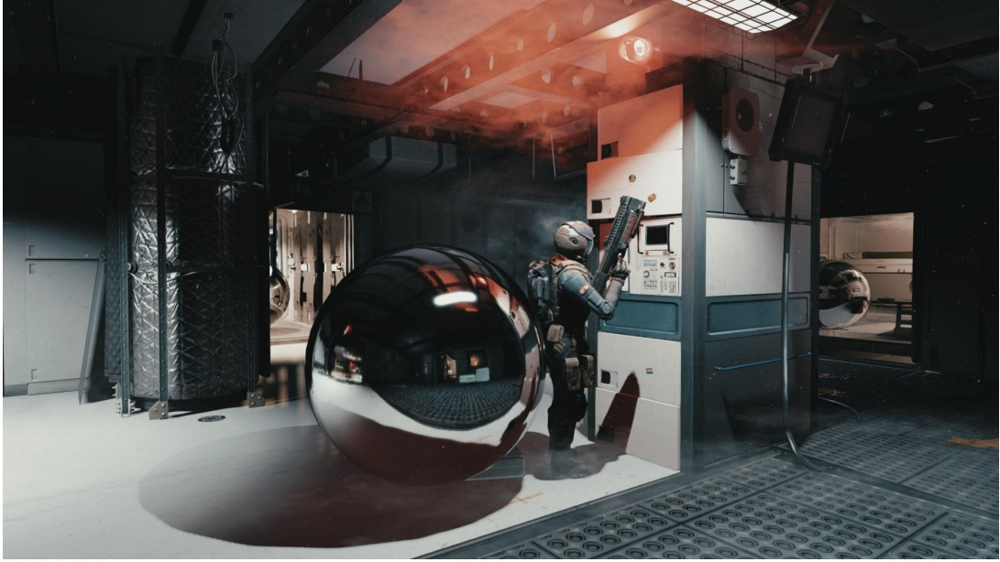

P43   
### Light Probe

   

P45    
### Reflection Probe

   

> Reflection Probe 的特点：    
(1) 数量少    
(2) 精度高，因为高光对高频很敏感。    

P46   
### Light Probes + Reflection Probes

- **Pros**   
  - Very efficient on runtime   
  - Can be applied to both **static and dynamic objects**   
  - Handle both diffuse and specular shading      

- **Cons**   
  - A bunch of SH light probes need some precomputation   
  - Can not handle fine detail of GI. I.e, soft shadow on overlapped structures   
