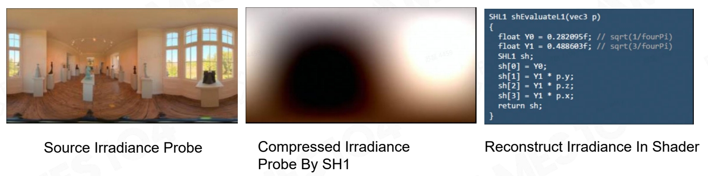

# Background

## Why Global Illumination is Important

   

> ambient 可以做间接光照效果，但会使整个场景统一变亮。看上去会有平面感。因此真实计算间接光照，而不是用一个简单的常数值。  

P26    
## Why Pre-computed Global Illumination    

> 假设场景中90%的东西是不动的，大量数据预计算，空间换时间。    

## 预计算GI的关键问题
  
> 预计算的GI，是对一个球面空间的采样。   

How to Represent Input Indirect Light
   
(1) GI的数据量非常大。     
使用几个[球谐基](https://caterpillarstudygroup.github.io/mathematics_basic_for_ML/Geometry/SphericalHarmonics.html)系数，可以把球面的光照信号大致表达出来。   
由于 GI 只需要表达低频，使用到 1 阶就足够了。这样就用极少的数据表达出了一整张图像的大致样子。    

(2) 如何让材质与GI做积分。   
频域上的一次卷积相当于对图像域上每个像素做加权平均    

&#x1F50E;[傅利叶变换](../Rasterization/TimeVsFrequency.md)

# Pipeline

P34   
## Sampling Irradiance Probe Anywhere

> 在任何一个点取 Irradiance Probe 信息，展开为下图    

  

P35   
## Compress Irradiance Probe to SH1

      

> 用 1 阶球谐基(对应 4 个系数)压缩后还原得到图 2。     
图 2 足以表达光的明暗，且数据非常连续。    
通一个简单的线性运算，就可以从图中查询出任意一个方     

P37   
