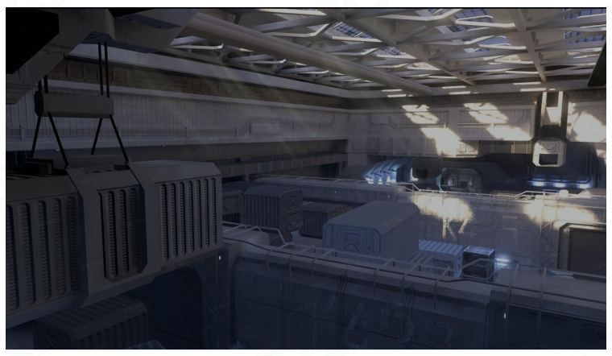

# SH Lightmap: Precomputed GI

## Parameterized all scene into huge 2D lightmap atlas    

   

**Lightmap density**   
- Low-poly proxy geometry   
- Fewer UV charts/islands   
- Fewer lightmap texels are wasted   

## Using offline lighting farm to calculate irradiance probes for all surface points  

**Indirect lighting, final geometry**   
- Project lightmap from proxies to all LODs   
- Apply mesh details
- Add short-range, high￾frequency lighting detail by HBAO   

### Lightmap: Lighting + Direct Lighting

**Direct + indirect lighting,final geometry**    
- Compute direct lighting dynamically 

## Compress those irradiance probes into SH coefficients    
## Store SH coefficients into 2D atlas lightmap textures   

P41   
## Final Shading with Materials

**Final frame**    
- Combined with materials   

P42   
# Lightmap 总结

- **Pros**   
  - Very efficient on runtime   
  - Bake a lot of fine details of GI on environment   
- **Cons**   
  - Long and expensive precomputation (lightmap farm)   
  - Only can handle **static scene and static light**   
  - Storage cost on package and GPU   

P43   
### Light Probe: Probes in Game Space

   

P45    
### Reflection Probe

   

> Reflection Probe 的特点：    
(1) 数量少    
(2) 精度高，因为高光对高频很敏感。    

P46   
### Light Probes + Reflection Probes

- **Pros**   
  - Very efficient on runtime   
  - Can be applied to both **static and dynamic objects**   
  - Handle both diffuse and specular shading      

- **Cons**   
  - A bunch of SH light probes need some precomputation   
  - Can not handle fine detail of GI. I.e, soft shadow on overlapped structures   
