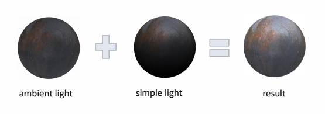

# Simple Light Solution

假设简单场景，只有一个主光源    

## 直接光照

由于直接一个光源，可以直接计算直接光照。  
可以直接入射光方向与物体表面法向方向决定是否表现是高光效果。

## 间接光照   

自定义一个常数环境光ambient    

     

### 常数环境光存在的问题

> ambient 可以做间接光照效果，但会使整个场景统一变亮。看上去会有平面感。    

   
 
## 光在材质上的效果

### Environment Map Reflection

> 增加物体反射光线的效果。   

     

**Early stage exploration of image- based lighting**      

方法：六面体环境贴图 cudemap    

## 总结

> 本质上，把一个半球形的光场模拟为均匀的环境光。环境光中高频内容用 envirnment map 表达。 

---------------------------------------

> 本文出自CaterpillarStudyGroup，转载请注明出处。  
> https://caterpillarstudygroup.github.io/GAMES101_mdbook/