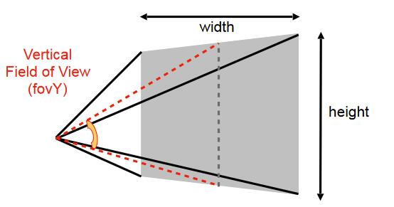
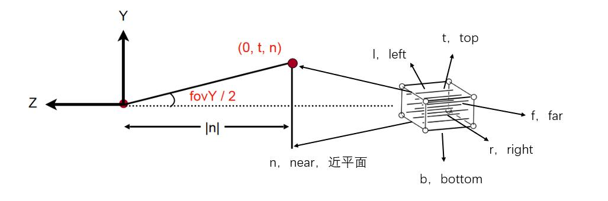

# 根据Fov定义cubic、Frustum

> **&#x1F4CC;补充：** 定义一个视锥，只需要视角和宽高比即可，其他参数可以转换。

1. 描述立方体的符号：l，r，u，d，f，n

2. 描述屏幕的符号：

- 宽高比（Aspect ratio）
- width/height
- 视角（Field of view）

3. 用符号描述屏幕和立方体的关系

把视角和宽高比转换为l、r、b、t

由图可得以下关系：

\\[
\tan \frac{fovY}{2}=\frac{t}{|n|}
\\]

\\[
aspect=\frac{r}{t}
\\]

------------------------------

> 本文出自CaterpillarStudyGroup，转载请注明出处。  
> https://caterpillarstudygroup.github.io/GAMES101_mdbook/