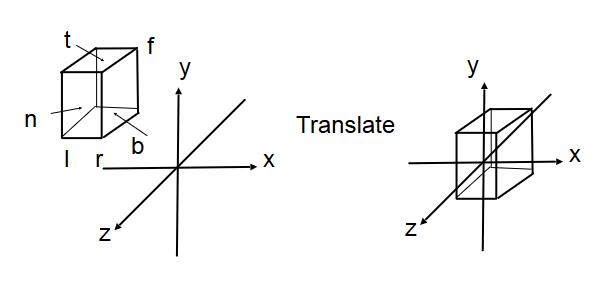

# 正交投影 

## 准备工作

把相机 view 变换为期望 view（转换到原点），方法是让相机参数乘以一个矩阵。

为了保持camera和object的相对位置不变，object也要同样乘以这样一个矩阵。  

这样调整之后，object位于z轴负方向上的某个位置。

[参见view](View.md)

## 正交投影的主要过程

$$
M_{ortho} = M_{scale} \cdot M_{trans}
$$

> &#x1F4A1; PPT 介绍了正交投影的一种简单理解的方式，让人能够直观地理解正交投影的结果，却也引入的歧义。让人误以为正交投影就是这么简单的过程。以至于后面讲正交投影的完整过程时听众会觉得confuse，为什么会有两个不一样的正交投影流程？因此在本文是中去掉了第一种理解方式。  

## 正交投影中的平移

|    |当前位置|期望位置|
| --- | ------- | ------ |
|左右|[l,r]|[-(r-l)/2, (r-l)/2]|
|上下|[b,t]|[-(t-b)/2, (t-b)/2]|
|远近|[f,n]|[-(n-f)/2, (n-f)/2]|

> **&#x1F4CC;补充：** 由于投影的设定，l在坐标值上，小于r；b小于t，f小于n（因为朝向-Z轴）

正交投影的平移矩阵为：

\\[
M_{trans}=\left[ \begin{matrix}
    1&        0&        0&        -\frac{r+l}{2}\\\\
    0&        1&        0&        -\frac{t+b}{2}\\\\
    0&        0&        1&        -\frac{n+f}{2}\\\\
    0&        0&        0&        1\\\\
\end{matrix} \right] 
\\]

## 正交投影中的缩放

与平移同理。

正交投影的缩放矩阵为：

\\[
M_{scale}=\left[ \begin{matrix}
    \frac{2}{r-l}&        0&        0&        0\\\\
    0&        \frac{2}{t-b}&        0&        0\\\\
    0&        0&        \frac{2}{n-f}&        0\\\\
    0&        0&        0&        1\\\\
\end{matrix} \right]
\\]

## 正交投影中的旋转

正交投影过程不涉及object的旋转，因此旋转矩阵\\(M_{rotation}\\)是单位阵。  

此处变换顺序为：先平移再缩放无旋转，因此  

$$
M = M_{scale} \dot M_{trans}
$$

------------------------------

> 本文出自CaterpillarStudyGroup，转载请注明出处。  
> https://caterpillarstudygroup.github.io/GAMES101_mdbook/