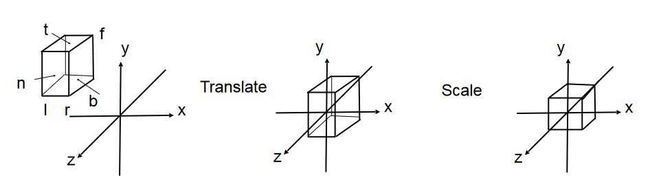

# Projection hangman 投影变换 [39.00]

- 投影： 3D --> 2D
  
  正交投影:（左），用于工程制图
  
  透视投影：（右），类似于人眼
  
  

- 数学上的区别:
  
  正交投影: 相机是近处的一个点
  
  透视投影: 相机位于无限远处

## 正交投影 [43：00]

### 投影的一种计算过程：

1. 把相机 view 变换为期望 view（转换到原点）
   
   object 需要乘以一个矩阵来做到
   
   [参见view](View.md)

2. 把 object 的Z轴坐标去掉
   
   3D信息变成了2D信息。

3. 变换和缩放使得object范围为[-1， 1]
   
   业界惯例

### 用更专业的方法来描述

长方体：

- [l, r] 左右
- [b, t] 上下
- [f, n] 远近

将该长方体直接转换成\\([-1, 1]^3\\)这样的立方体，先移动，后缩放。

> **&#x1F4CC;补充：** 由于投影的设定，l在坐标值上，小于r；b小于t，f小于n（因为朝向-Z轴）

正交投影的Transformation matrix：

\\[
M_{ortho}=\left[ \begin{matrix}
    \frac{2}{r-l}&        0&        0&        0\\\\
    0&        \frac{2}{t-b}&        0&        0\\\\
    0&        0&        \frac{2}{n-f}&        0\\\\
    0&        0&        0&        1\\\\
\end{matrix} \right] \left[ \begin{matrix}
    1&        0&        0&        -\frac{r+l}{2}\\\\
    0&        1&        0&        -\frac{t+b}{2}\\\\
    0&        0&        1&        -\frac{n+f}{2}\\\\
    0&        0&        0&        1\\\\
\end{matrix} \right] 
\\]

## 透视投影 [53:10]

在推导透视投影之前，先说一个齐次坐标的性质：

- 有 \\((x, y, z, 1)\\) 这样一个坐标，那么为该坐标乘以一个不为0的数 \\(k\\)，即 \\((kx, ky, kz, k)\\)，结果不变。 同理，给该坐标乘以坐标本身的 \\(z\\) 值，它仍然表示着3D中的相同点。
  例如： \\((1, 0, 0, 1)\\) 和 \\((2, 0, 0, 2)\\) 都表示 \\((1, 0, 0)\\) 

透视投影的过程是将Frustum（截锥体）转换为Cuboid（长方体），然后再把长方体正交投影：

考虑如何将Frustum转换为Cuboid呢？

1. Frustum的n（近处）面，所有坐标是不变化的；f面的Z轴坐标值，也是不变化的；Z轴穿过的中心点的坐标值，是不变化的。
   
   
   
2. 从侧面看，存在相似三角形（图中很容易看出）
   
   

通过相似三角形，可以得到：

\\[
y'=\frac{n}{z}y\\\\
x'=\frac{n}{z}x
\\]

我们的目的是将 \\((x, y, z)\\) 转换为 \\((x', y', z)\\)。

现在可以得到：

\\[
\left( \begin{array}{c}
    x\\\\
    y\\\\
    z\\\\
    1\\\\
\end{array} \right) \Rightarrow \left( \begin{array}{c}
    nx/z\\\\
    ny/z\\\\
    unknown\\\\
    1\\\\
\end{array} \right) 
\\]

为坐标乘以 \\(z\\)，得：

\\[
\left( \begin{array}{c}
    x\\\\
    y\\\\
    z\\\\
    1\\\\
\end{array} \right) \Rightarrow \left( \begin{array}{c}
    nx/z\\\\
    ny/z\\\\
    unknown\\\\
    1\\\\
\end{array} \right) ==\left( \begin{array}{c}
    nx\\\\
    ny\\\\
    still\,\,unknown\\\\
    z\\\\
\end{array} \right) 
\\]

想要将 \\(\left( \begin{array}{c}
    x\\\\
    y\\\\
    z\\\\
    1\\\\
\end{array} \right)\\) 投影为 \\(\left( \begin{array}{c}
    nx\\\\
    ny\\\\
    unknown\\\\
    z\\\\
\end{array} \right) \\)，需要求一个投影矩阵：

\\[
M_{persp\rightarrow ortho}^{\left( 4\times 4 \right)}\left( \begin{array}{c}
    x\\\\
    y\\\\
    z\\\\
    1\\\\
\end{array} \right) =\left( \begin{array}{c}
    nx\\\\
    ny\\\\
    unknown\\\\
    z\\\\
\end{array} \right) 
\\]

我们已经知道一些数据了，所以能求出M的一些值（显然，由上式可得）：

\\[
M_{persp\rightarrow ortho}^{\left( 4\times 4 \right)}=\left( \begin{matrix}
    n&        0&        0&        0\\\\
    0&        n&        0&        0\\\\
    ?&        ?&        ?&        ?\\\\
    0&        0&        1&        0\\\\
\end{matrix} \right) 
\\]

M已经被解决不少了，但还差一些，不过，我们还有一些坐标点不变的性质可以使用：

n面，所有坐标点不变，那么取一个n面上随便一点，该点的Z轴坐标值为n，即：

\\[
\left( \begin{array}{c}
    x\\\\
    y\\\\
    n\\\\
    1\\\\
\end{array} \right)
\\]

为坐标乘以n：

\\[
\left( \begin{array}{c}
    nx\\\\
    ny\\\\
    n^2\\\\
    n\\\\
\end{array} \right)
\\]

既然这一点在投影前后不会变化，我们可以列出下面的式子：

\\[
\left( \begin{array}{c}
    nx\\\\
    ny\\\\
    n^2\\\\
    n\\\\
\end{array} \right) =\left( \begin{matrix}
    n&        0&        0&        0\\\\
    0&        n&        0&        0\\\\
    ?&        ?&        ?&        ?\\\\
    0&        0&        1&        0\\\\
\end{matrix} \right) \left( \begin{array}{c}
    x\\\\
    y\\\\
    n\\\\
    1\\\\
\end{array} \right) 
\\]

上式其实只剩下下面这个式子要求：

\\[
n^2=\left( ?\,  ?\,  ?\,  ? \right) \left( \begin{array}{c}
    x\\\\
    y\\\\
    n\\\\
    1\\\\
\end{array} \right) 
\\]

具体来说，是这样的：

\\[
n^2=\left( 0\,  0\,  A\,  B \right) \left( \begin{array}{c}
    x\\\\
    y\\\\
    n\\\\
    1\\\\
\end{array} \right) 
\\]

于是可以得到：

\\[
An+B=n^2
\\]

同理，在f面上，所有点的Z轴坐标值不变，可以得到：

\\[
Af+B=f^2
\\]

联立上述AB方程，解得：

\\[
A=n+f\\\\
B=-nf
\\]

所以我们推导出了透视投影的一个变换矩阵：

\\[
M_{persp\rightarrow ortho}^{\left( 4\times 4 \right)}=\left( \begin{matrix}
    n&        0&        0&        0\\\\
    0&        n&        0&        0\\\\
    0&        0&        n+f&        -nf\\\\
    0&        0&        1&        0\\\\
\end{matrix} \right) 
\\]

透视投影的最终的变换矩阵是 **M = M（正交）M（透视）**

> 本文出自Metaverse Study Group，转载请注明出处。
>
> https://metaversestudygroup.github.io/GAMES101_pages/