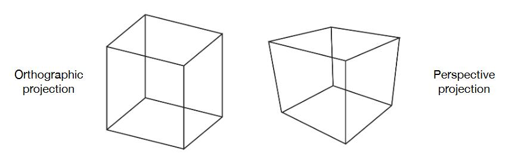
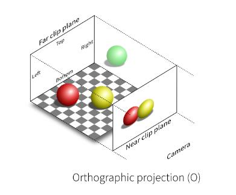
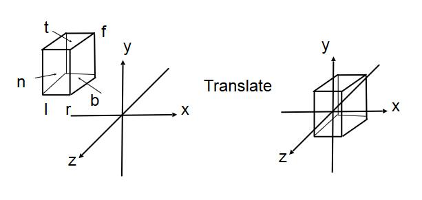
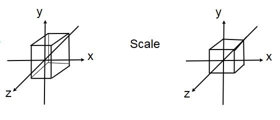
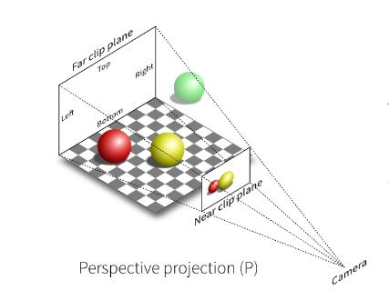
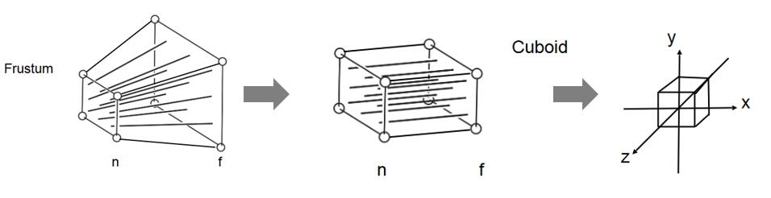
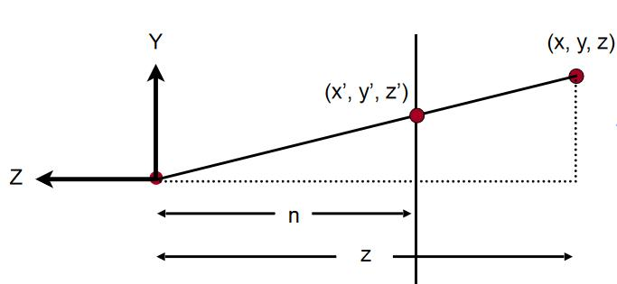
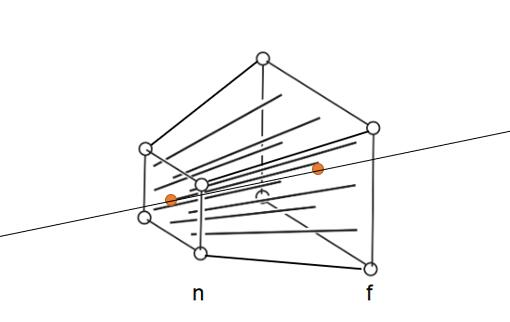

# Projection 投影变换 

[39：00]目的：物体处于坐标中心的\\([-1, 1]^3\\)这个立方体中。

## 正交投影vs透视投影
- 投影： 3D --> 2D
  
  正交投影:（左），用于工程制图
  
  透视投影：（右），呈现出近大远小的效果，类似于人眼
  
  

- 数学上的区别:
  
  正交投影: 认为相机是近处的一个点
  
  透视投影: 认为相机位于无限远处

# 正交投影 

[43：00]

## 准备工作

把相机 view 变换为期望 view（转换到原点），方法是让相机参数乘以一个矩阵。

为了保持camera和object的相对位置不变，object也要同样乘以这样一个矩阵。  

这样调整之后，在Projection阶段，只需要使用object调整之后的坐标，所以实际上只需要让object调整就可以。

[参见view](View.md)

## 正交投影中的平移

|    |当前位置|期望位置|
| --- | ------- | ------ |
|左右|[l,r]|[-(r-l)/2, (r-l)/2]|
|上下|[b,t]|[-(t-b)/2, (t-b)/2]|
|远近|[f,n]|[-(n-f)/2, (n-f)/2]|

> **&#x1F4CC;补充：** 由于投影的设定，l在坐标值上，小于r；b小于t，f小于n（因为朝向-Z轴）

正交投影的平移矩阵为：

\\[
M_{trans}=\left[ \begin{matrix}
    1&        0&        0&        -\frac{r+l}{2}\\\\
    0&        1&        0&        -\frac{t+b}{2}\\\\
    0&        0&        1&        -\frac{n+f}{2}\\\\
    0&        0&        0&        1\\\\
\end{matrix} \right] 
\\]

## 正交投影中的缩放

与平移同理。

正交投影的缩放矩阵为：

\\[
M_{scale}=\left[ \begin{matrix}
    \frac{2}{r-l}&        0&        0&        0\\\\
    0&        \frac{2}{t-b}&        0&        0\\\\
    0&        0&        \frac{2}{n-f}&        0\\\\
    0&        0&        0&        1\\\\
\end{matrix} \right]
\\]

## 正交投影中的旋转

正交投影过程不涉及object的旋转，因此旋转矩阵\\(\M_{rotation}\)是单位阵。  

# 透视投影 

[53:10]

透视投影的过程是先将Frustum（截锥体）转换为Cuboid（长方体），然后再用上面的方法对长方体做正交投影：

要把Frustum转换为Cubuid是仿射变换的过程，主要方法仍是求出仿射变换的矩阵。  

在正交投影中，是根据正交变换的过程，将仿射变换矩阵分解为S, R, T三个部分，依次计算出S， R, T再将它们合并。

在透视投影中，仍然不涉及旋转，但是平移和缩放的过程是揉合在一起的，难以拆分，因此采用选取特殊点的方式，直接求出投视投影的变换矩阵。

## \\(M_{persp\rightarrow ortho}\\)

### 侧面分析

从侧面看，存在相似三角形（图中很容易看出）
   
   

### 推导

通过相似三角形，可以得到：

\\[
y'=\frac{n}{z}y\\\\
x'=\frac{n}{z}x
\\]

我们的目的是将 \\((x, y, z)\\) 转换为 \\((x', y', z)\\)。

现在可以得到：

\\[
\left( \begin{array}{c}
    x\\\\
    y\\\\
    z\\\\
    1\\\\
\end{array} \right) \Rightarrow \left( \begin{array}{c}
    nx/z\\\\
    ny/z\\\\
    unknown\\\\
    1\\\\
\end{array} \right) 
\\]

为坐标乘以 \\(z\\)，得：

\\[
\left( \begin{array}{c}
    x\\\\
    y\\\\
    z\\\\
    1\\\\
\end{array} \right) \Rightarrow \left( \begin{array}{c}
    nx/z\\\\
    ny/z\\\\
    unknown\\\\
    1\\\\
\end{array} \right) ==\left( \begin{array}{c}
    nx\\\\
    ny\\\\
    still\,\,unknown\\\\
    z\\\\
\end{array} \right) 
\\]

想要将 \\(\left( \begin{array}{c}
    x\\\\
    y\\\\
    z\\\\
    1\\\\
\end{array} \right)\\) 投影为 \\(\left( \begin{array}{c}
    nx\\\\
    ny\\\\
    unknown\\\\
    z\\\\
\end{array} \right) \\)，需要求一个投影矩阵：

\\[
M_{persp\rightarrow ortho}^{\left( 4\times 4 \right)}\left( \begin{array}{c}
    x\\\\
    y\\\\
    z\\\\
    1\\\\
\end{array} \right) =\left( \begin{array}{c}
    nx\\\\
    ny\\\\
    unknown\\\\
    z\\\\
\end{array} \right) 
\\]

我们已经知道一些数据了，所以能求出M的一些值（显然，由上式可得）：

\\[
M_{persp\rightarrow ortho}^{\left( 4\times 4 \right)}=\left( \begin{matrix}
    n&        0&        0&        0\\\\
    0&        n&        0&        0\\\\
    ?&        ?&        ?&        ?\\\\
    0&        0&        1&        0\\\\
\end{matrix} \right) 
\\]

### n面分析和f面分析

- Frustum的n（近处）面，所有坐标是不变化的。

- f面的Z轴坐标值，是不变化的；Z轴穿过的中心点的坐标值，是不变化的。

### 继续推导

M已经被解决不少了，但还差一些，不过，我们还有一些坐标点不变的性质可以使用：

n面，所有坐标点不变，那么取一个n面上随便一点，该点的Z轴坐标值为n，即：

\\[
\left( \begin{array}{c}
    x\\\\
    y\\\\
    n\\\\
    1\\\\
\end{array} \right)
\\]

为坐标乘以n：

\\[
\left( \begin{array}{c}
    nx\\\\
    ny\\\\
    n^2\\\\
    n\\\\
\end{array} \right)
\\]

既然这一点在投影前后不会变化，我们可以列出下面的式子：

\\[
\left( \begin{array}{c}
    nx\\\\
    ny\\\\
    n^2\\\\
    n\\\\
\end{array} \right) =\left( \begin{matrix}
    n&        0&        0&        0\\\\
    0&        n&        0&        0\\\\
    ?&        ?&        ?&        ?\\\\
    0&        0&        1&        0\\\\
\end{matrix} \right) \left( \begin{array}{c}
    x\\\\
    y\\\\
    n\\\\
    1\\\\
\end{array} \right) 
\\]

上式其实只剩下下面这个式子要求：

\\[
n^2=\left( ?\,  ?\,  ?\,  ? \right) \left( \begin{array}{c}
    x\\\\
    y\\\\
    n\\\\
    1\\\\
\end{array} \right) 
\\]

具体来说，是这样的：

\\[
n^2=\left( 0\,  0\,  A\,  B \right) \left( \begin{array}{c}
    x\\\\
    y\\\\
    n\\\\
    1\\\\
\end{array} \right) 
\\]

于是可以得到：

\\[
An+B=n^2
\\]

同理，在f面上，所有点的Z轴坐标值不变，可以得到：

\\[
Af+B=f^2
\\]

联立上述AB方程，解得：

\\[
A=n+f\\\\
B=-nf
\\]

所以我们推导出了透视投影的一个变换矩阵：

\\[
M_{persp\rightarrow ortho}^{\left( 4\times 4 \right)}=\left( \begin{matrix}
    n&        0&        0&        0\\\\
    0&        n&        0&        0\\\\
    0&        0&        n+f&        -nf\\\\
    0&        0&        1&        0\\\\
\end{matrix} \right) 
\\]

## 透视投影矩阵

透视投影的最终的变换矩阵是 **M = M（正交）M（透视）**

# 为什么透视投影会z会后移

## 从数学上

定义z'为变换后的z坐标，那么z' = (n+f)-nf/z

\\[
f = z' - z 
  = (n+f) - nf/z -z
\\]

\\[
zf & = -z^2 + (n+f)z - nf
\\]

zf是一个开口向下的二次曲线。它与x轴的交点在z=n处和z=f处。当z位于(f, n)区间时，zf>0。  

由于f<0且z<0，当z位于(f, n)区间时，f>0，即z'-z>0

z'>z，因此z会变近。

> &#x2753; 这个结论应该不对，哪里错了呢？

## 从直觉上

一开始会觉得有点奇怪，违反直觉。细想之后觉得是很合理。  
因为透视投影要表现出近大远小的效果。近大不止是x轴和y轴的大，z轴上也会大。即同一个物体，如果放得近，它在z轴上会更大点。  
空间上也是如此，透视前的空间，把它以z=0分成前后均匀的两半，近的那一半，在透视后必然要占更大的z轴范围，因此z会往后。

------------------------------

> 本文出自CaterpillarStudyGroup，转载请注明出处。
>
> https://caterpillarstudygroup.github.io/GAMES101_mdbook/
