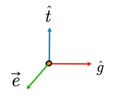

# View Transformation

假设此时：  
- 已经做完model transformation，即物体已经摆好。
- 相机的位置已先好，即相机和物体的相对关系是确定的。
现在要做的是：
- 调整相机的位置，使相机处于指定状态，为了便于后面的计算。
- 同时调整物体，保持相机和物体的相对关系不变。  

## 定义camera的view

||说明|camera当前的view|期望的view|
| --- | ---- | ---- | ---- |
|position|摄像机位置|\\(\vec{e}\\)|原点|
|gaze direction|摄像机朝向|\\(\hat{g}\\)|-Z轴(0,0,-1)|
|up direction|摄像机向上的方向|\\(\hat{t}\\)|Y轴(0,1,0)|

 

我们期望一个摄像机（view）能够有如上参数，这样方便计算，但是真实的camera view不会和我们期望的相同，所以我们需要对camera的上述三个向量做转换，使得view在原点上。

## view的变换

### 平移

平移 \\(\vec{e}\\) 到原点：

需要计算：原点 = \\(T_{view} \cdot \vec{e}\\)

用齐次坐标表达：

\\[
   \left[ \begin{array}{c}
	0\\\\
	0\\\\
	0\\\\
	1\\\\
\end{array} \right] =\left[ \begin{matrix}
	1&		0&		0&		?\\\\
	0&		1&		0&		?\\\\
	0&		0&		1&		?\\\\
	0&		0&		0&		1\\\\
\end{matrix} \right] \left[ \begin{array}{c}
	x_e\\\\
	y_e\\\\
	z_e\\\\
	1\\\\
\end{array} \right] 
\\]

解得：

\\[
T_{view}=\left[ \begin{matrix}
   1&        0&        0&        -x_e\\\\
   0&        1&        0&        -y_e\\\\
   0&        0&        1&        -z_e\\\\
   0&        0&        0&        1\\\\
\end{matrix} \right] 
\\]

### 旋转

旋转\\(\hat{g}\\)和\\(\hat{t}\\)将 \\(\hat{g}\\) 和 \\(\hat{t}\\) 旋转到-Z轴和Y轴，求出旋转矩阵 \\(R\\) 并不容易，但是由-Z轴和Y轴旋转到 \\(\hat{g}\\) 和 \\(\hat{t}\\) 就比较简单了，当我们得到 \\(R^{-1}\\) 后，如何进行逆运算，将 \\(R^{-1}\\) 转换为 \\(R\\) 呢？ 

需要注意，约定的 \\(\hat{g}\\) 和 \\(\hat{t}\\) 是垂直的，那么就满足 \\(R^{-1}=R^{T}\\)，于是有 \\(R=(R^{-1})^{T}\\)。
   
   \\[
   R_{view}^{-1}=\left[ \begin{matrix}
    x_{\hat{g}\times \hat{t}}&        x_t&        x_{-g}&        0\\\\
    y_{\hat{g}\times \hat{t}}&        y_t&        y_{-g}&        0\\\\
    z_{\hat{g}\times \hat{t}}&        z_t&        z_{-g}&        0\\\\
    0&        0&        0&        1\\\\
   \end{matrix} \right] 
   \\]
   
   \\[
   R_{view}^{}=\left[ \begin{matrix}
    x_{\hat{g}\times \hat{t}}&        y_{\hat{g}\times \hat{t}}&        z_{\hat{g}\times \hat{t}}&        0\\\\
    x_t&        y_t&        y_{-g}&        0\\\\
    x_{-g}&        y_{-g}&        z_{-g}&        0\\\\
    0&        0&        0&        1\\\\
   \end{matrix} \right] 
   \\]

### 旋转 + 平移

通过对camera进行旋转和平移，使camera满足指定view旋转与平移结合的方式有两种：

1. 先旋转后平移
2. 先平移后旋转
   
根据常识可知，应该先旋转在平移。

因此有变换矩阵：

\\[
M_{view}^{}=\left[ \begin{matrix}
   x_{\hat{g}\times \hat{t}}&        y_{\hat{g}\times \hat{t}}&        z_{\hat{g}\times \hat{t}}&        -x_e\\\\
   x_t&        y_t&        y_{-g}&        -y_e\\\\
   x_{-g}&        y_{-g}&        z_{-g}&        -z_e\\\\
   0&        0&        0&        1\\\\
\end{matrix} \right] 
\\]

-----------------------------
> 本文出自CaterpillarStudyGroup，转载请注明出处。
>
> https://caterpillarstudygroup.github.io/GAMES101_mdbook/