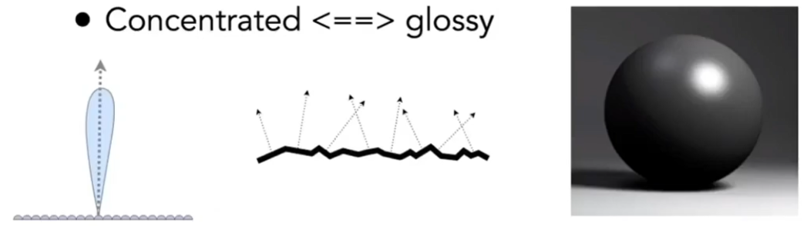
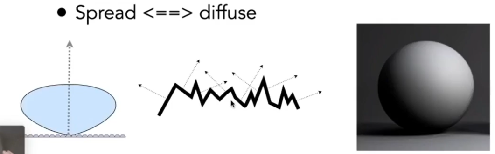
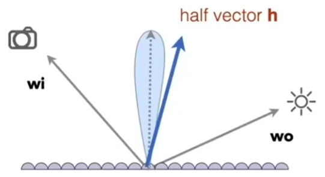

# 微表面模型 Micro facet Material [43：28]

[46：13]。当物体很远很小时，从远处看， 是平面且粗糙的。从近处看，是几何且**镜面反射**。[49：09]。

从微观上看，每个几何表面都有各自的法线方向。但拉远后，这些法线方向就抽象成了**法线方向的分布**。  

> &#x1F4A1; 本身是随机的，适用统计分布。本身是规律的，可以用公式计算规律。也有可能同一件事，从不同角度去看，会得到随机和有规律两种不同的结论。分析出的规律，也有可能最终还是以统计的方式体现。  

微表面的粗糙成度可以用法线分布来表示：

- 当微表面的法线方向比较集中，材质就类似于glossy

- 当微表面的法线方向比较分散，材质就类似于diffuse

考虑这样一个微表面：  

它的BRDF这样定义：

$$
f(i, o) = \frac{F(i, h)G(i, o, h)D(h)}{4(n, i)(n, 0)}
$$

说明：  
i和o：分别代表入射方向和出射方向  
F：Fresnel项  
**G：几何遮挡项，表示微表面的互相遮挡。**发生情况：光线几乎平的打到表面上时。  
D：法线方向的分布。当微表面法线方向h与(i, o)的half vector一致时，入射方向i的光能够反射到出射方向o上。D统计了有多少微表面的法线方向为h。    

> &#x1F4A1; 用物理方法模拟的难点在于如何基于物理去建模。用简体近似的方法模拟，难点在于应对不简化不合理地方出现的失真。用数据模拟，难点在于大量高质量的数据。  
> 光追属于第一种，这里的方法属于第二种，机器学习属于第三种。  

------------------------------

> 本文出自CaterpillarStudyGroup，转载请注明出处。  
> https://caterpillarstudygroup.github.io/GAMES101_mdbook/