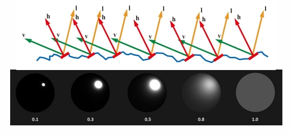
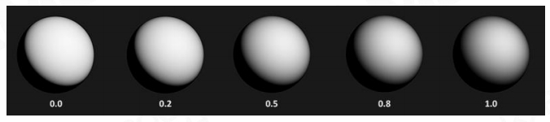

# 微表面模型 Micro facet Material [43：28]

[46：13]。当物体很远很小时，从远处看， 是平面且粗糙的。从近处看，是几何且**镜面反射**。[49：09]。

从微观上看，每个几何表面都有各自的法线方向。但拉远后，这些法线方向就抽象成了**法线方向的分布**。  

> &#x1F4A1; 本身是随机的，适用统计分布。本身是规律的，可以用公式计算规律。也有可能同一件事，从不同角度去看，会得到随机和有规律两种不同的结论。分析出的规律，也有可能最终还是以统计的方式体现。  

微表面的粗糙成度可以用法线分布来表示：

- 当微表面的法线方向比较集中，材质就类似于glossy

- 当微表面的法线方向比较分散，材质就类似于diffuse

## BRDF Model Based on Microfacet

   

$$
L_o(x,\omega _o)=\int _{H^2}\begin{pmatrix}  
  k_d\frac{c}{\pi } +\frac{DFG}{4(\omega _o\cdot n)(\omega _i\cdot n)}
\end{pmatrix} L_i(x,\omega _i)(\omega _i\cdot n)dw_i
$$

> diffuse：漫反射与 Bling Phong 类似，简化成常数。specular：高光，比 Bling Phong 要复杂，其中 D 项与之类似。      
DFG 中每个字母代表一种光学现象。  

> &#x1F4A1; 用物理方法模拟的难点在于如何基于物理去建模。用简体近似的方法模拟，难点在于应对简化不合理地方出现的失真。用数据模拟，难点在于大量高质量的数据。  
> 光追属于第一种，这里的方法属于第二种，机器学习属于第三种。  

## Normal Distribution Function 法向分布方程     

   

   

> \\(\alpha \\) 代表 roughness，范围取 [0，1]    

   

> GGX 曲线的特点：高频更具表现力，低频不会那么快消失。    

P51   
## Geometric Attenuation Term (self-shadowing)由于表面不平导致的自遮挡

   

> 遮挡影响的特点：    
(1) 遮挡可能发生在入射光射向物体表面，也发生在反射光射向眼睛，因此要算两遍。   
(2) 与是入射光还是反射光无关    
(3) 与入／反射光与法线的夹角有关    
(4) 与 D 方式中的 (\\( \alpha \\)) 有关    

   

P52   
## Fresnel Equation

   

> 当视线与物体表面的切平面夹角很小时，反射系数会急巨增加，看到倒影效果。    
参数：\\(\alpha \\)，fresnel 系数    

   

P53   
# Physical Measured Material

   

   

> 一个关于真实材质的各项系数的数据集。    

------------------------------

> 本文出自CaterpillarStudyGroup，转载请注明出处。  
> https://caterpillarstudygroup.github.io/GAMES101_mdbook/