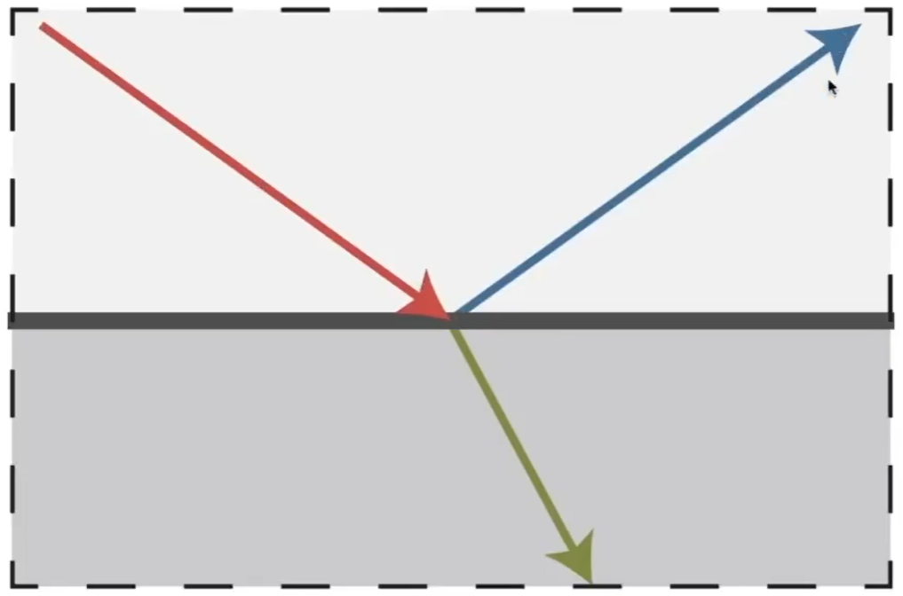
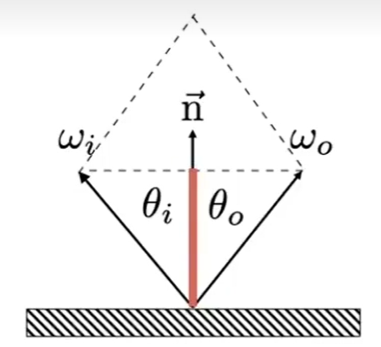
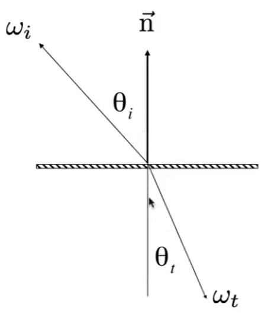

# 玻璃、水 

折射 + 反射，例如玻璃和水

## 反射

入射角 = 出射角

### 理解1

$$
\omega_i + \omega_o = 2(\omega_i \cdot n ) n
$$

根据平行四形法则，wi+wo的结果与n同方向，且大小为\\(\omega_i\cos\theta_i\\)的两倍

### 理解2

把wi和wo都看作是空间中的方向，因此可以分解为\\(\theta\\)和\\(\phi\\)。出射角和入射角，他们的\\(\theta\\)相同，\\(\phi\\)相差了\\(\pi\\)。  

> &#x2705; 在以反射平面为xz平面的局部坐标系下  

## 折射

折射定率：

$$
\eta_i \sin \theta_i = \eta_t \sin \theta_t
$$

说明：  
\\(\eta_i\\)：不同材质有不同折射率。  
\\(\theta_i\\)：入射角  
\\(\theta_t\\)：出射角  

当入射材质折射率>出射材质折射率，有可能折射变为全反射

BSDF(散射) = BRDF(反射) + BTDF(折射)

## 菲涅耳项 

反射和折射同时发生时，分别各多少  
答：与入射角有关。

如图中，从不同的角度看过去，书的反射的影子强度不同。  
计算公式，太复杂，用的时候直接查就好了。  

------------------------------

> 本文出自CaterpillarStudyGroup，转载请注明出处。  
> https://caterpillarstudygroup.github.io/GAMES101_mdbook/