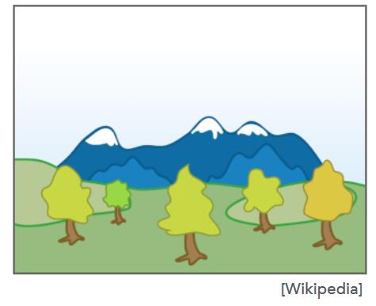

# 背景

有多个物体，每个物体都有多个三角形，因此要处理摭挡问题。

# 画家算法



## 原理

由远及近的在画布上添加新物体，新添加的物体将已有的物体覆盖

## 主要步骤

1. 由远即近排序 O(nlogn)
2. 依次光栅化
   
## 局限性[09:26]：

1. 难以决定被画对象的深度，深度估计错了，排序就错了，画出来就不对
2. 无法处理深度嵌套的场景


# Z-Buffer 算法

名称：depth buffer， Z buffer，或深度缓存

> **&#x1F4CC;** 可以解决画家算法无法决定深度的局限性

## 原理

不基于三角形的深度，而是基于像素的深度

## 预处理

[10:40]由于MVP之后，约定摄像机在坐标原点，物体在视角的z轴负方向，因此物体的z都是负的。为了便于计算，物体上每个点的Z坐标都取其绝对值（深度）。

因此：  

1. Z(depth) > 0
2. Z(depth) 小-->近， Z 大-->远
3. 深度是一个物体距离摄像机的Z轴距离的绝对值。

## 具体步骤

算法过程中维护两个数据:

1. frame buffer：存每个像素点当前绘制的像素值。当算法完成时，这里面的数据就是最终输出结果。
2. depth buffer：存每个像素点对应的物体上的最小的depth（最近）。当发现在这个像素点上有更近的物体时更新。  

两个buffer都是逐像素的，因此将buffer数据可视化[14:38]。  


> **&#x1F4CC;** 
> 
> 
> 
>  图中，A点是距离视点（摄像机）较近的点，所以颜色比较黑，B点是距离视点较远的点，所以颜色比较白。距离视点近的像素点，颜色就比较黑，反之比较白，这就是depth/Z buffer。


伪代码：

```python
Initialize depth buffer to ∞
during rasterization：
    for triangle in triangles:
        for (x, y, z) in triangle:
            if z < zbuffer[x, y]:
                framebuffer[x,y] = rgb
                zbuffer[x,y] = z
            else:
                pass
```

1. depth buffer 所有像素初始化为无限远
2. 对每个三角形做光栅化，每次绘制三角形时，计算当前像素在三角形上的深度Z
   如果Z小于depth buffer上对应点的值，就绘制该点，且更新depth buffer。

> **&#x1F4CC;** 深度缓存发生在每个像素内。


## 算法特点

1. 时间复杂为O(n)。
   
>  &#x2705;  
> 问：为什么能在O(n)复杂度内解决排序问题？  
> 答：这里没有排序。只是找个最值。

2. 与三角形的绘制顺序无关，因此**适合GPU优化**
3. 可以与MSAA算法兼容

----------------------------
> 本文出自CaterpillarStudyGroup，转载请注明出处。
>
> https://caterpillarstudygroup.github.io/GAMES101_mdbook/