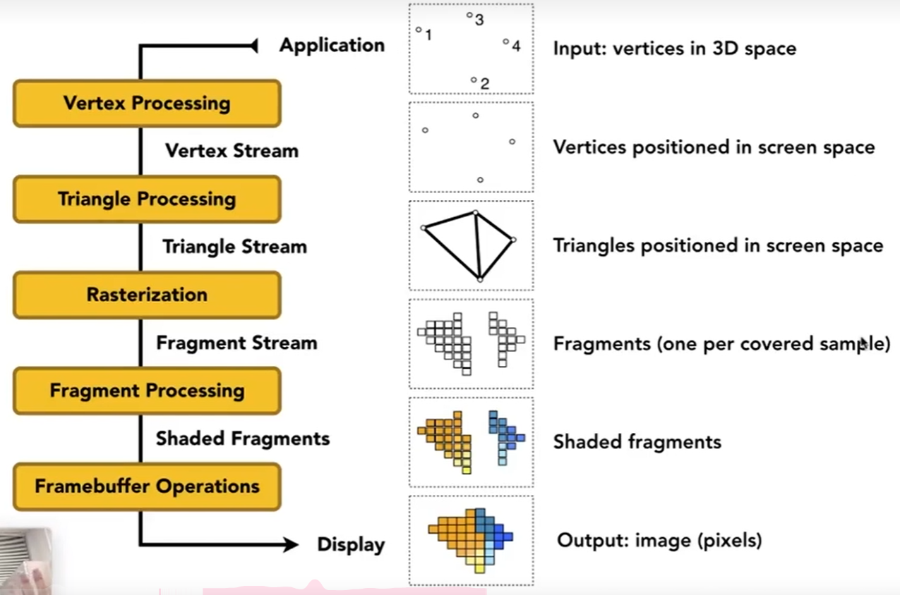
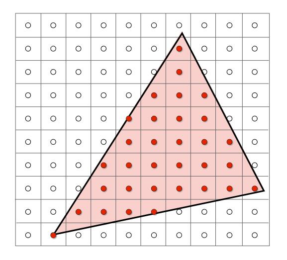

# Real-time Rendering Pipeline

实时渲染管线

> **&#x1F4CC;** 一个场景，最后到一张图，中间经历了什么过程，这个过程就是管线（pipeline），即一系列不同的操作。

[35：24]

## Vertex Processing

### MVP

> &#x1F446; MVP是图中前三步。最后一步不是。  

MVP发生在图中的Vertex Processing。  

> &#x2753; 问：MVP的目标是把3D三角形投影到平面上。为什么这里只有点？  
> 答：因为MVP这一步不改变点的连接关系。所以不需要对边做投影。投影之后提取原来的边的关系就可以。  

### 基于顶点的着色

基于顶点的着色发生在Vertex Processing。  

## Raserization

- Sampling Triangle Coverage

对像素采样判断是否在三角形内，这一步发生在Raserization。  

## Fragment Processing

### 用z-buff判定可见性

这一步发生在Fragment Processing

### 纹理映射

### 基于像素的Shading

基于像素的着色发生在Fragment Processing。  

# Shader Programs

基于OpenGL的着色编程是工程问题，跳过

------------------------------

> 本文出自CaterpillarStudyGroup，转载请注明出处。  
> https://caterpillarstudygroup.github.io/GAMES101_mdbook/