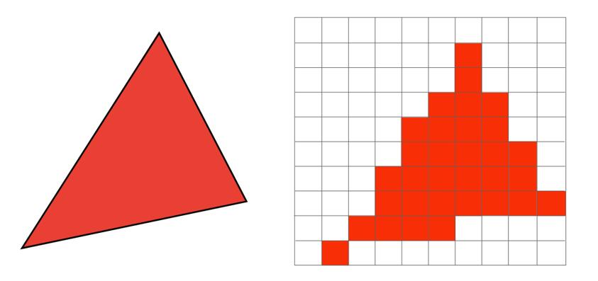
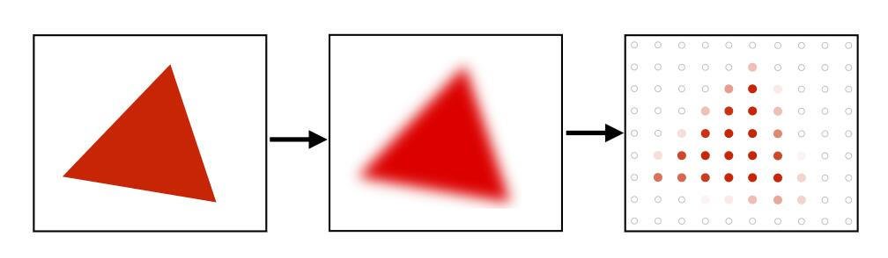

消除锯齿是图像学致力于解决的重要问题。

抗锯齿，也叫反走样。

# 反走样（Antialiasing）的定性分析与解决方法

## 采样理论

Photo是对image的采样  
video是在时间维度的采样[07:33]  
它们都是将连续的信息离散化。  

采样会产生 Artifact，例如：

- 锯齿[09:17]  
- 摩尔纹[09:30]
- 车轮效应

采样Artifact的本质原因：信号变化太快，采样速度跟不上

## 反走样方法

[14:05]

先对object模糊化，然后再采样  

模糊化的过程使用滤波实现。

采样后，中心点红色，边界点粉红色

> &#x2705; 先采样再模糊化不能起到反走样的效果

# 遗留问题

1. 为什么先采样再模糊化不能起到反走样的效果？  
2. 为什么采样速度跟不上信号变化的速度会产生走样？  

----------------------------
> 本文出自CaterpillarStudyGroup，转载请注明出处。
>
> https://caterpillarstudygroup.github.io/GAMES101_mdbook/
