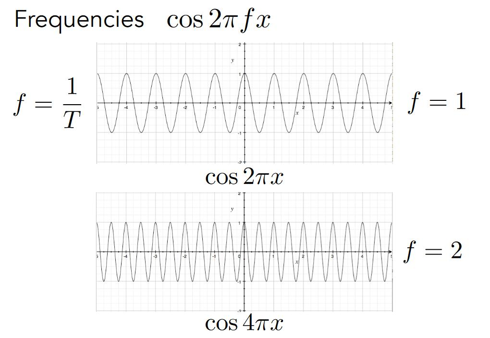
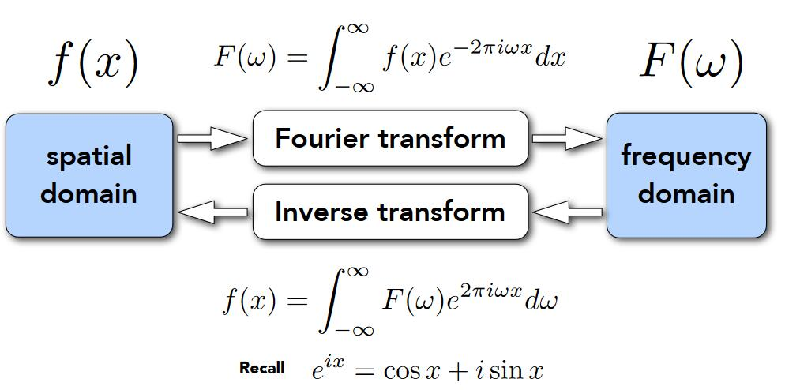
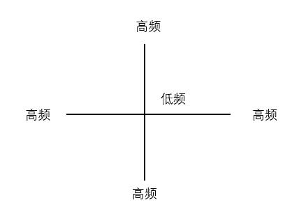
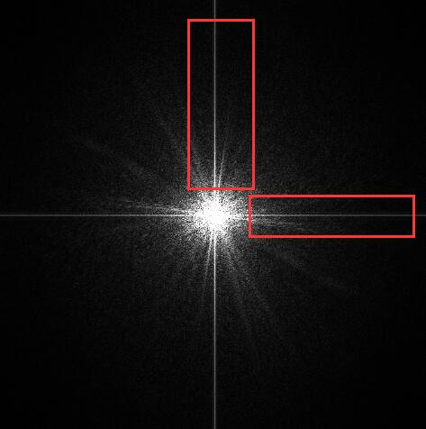
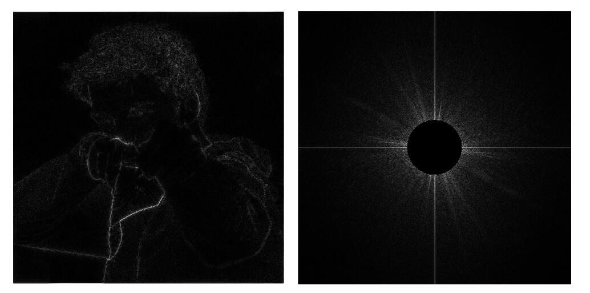
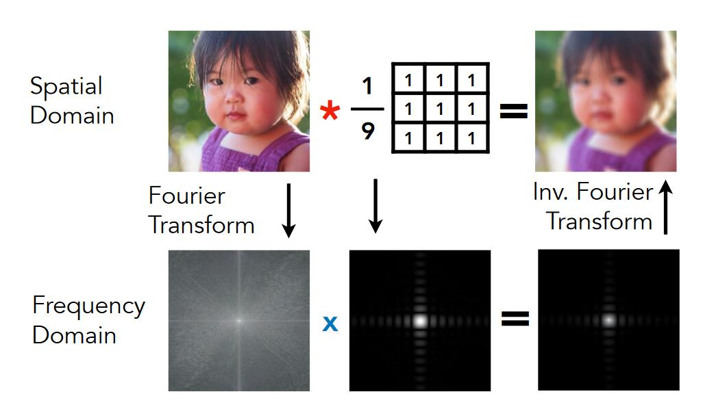

# 走样

当按照像素中心是否在三角形内的采样方式采样后，得到了不理想的结果。

产生了锯齿！（jaggies）

消除锯齿是图像学致力于解决的重要问题。

抗锯齿，也叫反走样。

# Antialiasing 反走样

## 采样理论

- Photo: image 采样
- video：时间采样[07:33]

采样会产生 Artifact.

- 锯齿[09:17]
- 摩尔纹[09:30]
- 车轮效应

本质原因：信号变化太快，采样速度跟不上

## 反采样方法

[14:05]

object --> 模糊化 --> 采样

模糊化，即滤波。

采样后，中心点红色，边界点粉红色

## Frequency Domain：频域

### 余弦波： \\(\cos 2\pi fx\\)

- f是频率

  

### 傅里叶级数展开：

- 任何一个周期函数可以写成：不同频率的正/余弦函数的线性组合，以及一个常数。

### 傅里叶变换（可逆的）

 

## 函数与采样的关系。

把函数分解为不同的频率的函数[24：51]

以相同采样频率对以上函数采样

通过采样点能恢复出低频信息，不能恢复出高频信息。

两个不同频率（蓝黑）的信号，在某采样频率下，得到了完全相同的采样点，因此无法区分。

## 滤波：

[29：32]

把某些信息（即特定的频率分量）去掉

1. 把图像（时域信息）转成频域信息[31：01]

   

   

   > **&#x1F4CC;补充：** 由于强行把图像周期化，红色框中的亮线是图像跨越边界时产生的高频信息

2. 高通 filter [34：21]

   保留的高频信息对应于图像边界

   

   > **&#x1F4CC;** 图像边缘为信号的剧变处，信号剧变即为高频信息。

3. 低通 filter [36：19]

   图像变模糊，失去边界

   

## 滤波 VS 卷积 VS 平均

卷积:

卷积可以看作是个局部区域的加权平均

频域上的乘积就是滤波的过程：

   `时域卷积 = 频域乘积 = 频域滤波 = 局部加权平均`

   `卷积kernel = 频域filter = 局部加权`

- Box Function = 低通 filter

   

## 采样 VS 频域信息

时域上的乘积就是采样的过程

时域乘积 = 频域卷积

\\[
f_1\left( x \right) \times f_2\left( x \right) \Longleftrightarrow F_1\left( \omega \right) \otimes F_2\left( \omega \right) 
\\]

> &#x1F4A1; \\(f_1\left( x \right)\\) 是信号（a）， \\(f_2\left( x \right)\\)是采样信号（c）， \\(F_1\left( \omega \right)\\) 是a的频谱（b）  \\(F_2\left( \omega \right)\\) 是采样信号的频谱（d）0

采样就是把原信号的频谱以特定周期呈现。

采样周期长 \\(\Longrightarrow \\)

\\(\Longrightarrow \\) \\(F_2\left( \omega \right)\\) 的频谱间隔小

\\(\Longrightarrow \\) (b)以更密的形式重复

\\(\Longrightarrow \\) (f)的频谱出现混叠

\\(\Longrightarrow \\) 时域上表现为走样

## 怎样反走样？

### 提升分辨率

分辨率上升 \\(\Longrightarrow \\) 像素格子小 \\(\Longrightarrow \\) 像素采样率上升 \\(\Longrightarrow \\) （b）间隔大 \\(\Longrightarrow \\) 混叠少 \\(\Longrightarrow \\) 减轻走样现象

缺点：受制于物理限制

### 反走样算法

1. 信号转频域
2. 低通filter，过滤高频信息，使（b）变窄
3. 采样
   
   

### Multi Sample 反走样算法[1：05：17]

#### MSAA

1. 一个象素内部划分成多个子（sub）像素
2. 判断每个点是否在三角形内
3. 把判断的结果平均

> **&#x2757;注意:** Supersampling 与提升分辨率的区别：
> 本算法并没有实质性地增加像素点
>
> 缺点：增加计算量

#### FXAA

1. 用常规方法得到带锯齿图像
2. 通过图像匹配的方法找到边界
3. 把边界换成没有锯齿的边界

优点：速度快， 与采样无关

#### TAA 

[1：15：10]

**T** ：Temporal .时间上的

大概意思是,边界上的点，有时显示在上一帧，有时显示在这一帧

### 其它问题

#### Super Resolution 超分辨率

- 低分辨率图拉大成高分辨率出现的锯齿问题
- 解决方法，一 DLSS
- Deep Learning Super Sampling

#### Super Sampling 上采样

跟上面是同一个问题。

----------------------------
> 本文出自CaterpillarStudyGroup，转载请注明出处。
>
> https://caterpillarstudygroup.github.io/GAMES101_pages/
