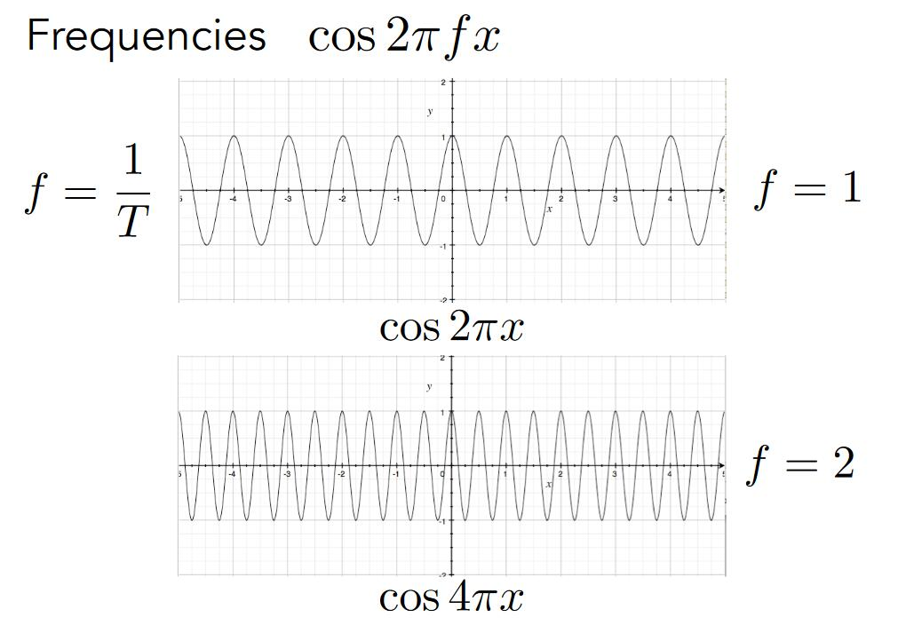
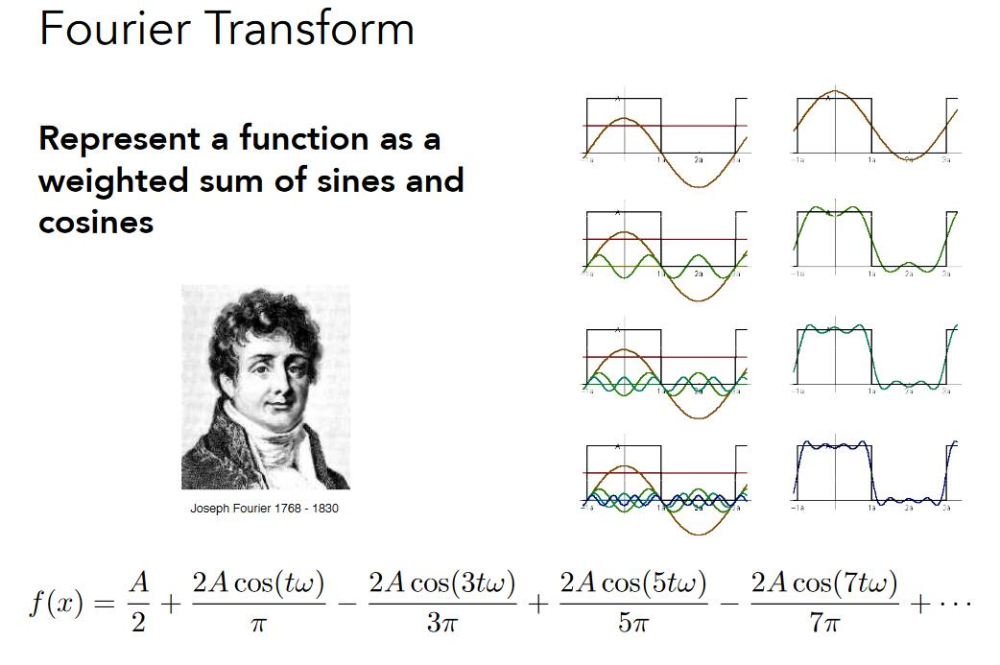
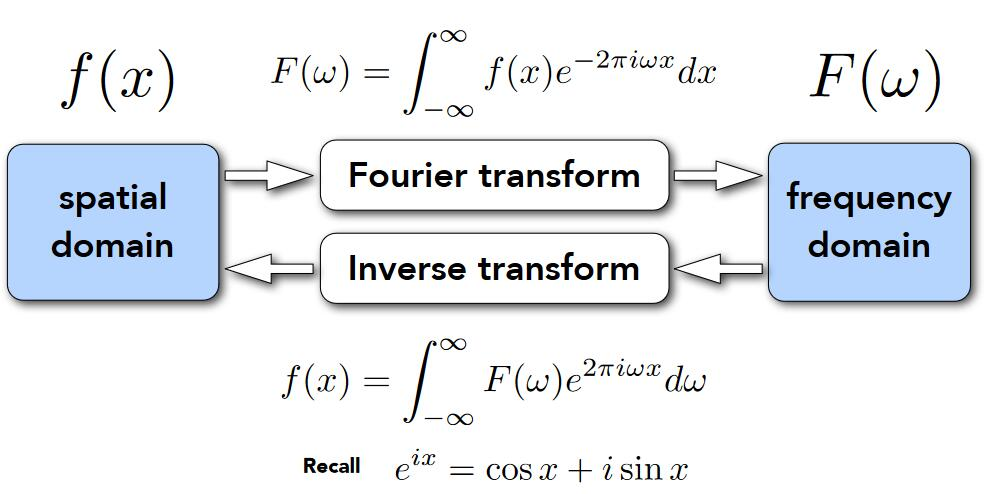
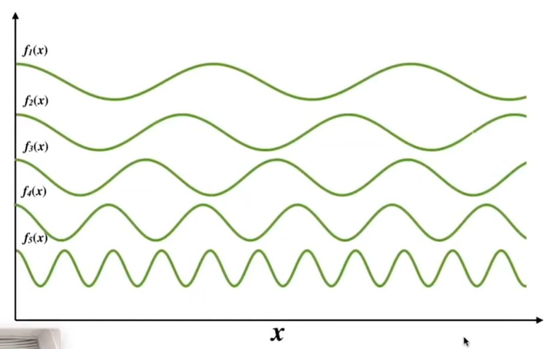
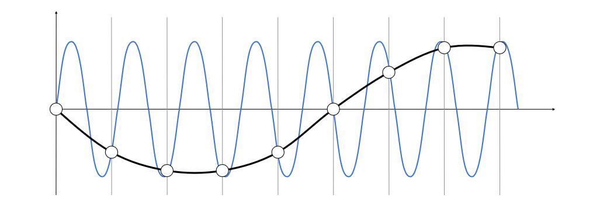
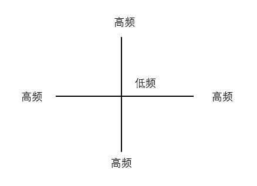
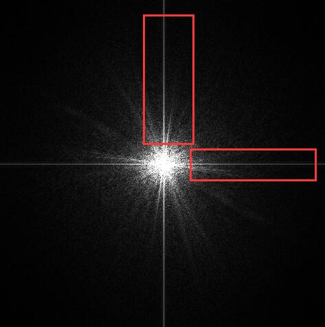
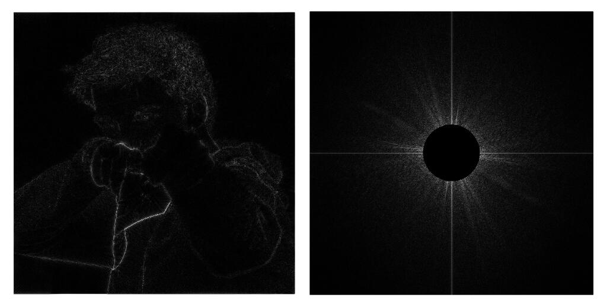
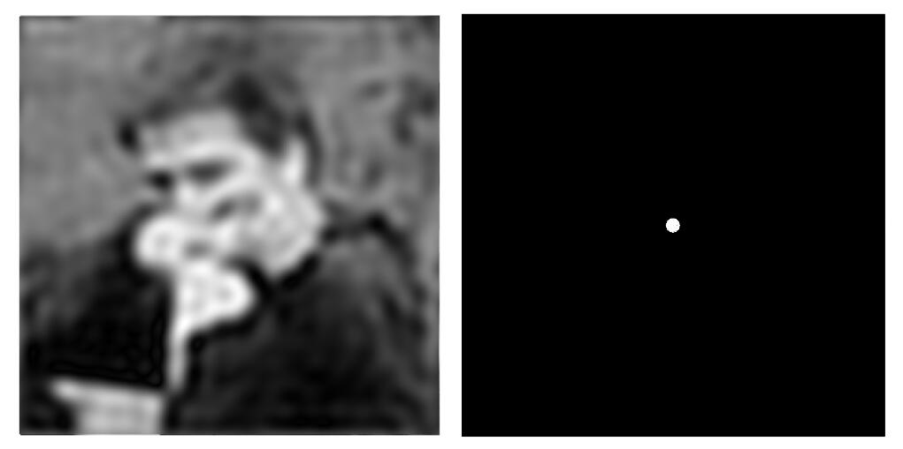

上节提到，走样的本质原因是信号的变化速度太快，采样的速度跟不上。  

变化速度与采样速度，都是与频率相关的概念，因此本节从频域的角度来分析走样问题。   

# 频域的相关概念

## 余弦波

\\(\cos 2\pi fx\\)，其中f代表频率。f越大，则信号变化越快。   

  

## 傅里叶级数展开：

任何一个周期函数可以写成：不同频率的正/余弦函数的线性组合，以及一个常数。

> &#x2753; 非周期函数会怎么样呢？

## 傅里叶变换（可逆）

 

傅里叶变换是指把函数转为它在频域上级数展开的形式。   

# 函数与采样的关系

## 函数的频率

基于傅里叶变换，可以把函数分解为不同的频率的函数[24：51]  
  
频率高，即代表信号变化快。也就是说，一个函数是由各种不同频率的信号混合而成的。   

## 采样的频率

[24:51]

以相同采样频率对以上函数采样

通过采样点能恢复出低频信息，不能恢复出高频信息。

[29:00]

走样的本质原因的数学描述：两个不同频率（蓝黑）的信号，在某采样频率下，得到了完全相同的采样点，因此无法区分。

# 图像中的频率成分[29：32]

对图像信息做傅里叶变换，就可以把图像（时域信息）转成频域信息[31：01]：

   

图像的频域图具有以下特点：

- 图中点越亮代表此处频率的能量越高
- 图像中的信息大部分为低频信息（自然生成的图像都有此特点）
- 由于强行把图像周期化，红色框中的亮线是图像跨越边界时产生的高频信息，为些高频信息可以忽略。

   

## 高通 filter [34：21]

**滤波：即把某些信息（即特定的频率分量）去掉。**

保留频域图中的高频信息，再把频域图恢复成原始图像。发现图像只剩下了原图的轮廓部分。  

解释：

保留的高频信息对应于图像边界。因为图像边缘为信号的剧变处。

## 低通 filter [36：19]

同理，只保留图像的低频信息，图像会变模糊，失去边界

   

----------------------------
> 本文出自CaterpillarStudyGroup，转载请注明出处。
>
> https://caterpillarstudygroup.github.io/GAMES101_mdbook/
