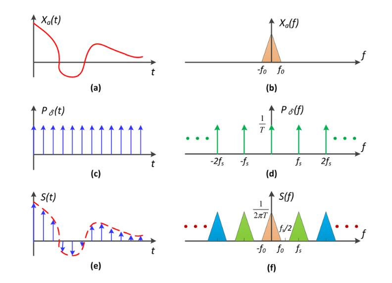
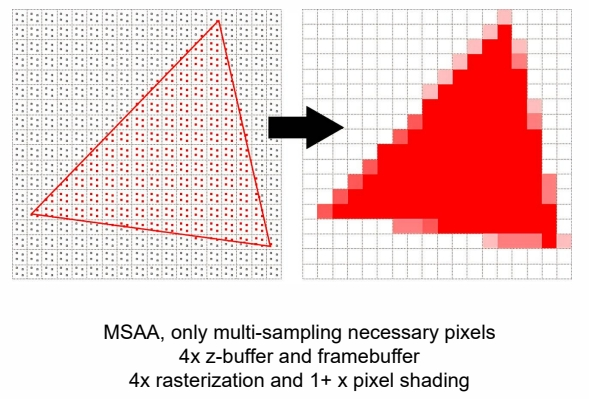
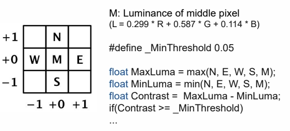

# 反走样算法

## 提升分辨率/采样率 Super-sample AA (SSAA)

Super sampling is the most straightforward solution to solve **AA**    

  

分辨率上升 \\(\Longrightarrow \\) 像素格子小 \\(\Longrightarrow \\) 像素采样率上升 \\(\Longrightarrow \\) （b）间隔大 \\(\Longrightarrow \\) 混叠少 \\(\Longrightarrow \\) 减轻走样现象

缺点：受制于物理限制  
因此需要思考如何在物理条件不变的情况下解决走样问题

## 把可能混叠的部分切掉

   

### 具体方法：

1. 使三角形变模糊，对于三角色形上任意一个像素点：
 - 原来是根据像素点中心是否在三角形内来判断着色。
 - 现在的做法是，判断整个像素点有多少面积在三角形内来计算着色（卷积）。  

  

1. 正常采样
   
### 局限性

面积难以计算

## Multi-sample AA (MSAA)

Multi Sample Anti-aliasing算法，反走样算法的近似算法

### 具体方法

|SSAA|MSAA|
|---|---|
|||

1. Supersampling：一个象素内部划分成多个子（sub）像素 
2. 判断每个子像素是否在三角形内  
    
> &#x1F4CC; 实际在这一步中不会这样均匀的划分，而是采用更合理的方法，在达到效果的同时尽量少地提升计算量。  
3. 对判断结果求平均值  

> 目前硬件部已支持 MSAA。    

### 局限性

缺点：  
1. 增加计算量
2. 但现在的高精模型可能比一个像素还小，这种方法就失效了。      

> **&#x2757;注意:** Supersampling 与提升分辨率的区别：
> 本算法并没有实质性地增加像素点

## FXAA (Fast Approximate Anti-aliasing)

1. 用常规方法得到带锯齿图像
2. 通过图像匹配的方法找到边界

   

3. 把边界换成没有锯齿的边界

   

> 提取边界，并在边界做插值。   
优点：(1) 效果好    
(2) 速度快，利用 GPU 的并行计算，没有多余的计算。   
(3) 计算简单。  

### Edge Searching Algorithm

   

   

### Calculate Blend Coefficient

- Compute blender coefficient

**targetP** is the nearer edge end of **CurrentP**    

   

   

   

### Blend Nearby Pixels

- Compute blender coefficient   

   

**PixelNewColor = Texture(CurrentP_UV + offset_direction * offset_magnitude )**

### Result

   

## TAA (Temporal Anti-aliasing)

Utilize spatial-**temporal** filtering methods to improve AA stability **in motion**   

大概意思是，边界上的点，有时显示在上一帧，有时显示在这一帧

> 引擎中的主流方法。   

   

   

### Result

   

----------------------------

> 本文出自CaterpillarStudyGroup，转载请注明出处。  
> https://caterpillarstudygroup.github.io/GAMES101_mdbook/
