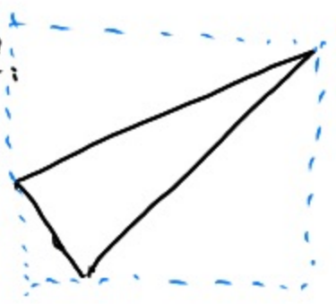

当观测结束后，所有物体到了[-1, 1]的三次方这个立方体中，那么，下一步是什么？将其放在屏幕上。

# 什么是光栅化

> &#x1F50E;  
> Raster:屏幕  
> Rasterize: 光栅化  
> Triangle Mesh: 三角形面片

光栅化，即把对象（object）画在屏幕（raster）上。对象是指cubic中的内容，常用用三角形面片表示对象的表面。屏幕，由像素（pixel）组成的2D数组。数组的大小代码的屏幕的分辨率。  
具体过程可以描述为：找到对象表面在cubic中的位置，根据cubic与raster的关系，确定它在raster上应出现的位置。在raster的正确的位置上渲染对象。

将观测的物体在屏幕上显示，就是**光栅化**。  


# 定义一些符号

1. 描述立方体的符号：l，r，u，d，f，n
- l = -r = 1
- b = -t = 1
- f = -n = 1, 物体在z轴负方向，因此n < 0  

2. 描述屏幕的符号：


- 宽高比（Aspect ratio）
- width/height
- 视角（Field of view）


3. 用符号描述屏幕和立方体的关系

- 把视角和宽高比转换为l、r、b、t


由图可得以下关系：

\\[
\tan \frac{fovY}{2}=\frac{t}{|n|}
\\]

\\[
aspect=\frac{r}{t}
\\]

> **&#x1F4CC;补充：** 定义一个视锥，只需要视角和宽高比即可，其他参数可以转换。


# 光栅化的最基本的流程

## Step 1: 选取cubic中物体的表面三角形

3D空间中的物体，通常使用三角形面片来描述物体的表面。所谓把物体画到屏幕上，实际上就是把这些三角形面片画到屏幕上。   

为什么用三角形？

1. 最基本的多边形（其他多边形可以由三角形拼成）

2. 一个三角形一定在一个平面上

3. 三角形关于“内”、“外”的定义是明确的

4. 给定三角形三个顶点的属性，其内部任意点的属性可以通过插值得出

## Step 2: 根据三角形在cubic内的坐标计算出它在屏幕上的位置（浮点数）

坐标系的变换，只需要计算出正确的变换矩阵就可以实现。  


\\[
\begin{bmatrix}
x' \\\\
y' \\\\
1 \\\\
1 \\\\
\end{bmatrix} = \begin{bmatrix}
S & T \\\\
0 & 1 \\\\
\end{bmatrix}\begin{bmatrix}
x \\\\
y \\\\
z \\\\
1
\end{bmatrix}
\\]

其中S是指缩放，T是指平移，这里面不涉及到旋转。  

对变换做以下假设：  

1. 忽略Z轴
2. 将xy平面：[-1,1]^2 转换到 [0, width] X [0, height]
3. 不涉及旋转


选取部分特殊点，代入计算，即可得出变换矩阵为：

\\[
M_{viewport}=\left( \begin{matrix}
    \frac{width}{2}&        0&        0&        \frac{width}{2}\\\\
    0&        \frac{height}{2}&        0&        \frac{height}{2}\\\\
    0&        0&        1&        0\\\\
    0&        0&        0&        1\\\\
\end{matrix} \right) 
\\]

## Step 3: 把三角形画在屏幕上

根据上面的转换公式，可以得出三角形上每个点对应在屏幕上的位置（浮点数）。但屏幕上像素的下标是整数。如下图：  


怎么确定每个像素格子是否需要被渲染成三角形的颜色？   
最简单的方法是：判断**屏幕空间**中每个像素的中心是否在三角形的内部。  


### 屏幕空间

在屏幕上的坐标系


- 每个像素的坐标是整数，范围为[0, width)  [0, height)  
- 像素(x， y)的中心位置：(x+0.5, y+0.5)

> &#x2757;注意区分**坐标**与**位置**的不同含义

### 方法一：遍历

```
依次遍历每个像素(x, y)：
    取像素中心的位置(x+0.5, y+0.5)
    判断像素中心是否在三角形内部（叉乘）
    如果在内：
        渲染
    如果在外：
        渲染
    如果在三角形边上：
        自己决定是否渲染
```

> &#x1F50E;**判断三角形的内和外：**  
https://caterpillarstudygroup.github.io/GAMES101_pages/Dependency/Vector.html#%E5%9C%A8%E5%9B%BE%E5%BD%A2%E5%AD%A6%E4%B8%AD%E7%9A%84%E4%BD%9C%E7%94%

缺点：必须要依次check每个pixel

### 方法二：Bounding Box [56:00]

对整个屏幕遍历，然后判断每个像素的中心是否在三角形内，这太傻了。

正确的做法是，只遍历包围三角形的最小矩阵，称之为三角形的包围盒。


局限性：  
对于这种情况仍有较大的计算量。   




### 方法三：Incremental [56:55]

一种启发式的方法，比较容易想到，也懒得记了。   


> &#x1F4CC;课程中关于显示器的部分被我跳过了，因为我认为与算法相关度不大。  


# 光栅化的结果

[1:02:38], [1:03:01]


-----------------------------
> 本文出自CaterpillarStudyGroup，转载请注明出处。
>
> https://caterpillarstudygroup.github.io/GAMES101_pages/
