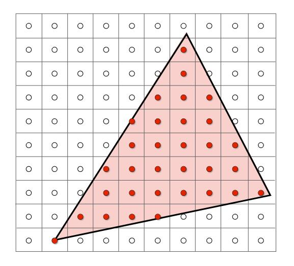

# Rasterization 光栅化

当观测结束后，所有物体到了[-1, 1]的三次方这个立方体中，那么，下一步是什么？将其放在屏幕上。

将观测的物体在屏幕上显示，就是**光栅化**。

## 定义一些符号

1. 描述立方体的符号：l，r，u，d，f，n
- l = -r
- b = -t
2. 描述屏幕的符号：
- 宽高比（Aspect ratio）
- width/height
- 视角（Field of view）

### 如何把视角和宽高比转换为l、r、b、t？

由图可得以下关系：

\\[
\tan \frac{fovY}{2}=\frac{t}{|n|}
\\]

\\[
aspect=\frac{r}{t}
\\]

> **&#x1F4CC;补充：** 定义一个视锥，只需要视角和宽高比即可，其他参数可以转换。

### 屏幕

- 由像素（pixel）组成的2D数组
- 是典型的光栅成像设备
- 数组大小：分辨率

> Raster:屏幕
> 
> Rasterize: 光栅化，即把东西画在屏幕上

## 屏幕空间：在屏幕上的坐标系

- 坐标是整数
- 范围[0, width)  [0, height)
- 像素(x， y)中心：(x+0.5, y+0.5)

### 将立方体映射到屏幕

1. 忽略Z轴
2. 将xy平面：[-1,1]^2 转换到 [0, width] X [0, height]
3. 视口变换（viewport），变换矩阵为：

\\[
M_{viewport}=\left( \begin{matrix}
    \frac{width}{2}&        0&        0&        \frac{width}{2}\\\\
    0&        \frac{height}{2}&        0&        \frac{height}{2}\\\\
    0&        0&        1&        0\\\\
    0&        0&        0&        1\\\\
\end{matrix} \right) 
\\]

### 怎样在屏幕上画东西？

Triangle Mesh: 三角形面片

为什么用三角形？

1. 最基本的多边形（其他多边形可以由三角形拼成）

2. 一个三角形一定在一个平面上

3. 三角形关于“内”、“外”的定义是明确的

4. 给定三角形三个顶点的属性，其内部任意点的属性可以通过插值得出
   
   利用前面的知识，我们已经知道了三角形在屏幕的坐标，接着要把坐标转换到像素上。

上图的三角形，内部的区域是连续的不发生变换的，所以我们只要确定三个顶点的像素。

所以引出重要的一个问题：**像素的中心点与三角形的位置关系**

### 采样

**采样是把一个函数离散化的过程**

我们要判断一个像素中心，是否在三角形内

定义如下函数：

\\[
inside\left( t, x, y \right) =\begin{cases}
    1&        point\left( x,y \right) \,in\,triangle \,t\\\\
    0&        otherwise\\\\
\end{cases}
\\]

我们知道：

- 像素（x，y）的中心是（x+0.5， y+0.5）
- 判断点是否在三角形内部可以用叉乘

如果像素中心落在三角形边上怎么办？

- 自己决定

### Bounding Box

对整个屏幕遍历，然后判断每个像素的中心是否在三角形内，这太傻了。

正确的做法是，只遍历包围三角形的最小矩阵，称之为三角形的包围盒。

-----------------------------
> 本文出自CaterpillarStudyGroup，转载请注明出处。
>
> https://caterpillarstudygroup.github.io/GAMES101_pages/
