# 可见性/遮挡

**背景：**

有多个物体，每个物体都有多个三角形，因此要处理摭挡问题。

**画家算法：**

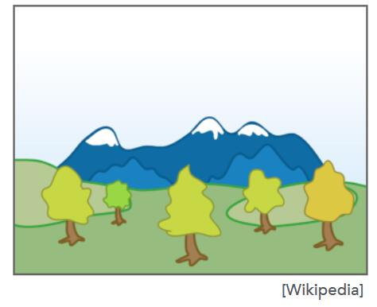

由远及近的在画布上添加新物体

back-> front，覆盖

1. 排序 O(nlogn)
2. 光栅化
   
局限性[09:26]：无法决定深度

**Z-Buffer 算法**

名称：depth buffer， Z buffer，或深度缓存

> **&#x1F4CC;** 为了解决画家算法无法决定深度的局限性

[10:40]

为了便于计算，物体上每个点的Z坐标都取其绝对值（深度）

因此：
1. Z(depth) > 0
2. Z(depth) 小-->近， Z 大-->远

> **&#x1F4CC;** 我们约定摄像机在坐标原点，看向-Z轴，深度是一个物体距离摄像机的Z轴距离的绝对值。

每次生成2张图：

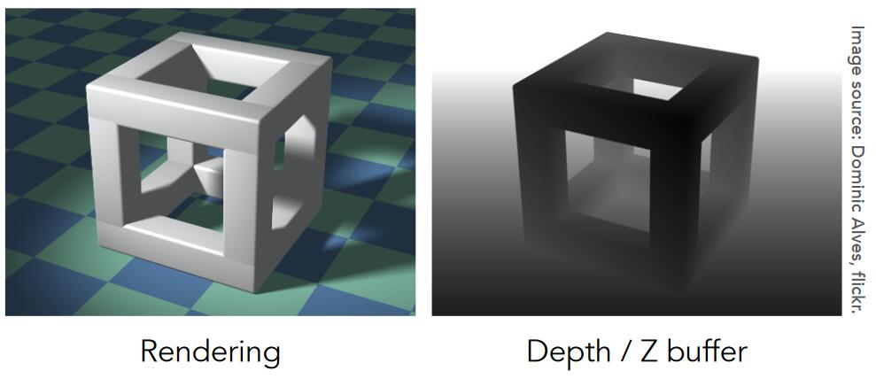

1. frame buffer：存最终结果
2. depth buffer：存某个像素点对应的物体上的最小的depth（最近）

> **&#x1F4CC;** 
> 
> 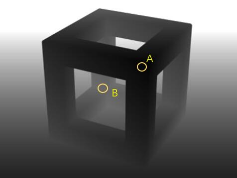
> 
>  图中，A点是距离视点（摄像机）较近的点，所以颜色比较黑，B点是距离视点较远的点，所以颜色比较白。距离视点近的像素点，颜色就比较黑，反之比较白，这就是depth/Z buffer。


具体步骤

```
Initialize depth buffer to ∞
during rasterization：
    for triangle in triangles:
        for (x, y, z) in triangle:
            if z < zbuffer[x, y]:
                framebuffer[x,y] = rgb
                zbuffer[x,y] = z
            else:
                pass
```

1. depth buffer 所有像素初始化为无限远
2. 对每个三角形做光栅化，每次绘制三角形时，计算当前像素在三角形上的深度Z
   如果Z小于depth buffer上对应点的值，就绘制该点，且更新depth buffer。

> **&#x1F4CC;** 深度缓存发生在每个像素内。


算法特点
1. O(n)
2. 与三角形的绘制顺序无关
3. 可以与MSAA算法兼容
4. 适合GPU优化（因为与绘制顺序无关）


# Shading 着色

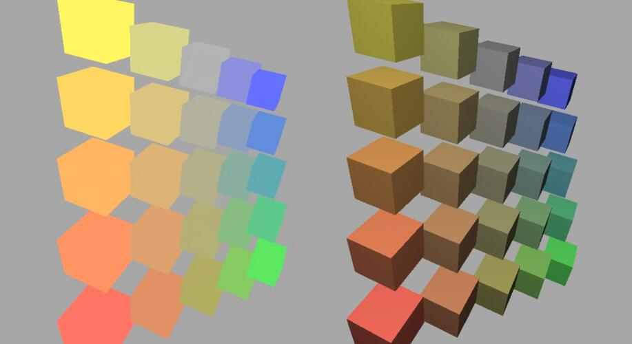

（左）不考虑着色的效果；（右）期望达到的效果。

纯色立方体的每个面每个时刻呈现的颜色有变化。使整体效果更真实。

课程中的shading:

- The process of applying a material to an object.

对不同物体应用不同材质的过程，不包含给object添加投影的过程。

> **&#x1F4CC;** 场景不变，光源发生变化，物体的位置没有改变但是颜色却变化了，这个过程就是着色。

> **&#x1F4CC;** 不同材质的物体看起来不一样，是因为不同材质与光源作用结果不同。


## Blinn-Phong 反射模型

（一个简单基础的模型）

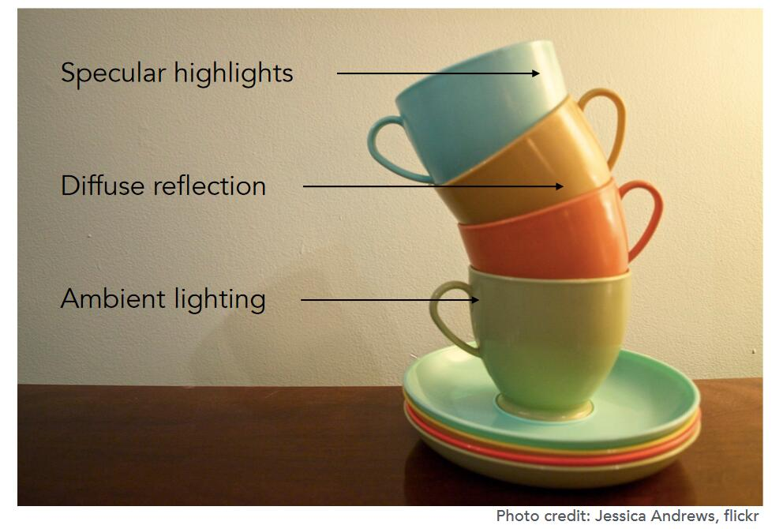

- 高光(Specular highlights): 光线反射到镜面反射附近
- 漫反射(Diffuse reflection): 光线被反射到各个方向上，
- 环境光(Ambient lighting): 假设任何一个点会接收到来自环境的常­量的光

**定义**

<div align="center"> 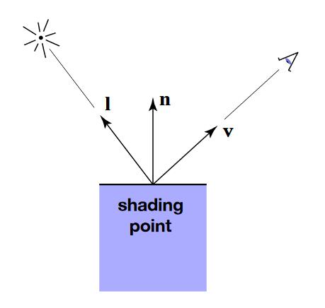 </div>

- shading point：当前要计算着色的点，位于物体表面。
- （n）Surface normal：假设点附近极小范围内是一个平面，n为平面指向外的法向量
- （v）Viewer direction：观测方向
- （l）Light direction：光源方向，与光照向point的方向相反

> **&#x1F4CC;** \\(\hat{l}\\)如何计算？
> 
> 光源的位置减去shading point的位置，得到向量，然后求出单位长度\\(\hat{l}\\)


**漫反射**

[47:35]

<div align="center"> 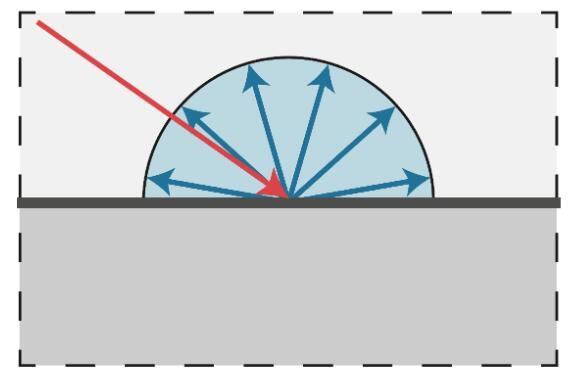 </div>

打到 point 上的光线被均匀地反射出去，（与观测点v没有关系）

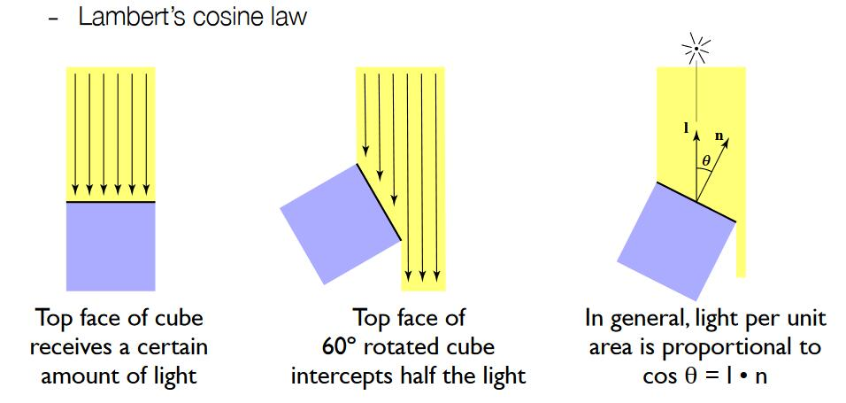

l 与 n 的夹角决定了 point 接收到的光线的强度(Lambert's cosine law)

<div align="center"> 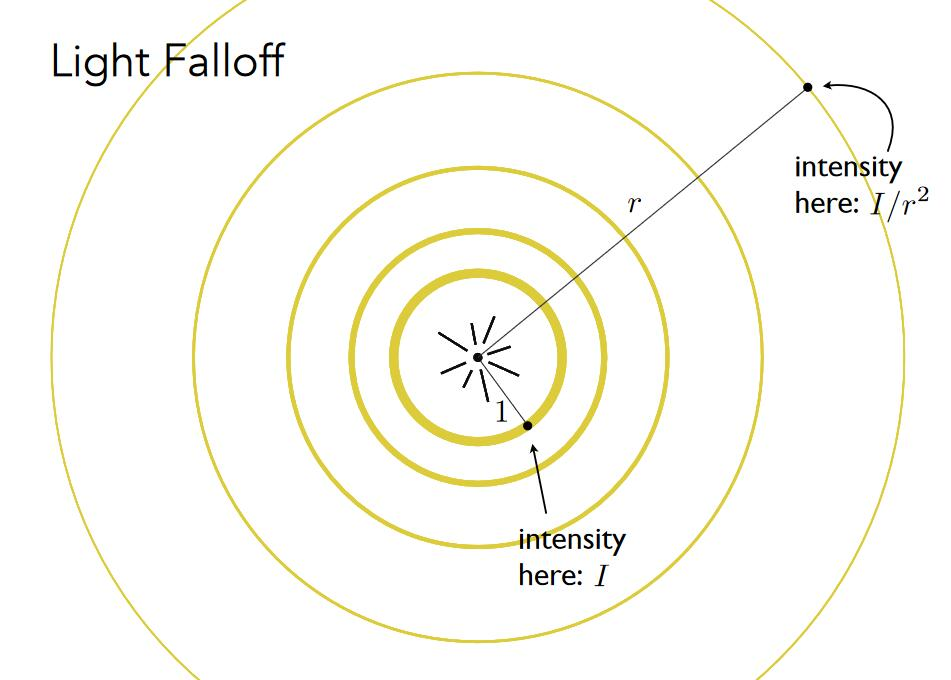 </div>

[54:48] 圆心是点光源，向外辐射能量。

（能量守恒定理）不考虑传播损耗，每个圆上的能量之和不变，某点处的能量与它到光源的距离平方是反比。

\\[
L_d=k_d\left( I/r^2 \right) \max \left( 0,\boldsymbol{n}\cdot \boldsymbol{l} \right) 
\\]

- \\(L_d\\) 漫反射的能量
- \\(k_d\\) point对光的吸收率 (例如，不同的颜色对光的吸收能力不同)
- \\(\left( I/r^2 \right)\\) 有多少能量到达了point
- \\(\max \left( 0,\boldsymbol{n}\cdot \boldsymbol{l} \right) \\) 从正面照射的光，漫反射才有意义 （非正面射入，\\(\boldsymbol{n}\cdot \boldsymbol{l}\\)的值小于零）
- \\(\boldsymbol{n}\cdot \boldsymbol{l}\\) 表示有多少能量被point接收

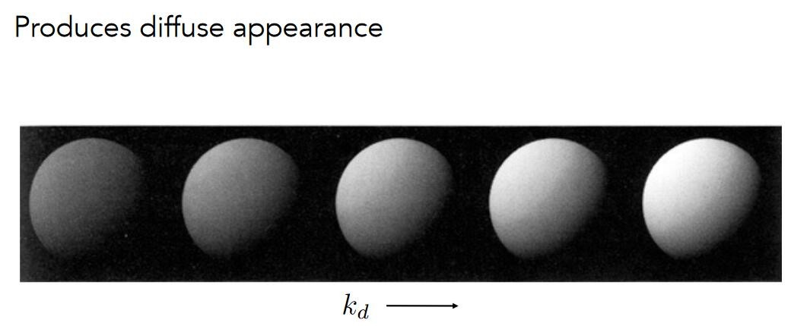


**高光项**

<div align="center"> 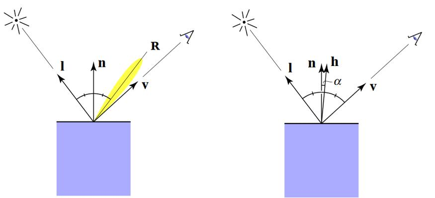 </div>

R 为物体镜面反射的方向。

当 v 和 R 接近时，会看到高光

[08:25] 当v和R接近时，v+l 的方向(h)与n接近:

\\(h=\frac{v+l}{||v+l||}\\) 代表了 v+l 的方向。

h 称为半程向量 half vector

\\[
L_s=k_s\left( I/r^2 \right) \max \left( 0, \cos \alpha \right) =k_s\left( I/r^2 \right) \max \left( 0, n\cdot h \right) ^p
\\]

- \\(k_s\\) 吸收率，通常认为高光是白色，也就是全吸收
- \\(\left( I/r^2 \right)\\) 表示有多少能量到达了point
- \\(\max \left( 0, n\cdot l \right) ^p\\) 表示n和h的接近程度
- \\(L_s)\\) 同样应该考虑有多少有多少能量被接收，但Blinn Phong模型将这个因素简化了

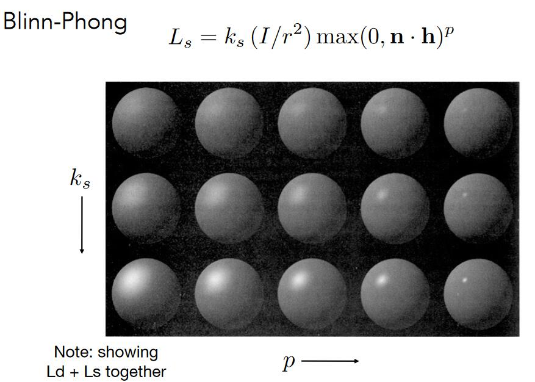


> **&#x1F4A1;** 为什么用\\(n\cdot h\\)代替\\(v\cdot R\\)？
>
> 因为\\(n\cdot h\\)更容易计算


> **&#x1F4A1;** 公式中为什么会有指数p？
>
> 在保证函数趋势不变的同时，让高光更集中，通常取[100, 200]
>
> 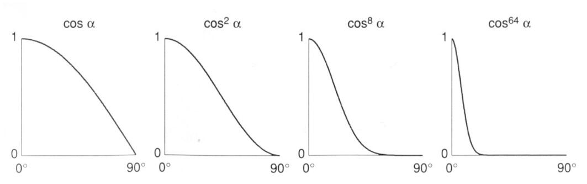


**环境光照项**

Blinn Phong模型假设所有 point 接收到来自环境光的强度相同，且为常数:
\\[
L_a=k_aI_a
\\]

与\\(l\\)和\\(v\\)无关

**模型总述**

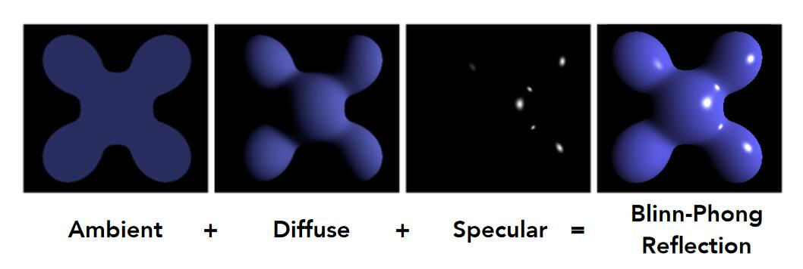

\\[
L=L_a+L_d+L_s=k_aI_a+k_d\left( I/r^2 \right) \max \left( 0,n\cdot l \right) +k_s\left( I/r^2 \right) \max \left( 0,n\cdot h \right) ^p
\\]

> **&#x1F4A1;** 为什么不考虑point到v的距离对能量的影响？？
>
> 这部分比较复杂,Blinn-phong模型没有考虑这个问题


# 着色频率

[20:50]

1. 着色应用于一个平面上,整个平面共用一个L（Flat Shading）
   
   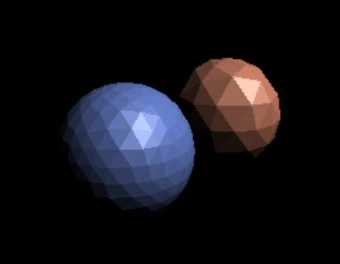

2. 着色应用三角形面片的顶点上，每个顶点计算一个L，三角形内通过插值计算出L（Gouraud Shading）
   
   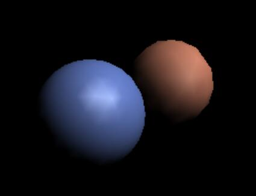

3. 着色应用于像素，每个像素计算一个L（Phong Shading）
   
   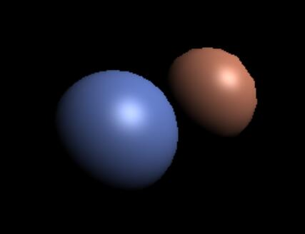


不同着色频率和着色几何体的效果比较：

<div align="center"> 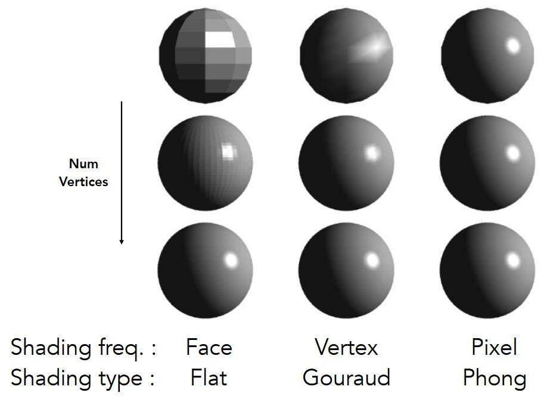 </div>


## 计算一个点的法向量

方法一：利用几何特征

例如，已知object是个球体。可直接球出球表面某点的n（法向量）


方法二：利用三角形面片

[30:08]

\\[
N_v=\frac{\sum{N_i}}{||\sum{N_i}||}
\\]

相邻的三角形的n的平均或加权平均

> **&#x1F4CC;** 一个点可做多个三角形的顶点，将这些三角形（面）的法向量求均值，可简单的看做是这个点的法向量


方法三：利用插值

[31:29]


------------------------------

> 本文出自CaterpillarStudyGroup，转载请注明出处。
>
> https://caterpillarstudygroup.github.io/GAMES101_pages/