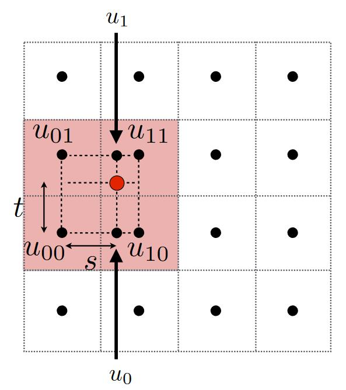
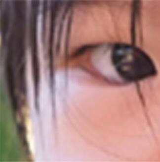
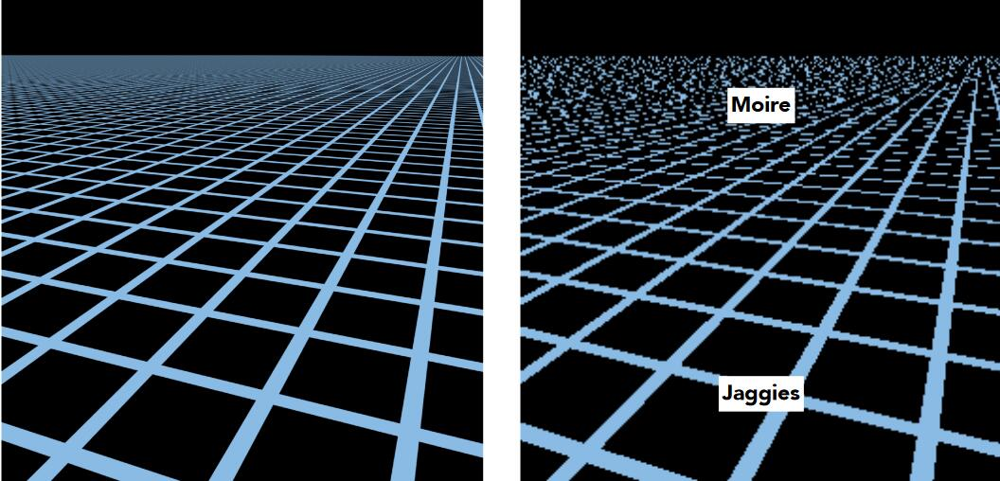
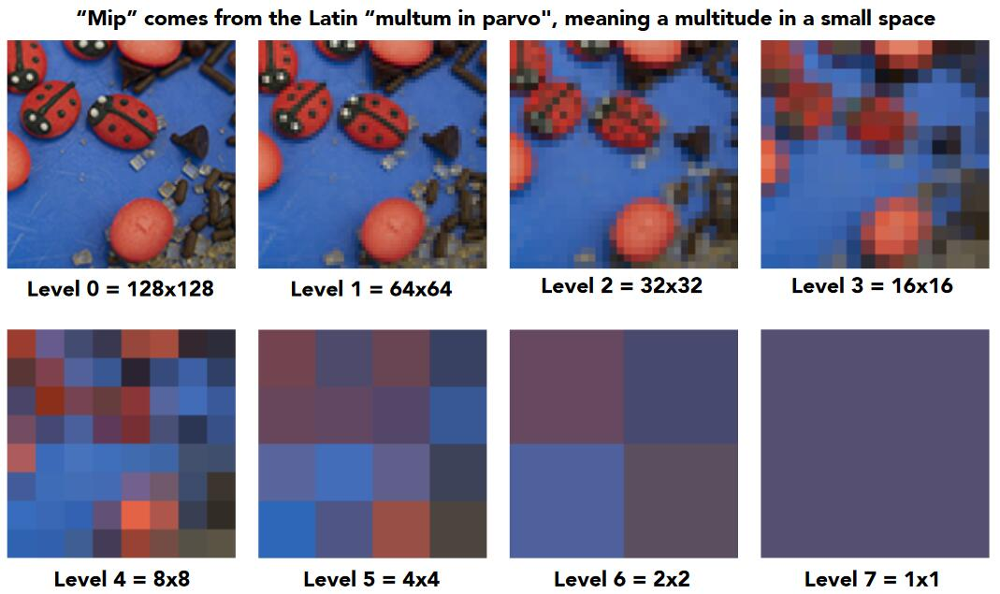
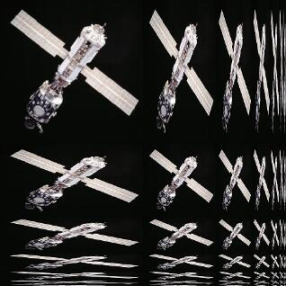

# 纹理映射 

Texture Mapping 

[55：59]

\\[
L_d=k_d\left( I/r^2 \right) \left( n\cdot l \right) 
\\]

- \\(k_d\\) 不同点的颜色不同 
- \\(\left( I/r^2 \right) \left( n\cdot l \right) \\) 小球上所有点处于相同的一光照环境下

object在不同处的点需要定义不同的属性

上面例子中的\\(k_d\\)是其中一种属性

## 表面

3D物体的表面是2D的

纹理：一张有弹性、可拉伸的2D图

纹理映射：把2D图贴在的物体表面的过程

假设映射关系是已知的

纹理坐标用（u，v）表示， 范围[0，1]

映射关系只包含三角形顶点对应的(u，v)，三角形内部点的(u，v)通过插值得到

# 三角形内插值

## Background

为什么需要计算三角形内插值？

答：很多特殊值的计算都是只计算顶点，而内部点的值通过插值得到平滑的结果。

插值可以用于哪些数据？

答：纹理坐标、颜色、法向量等

## 重心坐标 

Barycentric Coordinates

**三角形的 \\(\left( \alpha , \beta , \gamma \right) \\) 坐标系统**

假设三角形的三个顶点分别是 A、B、C，则三角形所在平面上的任意一点可描述为A、B、C的线性组合，即：

\\[
\left( x,y \right) =\alpha A+\beta B+\gamma C
\\]

三角形内部的点需要满足：\\(\alpha +\beta +\gamma =1\\)   \\(\alpha \geqslant 0, \beta \geqslant 0,\gamma \geqslant 0\\)

\\(\left( \alpha , \beta , \gamma \right)\\) 称为在三角形平面上的任意一点在三角形重心坐标系下的表示，简称为重心坐标。

在此定义下，可得出：

\\[
A=\left( 1,0,0 \right) \,\,  B=\left( 0,1,0 \right) \,\, C=\left( 0,0,1 \right) 
\\]

重心 = \\(\left( \frac{1}{3},\frac{1}{3},\frac{1}{3} \right) \\)

任意点(x,y)的重心坐标公式：

\\[
\alpha =\frac{-\left( x-x_B \right) \left( y_C-y_B \right) +\left( y-y_B \right) \left( x_C-x_B \right)}{-\left( x_A-x_B \right) \left( y_C-y_B \right) +\left( y_A-y_B \right) \left( x_C-x_B \right)}
\\]

\\[
\beta =\frac{-\left( x-x_C \right) \left( y_A-y_C \right) +\left( y-y_C \right) \left( x_A-x_C \right)}{-\left( x_B-x_C \right) \left( y_A-y_C \right) +\left( y_B-y_C \right) \left( x_A-x_C \right)}
\\]

\\[
\gamma =1-\alpha -\beta
\\]

> **&#x1F4CC;** 重心坐标不是指某个点的坐标，而是根据三角形顶点定义的一套坐标系

## 利用重心坐标做插值

点P的重心坐标为\\(\left( \alpha , \beta , \gamma \right) \\)

那么，\\(V_P=\alpha V_A+\beta V_B+\gamma V_C\\)

优点：计算方便

局限性：空间三角形在平面上投影以后，同一个点在投影前后的重心坐标会改变，因此，插值所有的重心坐标必须是投影前的重心坐标

## 应用纹理

为屏幕上的点p=(x,y)设置颜色
1. 找出p在投影前的坐标p'=(x,y,z)
2. 计算p'的(u,v)
3. 从texture中取出(u,v)点的值
4. 设置p的值为(u,v)点的值

## 纹理放大 

Texture Magnification

**问题描述1**：Texture Map 是256X256的，而要投影的屏幕是4K的，会导致多个屏幕像素对应一个纹理像素。

效果：

解决方法：

### 双线性插值 

Bilinear Interpolation

1. 取对应格子的值
2. 取邻近四个纹理像素(a,b,c,d)再根据(u,v)在a,b,c,d中的位置插值出(u,v)处的值，即分别做一个横向插值和竖向插值

Linear interpolation(1D)：

\\[lerp\left( x,v_0,v_1 \right) =v_0+x\left( v_1-v_0 \right) \\]

Two helper lerps:

\\[u_0=lerp\left( s,u_{00},u_{10} \right) \\]

\\[u_1=lerp\left( s,u_{01},u_{11} \right) \\]

Final vertical lerp, to get result:

\\[f\left( x,y \right) =lerp\left( t,u_0,u_1 \right) \\]

效果：

### 双向三次插值

Bicubic

1. 取周围16个点
2. 三阶插值

效果：

**问题描述2**：纹理像素分辨率过大

效果：（近处路齿，远多摩尔纹）

原因：[37:00]

由于透视的原因，不同距离的屏幕像素对应的纹理像素区域不同

> **&#x1F4CC;** 有的像素对应一小部分纹理像素，有的像素对应较大区域的纹理像素
> 
> 

一个屏幕像素对应一片纹理像素，但只取一个纹理像素来代表这一片点，就会出问题。

**解决方法：**

1. MSAA，超采样，可解决，但costly。
2. 点查询-->范围查询。不采样。而是取一个范围的平均值。

### Mip map 

[44:20]

目的：范围查询

特点：快，不精确（近似），方形区域

1. 根据原始纹理，预处理出低分辨率的纹理，仅消耗额外1/3存储。
   
   [47:17]
   
   

2. 找出屏幕上的一个像素对应的纹理上的近似方形区域。
   
   [52:30]
   
   

3. 根据mipmap计算边长为L的纹理方形区域的均值。边长为L的方形区域，会在第\\(\log _2L\\)层变成一个像素。直接查在\\(\log _2L\\)层纹理上查(u,v)的值即可。

4. 效果：
   
   [56：20]
   
   

   不同颜色代表查询不同的层，但是，存在两层之间的边界，边界处可能存在突变

5. 改进：利用三线性插值得出例如1.8层的值，即层数也可以是连续的值。
   
   [57:52]
   
   把D层的插鱼结果与D + 1层的结果再做一次插值

6. 效果：
   
   [1：00：20]
   
   
   
   MipMap解决问题描述2的效果：
   
   

   远处变成一片灰色

   原因：mipmap只能计算方形区域

7. 改进：三线性插值-->各项异性过滤(Anisotropic littering)
   
   对原始纹理做不均匀压缩，这样，有形压缩区域对应原始的矩形区域。[103：35]
   
   
   
   屏幕的方形区域实际上是对应纹理空间的不规律形状，如果用正方形来代表这长条，会发生过渡blur。 [1：04：40]
   
   各项异性过滤能解决水平或竖直长方形的问题，不能解决倾斜长方形的问题。

8. 改进：Anisotropic Filting --> EWA Filtering
   [1:06:31] 
   
   

# 纹理应用

纹理，原义为贴图。

广义上，纹理=内存 + 范围查询（滤图）

## 环境光照

以一个点出发，向其四周都能看到光，把这些光记录下来，就是环境光照

用这个环境光照来渲染茶壶

1. 用纹理描述环境光
2. 用环境光渲染其他物体
   
假设环境光的光源无限远，只记录方向信息，不记录深度信息，且在记录光照信息时，不区分光照的种类。

### 应用例子2 

[12:35] Spherical 环境图：

把环境光存储在球面上（左）

并把它展开：

但存在扭曲问题。

### Cube Map

把光照信息存在立方体表面，球表面点和立方体表面点可以一一对应。

并展开：

## 凹凸贴图

用纹理定义某个点的相对高度，在object triangle mesh不变的条件下，得到视觉上的表面凹凸效果，即：用复杂纹理代替复杂几何

原理：高度-->法线-->着色或法线-->着色

### 法线贴图 
Bump Mapping

2D：

切线方向 (1,dp)

法线方向 (-dp, 1)

3D:

切线方向 (1, dp/du, dp/dv)

法线方向 (-dp/du, -dp/dv, 1)

先在p点定义局部坐标系，假原始方向向上，为(0,1)或(0,0,1)

在此局部坐标系中求切线方向和法线方向，求导后再切回实际坐标系。

### 位移贴图

凹凸贴图的局限性：

1. 边缘处会露馅
2. 缺少“自己阴影投影到自己身上”
   
**位移贴图**：

输入：原始mesh，高度贴图

输出：mesh的顶点被改变

代价：要求原始mesh的三角形足够细

改进：动态三角形细分

## 3D纹理

纹理不只有表面，内部也有值，即空间任意一点都有值。

纹理并非实际定义，而是通过noise生成（右）

## 用纹理记录之前算好的信息

好处：很多计算可以提前算好

## 3D纹理用手体积渲染

用于记录3D空间信息

------------------------------

> 本文出自CaterpillarStudyGroup，转载请注明出处。
>
> https://caterpillarstudygroup.github.io/GAMES101_pages/