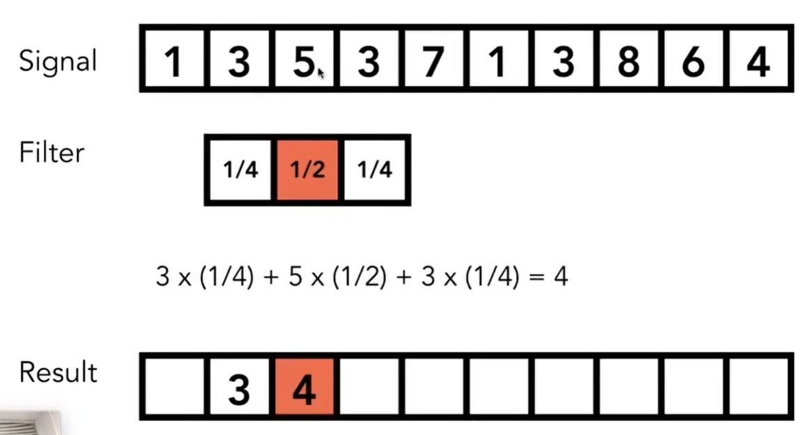
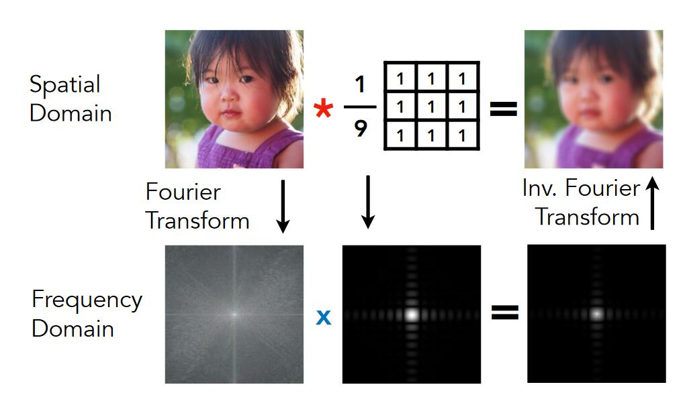
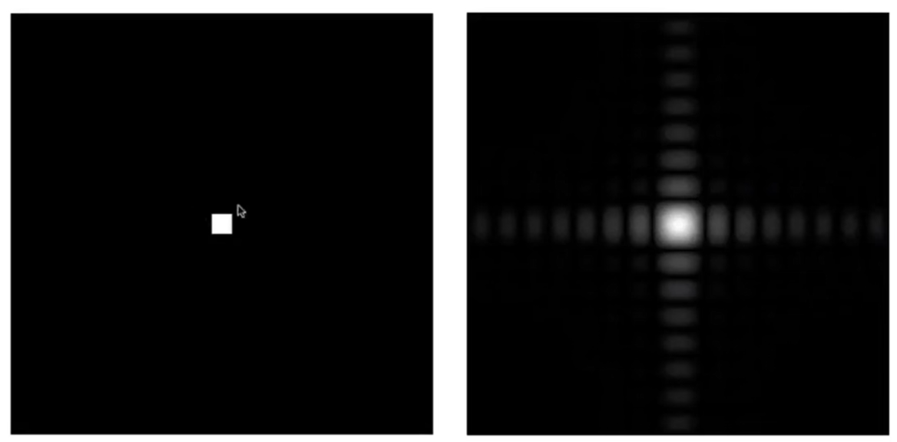
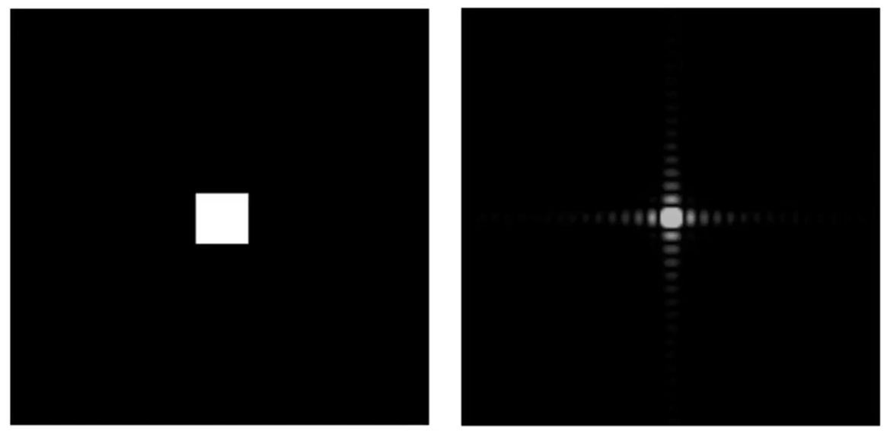
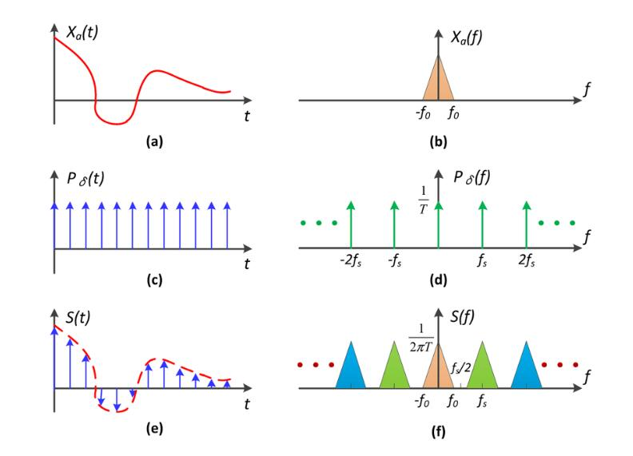
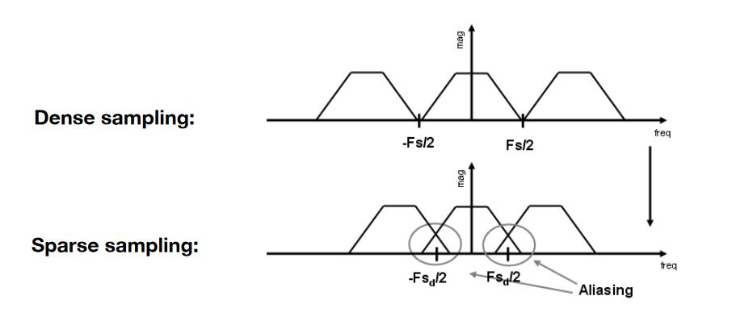

# 滤波 VS 卷积 VS 平均

## 卷积 VS 平均

结论1： **卷积可以看作是个局部区域的加权平均， 卷积kernel即局部加权**  

## 卷积 VS 滤波

> &#x1F50E; 卷积定理：  
> 时域卷积 = 频域乘积  
> 时域乘积 = 频域卷积

图像的卷积操作是从信号的卷积运算中借鉴过来的概念。虽然不完全相同，其本质是一样的。  
图像的卷积操作可以看作中对图像的时域信息做卷积运算，时域信息的卷积运算又可以转化为频域上的乘积运算。前面所讲的滤波操作实际上就是用频域上的乘积运算来实现的。因此图像的时域卷积操作与频域滤波操作本质上是一致的。

例子一：以低通滤波为例

  

例子二：

结论2：**时域卷积 = 频域滤波， 卷积kernel = 频域filter**

## 结论

时域卷积 = 频域滤波 = 局部加权平均

卷积kernel = 频域filter = 局部加权

# 采样 VS 频域卷积

## 例子

  

解释：  

a：时域信号   

b：a对应的频域信号   

c：对a进行采样的周期采样函数  

d：采样函数的频域表示  

e：对a进行采样的结果，即a与c乘积的结果  

f：采样结果的频域表示。由于时域乘积=频域卷积，这也中b与d卷积的结果

## 分析

采样是通过时域上的乘积操作实现的。

时域乘积 = 频域卷积

\\[
f_1\left( x \right) \times f_2\left( x \right) \Longleftrightarrow F_1\left( \omega \right) \otimes F_2\left( \omega \right) 
\\]

> &#x1F4A1; \\(f_1\left( x \right)\\) 是信号（a）， \\(f_2\left( x \right)\\)是采样信号（c）， \\(F_1\left( \omega \right)\\) 是a的频谱（b）  \\(F_2\left( \omega \right)\\) 是采样信号的频谱（d）0

结论：**采样就是把原信号的频谱以特定周期呈现。**

采样周期长 \\(\Longrightarrow \\)

\\(\Longrightarrow \\) \\(F_2\left( \omega \right)\\) 的频谱间隔小

\\(\Longrightarrow \\) (b)以更密的形式重复

\\(\Longrightarrow \\) (f)的频谱出现混叠[55:59]

\\(\Longrightarrow \\) 时域上表现为走样

----------------------------

> 本文出自CaterpillarStudyGroup，转载请注明出处。  
> https://caterpillarstudygroup.github.io/GAMES101_mdbook/
