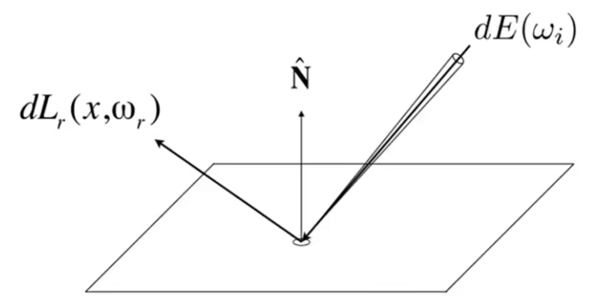

# BRDF, 双向反射分布函数【29：00】

Bidirectional Reflected Distribution Function

输入：一个入射光线的角度和能量  
输出：各个反射光线的能量分布，包含镜面反射和漫反射

## 反射

反射可以理解为从某个入射角度\\(\omega\\)打到指定区域的能量radiance。  
这些radiance被区域吸收，并从这个区域向各个方向辐射。  

> &#x2705; 从吸收的视角来理解是radiance，从辐射的视角来理解是irradiance，但是所承载的能量大小是相同的。
  
BRDF则描述了这些irradiance会如何分配到各个立体角上去，即向某个方向辐射的radiance。  
BRDF用比例的方式来描述这种分配关系。提供某个立体角上的radiance占的irradiance的多少。  

以上图为例：  
从\\(\omega_i\\)向指定区域辐射到的能量，也可以说是指定区域从\\(\omega_i\\)方向吸收到的能量，为：

$$
dE(\omega_i) = L(\omega_i)\cos\theta_i d\omega_i
$$

这些吸收到的能量又从这个区域被辐射出去，向\\(\omega_r\\)方向辐射的能量为：  

$$
dL_r(\omega_r)
$$

BRDF为“从某个角度辐射的能量”与“向所有角度辐射的总能量”的比例：  

[36:16]

$$
f_r(w_i->w_r) = \frac{dL_r(w_r)}{dE_i(w_i)} = \frac{dL_r(w_r)}{L_i(w_r)\cos\theta_idw_i}
$$

其中分子表示unit area向wr辐射的能量，分母表示unit area从wi接收到的能量

\\[
L_r(p,w_r) = \int_{H_2}f_r(p, w_1->w_2)Li(p, w_i)\cos\theta_idw_i
\\]

其中：   
fr：把radiance分给某个出射角  
Li：radiance  
dwi：每个入射角wi对同一出射方向wr的贡献的累积

任何的出射的 radiance 都会变成其它的入射的 radiance，即公式中的 Li(p, wi)不一定来自光源

# 渲染方程

Lo(p, wo) = 自己发光 + 来自其它的反射或直射光。  
定义的积分域为上半球，即不考虑折射。

- 理解1：1个入射光线。[47:44]
- 理解2：多个八入射光线 [47：57]
- 理解3：1个面光源 [48：30]
- 理解4：考虑其它物体的反射光作为入射光线[49:31]
这里涉及到递归，简化公式得：  

\\[
I(u) = e(u) + \intI(v)k(u,v)dw
\\]

其中：  
I(u)：未知量  
e(u)：自己发的光  
I(v)：未知量  
k(u,v)dw：材料属性

进一步简化得:

L = E + K L 

解得:

\\[
L = E + KE + K^2E + k^3E + \dots
\\]

其中：  
前2项为光栅化信息  
除第一项以外都是全局光照  
1次项KE为直接光照  
后面项为间接光照  

------------------------------

> 本文出自CaterpillarStudyGroup，转载请注明出处。  
> https://caterpillarstudygroup.github.io/GAMES101_mdbook/