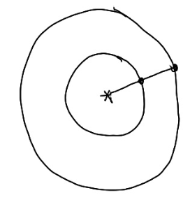
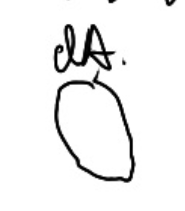

Basic radio meting 辐射度量学

# 定义

这是一种基于物理的方法。首先对光的单位和属性做一些定义

|定义|说明|符号|单位|关系|
|---|---|---|---|---|
|Radiant Energy|能量| Q| J||
|Radiant Flux|power，即单位时间的能量[1：09：56]|\\(\phi\\)|W|\\(\phi = \frac{dQ}{dt}\\)|
|Radiant Intensity|power per unit solid angle，即单位时间单位面积上的能量|I|\\([\frac{W}{Sr}]\\)|\\(I(w) = \frac{d(\phi)}{dw}\\)，其中分子代码power，分母代表per unit solid angle|
|Irradiance|power per unit area|E|\\([\frac{W}{m^2}]\\)|\\(E(x) = \frac{d(\phi(x))}{dA}\\)，其中A代表光线垂直接触的面积|
|Radiance [19:30]|power per unit solid angle per unit area|L|\\([\frac{W}{Srm^2}]\\)|\\(L(p, w) = \frac{d^2(\phi(p, w))}{dwdA\cos\theta}\\)|

- 补充1：立体角

立体角：[1：13：19下]

2D：\\(\theta = \frac{l}{r}, \in [0, 2\pi]\\)
3D：\\(\omega = \frac{A}{r^2}, \in [0, 4\pi]\\)

单位立体角：[1:17:43]，表示空间中一个方向，符号为：\\(\theta\\)或\\(\phi\\)

unit solid angle = \\(\sin \theta d \theta d \phi\\)

- 补充2：单位面积上的Irradiance

单位面积上的Irradiance为：\\(E = \frac{\phi}{4\pi r^2}\\)
当 r 变大.不是 Intensity 在衰减，而是 Irradiant 在衰减

- 理解1： Irradiance per 立体角

这是一个unit Area.
它辐射的总能量为 Irradiance
它向方向 W 辐射的能量强度为 Radiance

- 理解2：

沿着 w 方向到达dA的能量为 Radiance
所有方向到达dA的能量的总和为 Irradiance

------------------------------

> 本文出自CaterpillarStudyGroup，转载请注明出处。
>
> https://caterpillarstudygroup.github.io/GAMES101_mdbook/