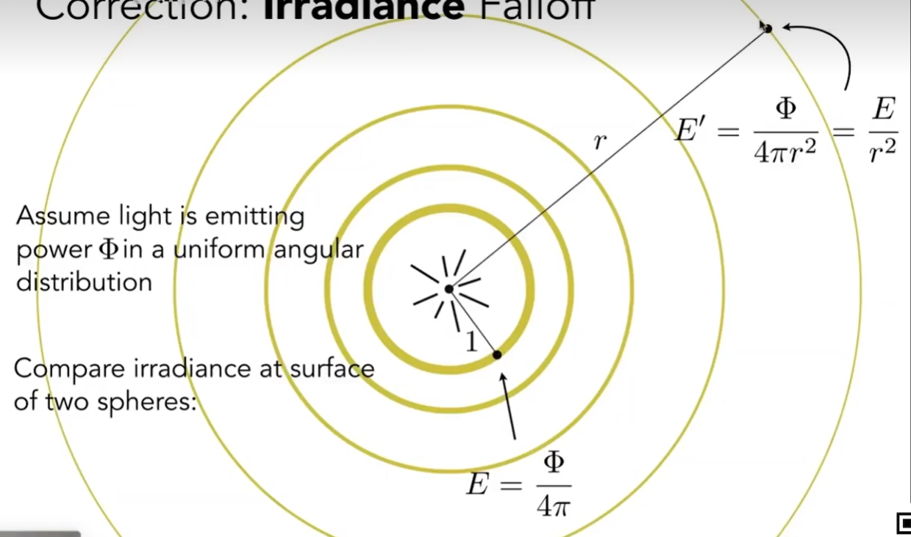

Basic Radiometry 辐射度量学，是对光的物理性质精准建模的方法。因此能够得到更真实的效果。  

1. 定义了一系列方法和单位
2. 给光定义了各种空间中的属性
3. 基于几何光学，认为光沿直接传播，无波动性

# 定义

**这是一种基于物理的方法。首先对光的单位和属性做一些定义**

|定义|说明|符号|单位|关系|
|---|---|---|---|---|
|Radiant Energy[1:04:29]|能量，光源辐射出来的是Energy| Q| J||
|Radiant Flux|power，即单位时间的能量[1：09：56]|\\(\Phi\\)|Watt或lumen|\\(\Phi = \frac{dQ}{dt}\\)|
|Radiant Intensity|power per unit solid angle，即单位时间单位面积上的能量|I|\\([\frac{W}{Sr}]\\)|\\(I(\omega) = \frac{d(\Phi)}{d\omega}\\)，其中分子代码power，分母代表per unit solid angle|
|Irradiance|power per unit area|E|\\([\frac{W}{m^2}]\\)|\\(E(x) = \frac{d(\Phi(x))}{dA}\\)，其中A代表光线垂直接触的面积|
|Radiance [19:30]|power per unit solid angle per unit area|L|\\([\frac{W}{Srm^2}]\\)|\\(L(p, \omega) = \frac{d^2(\Phi(p, \omega))}{d\omega dA\cos\theta}\\)|

# Radiant Intensity [1:09:20]

power per unit solid angle(立体角)，光源向外辐射能量时与方向有关的辐射概念。

$$
I(\omega) = \frac{d(\Phi)}{d\omega}
$$

## 立体角 [1：13：19]

通常使用弧度制来描述一个角。立体角是2D角度在3D空间中的延伸。用来描述空间中的一个角有多大。  

### 2D角

$$
\theta = \frac{l}{r}, \in [0, 2\pi]
$$

### 3D立体角

$$
\Omega = \frac{A}{r^2}, \in [0, 4\pi]
$$

### 单位立体角

即球面上的单位面积与除以半径平方。  

1. 通过\\(\theta\\)和\\(\phi\\)定义球面上的一个方向。  

> &#x2705; 假设朝右的是x轴，朝上的是y轴，朝前的是z轴。从图上看，应该是先**以y为轴把坐标系**（不是把y轴）顺时针转\\(\phi\\)，然后以z为轴把坐标系顺时针转\\(\theta\\)得到一个新的坐标系。所定义的朝向是新坐标系中的y轴正方向在原坐标系中的朝向。  

2. 计算这个方向上的单位面积

> &#x2753; 怎么就从这个方向得到了这个矩形？　

假设这个区域是个矩形，横边的长度是\\(r \sin \theta d\phi\\)，竖边的长度是\\(r d\theta\\)

> &#x2705; 这里反向利用了2D角度公式\\(\theta = \frac{l}{r}\\)  
> 竖边是以r为半径的2D圆，大小为\\(d\theta\\)的2D角对应的弧长。  
> 横边是以\\(r \sin \theta\\)为半径的2D圆，大小为\\(d\phi\\)的2D角对应的弧长。  

$$
dA = (r d\theta) (r \sin \theta d\phi) = r^2 \sin \theta d \theta d \phi
$$

3. 计算单位立体角

根据定义可知：

$$
d\omega = \frac{dA}{r^2} = \sin \theta d \theta d \phi
$$

> &#x2757; 后面内容将会用\\(\omega\\)来表示空间的一个方向。且\\(\omega\\)可通过\\(\theta\\)和\\(\phi\\)来定义。

## 再看Intensity

Intensity = Flux per unit solid angle，代表了光源在某个方向上的量度。

$$
I(\omega) = \frac{d(\Phi)}{d\omega}
$$

反过来说，Flux是Intensity在各个方向上的积分，因此

$$
\Phi = \int_{S^2} I d\omega = 4\pi I \\\\
I = \frac{\Phi}{4\pi}
$$

# Irradiance

 补充2：单位面积上的Irradiance

单位面积上的Irradiance为：\\(E = \frac{\phi}{4\pi r^2}\\)
当 r 变大.不是 Intensity 在衰减，而是 Irradiant 在衰减

- 理解1： Irradiance per 立体角

这是一个unit Area.
它辐射的总能量为 Irradiance
它向方向 W 辐射的能量强度为 Radiance

- 理解2：

沿着 w 方向到达dA的能量为 Radiance
所有方向到达dA的能量的总和为 Irradiance

------------------------------

> 本文出自CaterpillarStudyGroup，转载请注明出处。  
> https://caterpillarstudygroup.github.io/GAMES101_mdbook/