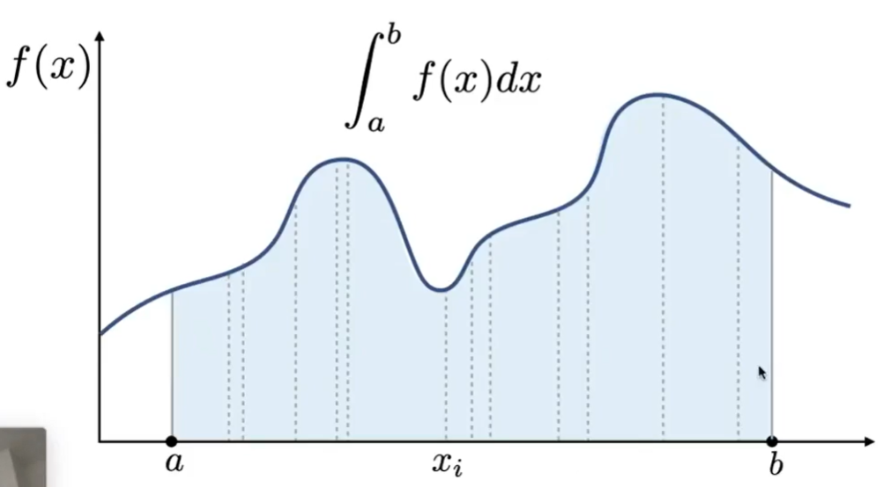

# 概率论基础 [1:05:45]

省略，见[机器学习数学基础](https://windmissing.github.io/mathematics_basic_for_ML/)

PDF：概率密度函数

# 复习渲染方程

复习渲染方程，回顾求积分的业务背景

$$
L_o(p, w_o) = L_e(p, w_o) + \int_{\Omega^+}L_i(p, w_i)f_r(p, w_i, w_o)(n\cdot w_i)dw_i
$$

其中：  
第一项：自己发的光  
Li：接收到的光  
fr：反射参数，与材料有关  
n*wi：夹角  
dwi：积累所有的方向

# 蒙特卡罗积分 Monto Carlo Integration

## 目标：求任意函数的定积分\\(\int_a^bf(x)dx\\)  

函数f(x)的在[a, b]区间内的定积分，其物理含义是图中阴影部分的面积。  

但是f(x)比较复杂，难以从公式推导上去求解这个问题。  

## 黎曼积分 [11:10]

没听懂，大概是用某种方法简单地把阴影近似成一个或一些长方形，把长方形的面积当作是阴影的面积，因此求得的是近似值。

## 蒙特卡罗积分

### 原理

用另一种方法来估计阴影部分的面积。所估计出的面积也是近似值。  

### 方法

1. 在积分域内不断地采样，采样点为xi
2. 采样点对应的value是f(xi)
3. 多次采样，并对采样结果的value取平均
4. 把阴影近似成一个长方形，长方形的宽为区域范围(b-a)，高为第3步的平均值

则：  
$$
\int_a^bf(x)dx \approx E(f(x))(b-a)
$$

当采样次数越来越多，f(xi)的平均值逐渐接近f(x)的期望。也因此长方形的面积也会逐渐接近阴影面积的真实值。  

### 进一步理解

前面所说在积分域内随机采样，通常会理解为是均匀采样。实际上，用任意的采样函数做随机采样都是可行的。  

例如使用概率密度函数：

$$
X_i \sim p(x)
$$

则：  

$$
\int_a^bf(x)dx = \frac{1}{N}\sum\frac{f(X_i)}{p(X_i)}
$$

### 特点

1. 只需要能对[a b]以一定方式采样，就可以求出定积分。**对f(x)和p(x)都没有特殊的要求。**  
2. 采样次数越多，结果越准确。  
3. 积分域和采样域必须相同。

------------------------------

> 本文出自CaterpillarStudyGroup，转载请注明出处。  
> https://caterpillarstudygroup.github.io/GAMES101_mdbook/