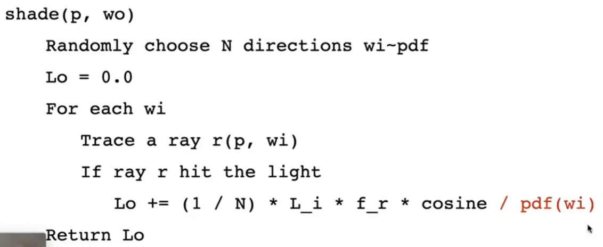
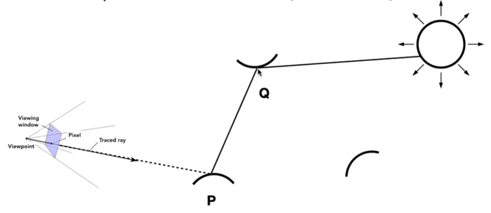
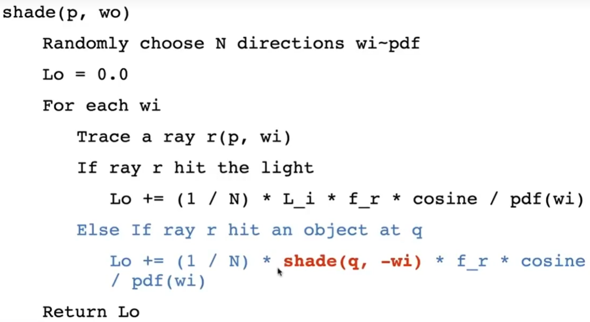
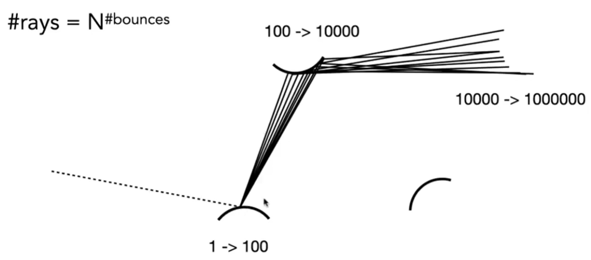
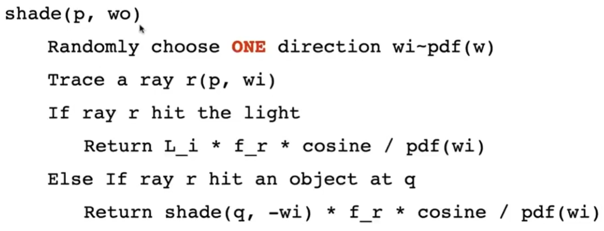
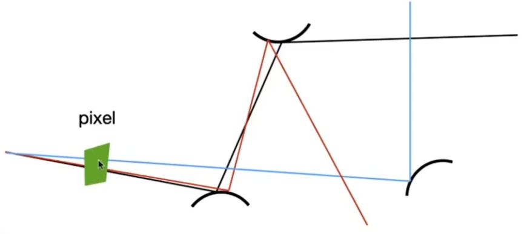
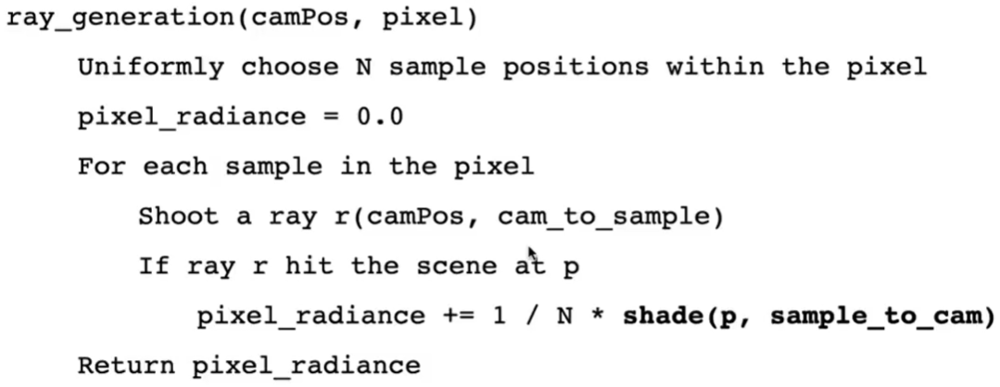
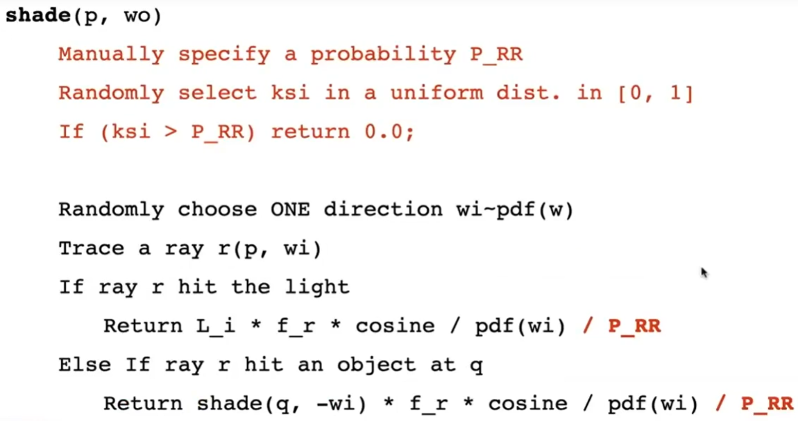

# PathTracing

渲染方程：

$$
L_o(p, w_o) = L_e(p, w_o) + \int_{\Omega^+}L_i(p, w_i)f_r(p, w_i, w_o)(n\cdot w_i)dw_i
$$

通过解渲染方程，可以得到正确的算法。

但它有以下两个难点：
1. 公式的第二项是一个定积分，比较难求，可以使用Monto Calio方法解出它的近似值。  
2. 这是一个递归公式。  

# 用 Monto Calio 方法解定积分

## 场景1[32：18]

先考虑一个简单场景：  

  

只考虑这一个着色点、只考虑直接光照、且被照射点不发光。  
有一个物体会遮住部分、有一个较大的面光源。  
入射光线为上半球所有Wi，且均匀分布。出射光线为 Wo。  
求这个点接收到并向wo辐射的能量。  

根据渲染方程，有：

$$
L_o(p, w_o) = \int_{\Omega^+}L_i(p, w_i)f_r(p, w_i, w_o)(n\cdot w_i)dw_i
$$

由于本场景假设**只考虑直接光照**，那么\\(L_i(p, w_i)\\)只来自于光源。  

用Monto Carlio解定积分，假设使用均匀采样，将公式代入以上公式，可**将连续问题转化为离散问题**，得到：  

||采样函数|积分函数|积分结果|
|---|---|---|---|
|理论上|\\(X_k \sim p(x)\\)|\\(f(X_k)\\)|\\(\frac{1}{N}\sum\frac{f(X_i)}{p(X_i)}\\)|
|实际上|\\(\frac{1}{2\pi}\\)|\\(L_i(p, w_i)f_r(p, w_i, w_o)(n\cdot w_i)\\) 均匀采样|\\(\frac{2\pi}{N}L_i(p, w_i)f_r(p, w_i, w_o)(n\cdot w_i)\\)|

其中wi来自采样

  

> &#x1F4A1; 连续问题往往比较难解。通过采样的方式把连续问题转化为离散问题，这样就只是需要考虑几个离散的点，就要好解得多。这是复杂问题简单化的一个思路。

## 场景2[40:40] 引入间接光照

  

P接收到的辐射不一定来自光源，也可以来自Q。  
P接收到的来自Q的辐射 = Q向P发出的辐射。  
对于P来说，辐射是来自直射光还是反射光，没有区别。  

  

$$
L_o(p, w_o) \approx \frac{1}{N} \sum \frac{func(w_i)}{1/2\pi}
$$

当wi来自光源时，

$$
fun = Li * Fr * cos
$$

当wi来自其它物体q时，

$$
fun = shade(q - wi) * fr * cos
$$

## 场景3：一根光线会向多个方向弹射

  

[46：48] 光线路径数\\(rays = N^{bouns}\\) 这个量级下计算量会爆炸

因此取 N = l （即 path tracing)，才不会发生爆炸。  

即：每次使用Monto Calio求定积分时，只做一次采样。  
  

虽然N取1会导致这个path在求定积分这一步引入较大的噪声。但是穿过像素的不止这一个path。[49：4] path足够多时，多个path的平均会缓解N=1带来的噪声。  

  

  

# 如何解递归问题

从公式或者从上面的伪代码都能看出，这是一个递归问题。  
递归本身不是问题。问题是这里的递归没有停止条件，会无限地递归下去。  

## 人为定义 bounce 的次数

人为定义 bounce 的次数，当光线bounce这么多次（或者说递归到这个深度）后就强行停止。  

这种方法能解决无限递归的问题，但会带来能量的损失。

## Russian Roulette 俄罗斯轮盘赌

即不明确定义次数，而是以一定概率p决定是否继续 bounce。以此算出能量Lo。    
最后使用Lo/p该点输出的能量。  
这个结果的期望与无限 bounce 的理论结果相同，因为：  
E = P * (Lo/ P) + (1-P) * 0 = Lo

  

**到目前为止，已经得到一个正常的path tracing流程了。**

------------------------------

> 本文出自CaterpillarStudyGroup，转载请注明出处。  
> https://caterpillarstudygroup.github.io/GAMES101_mdbook/