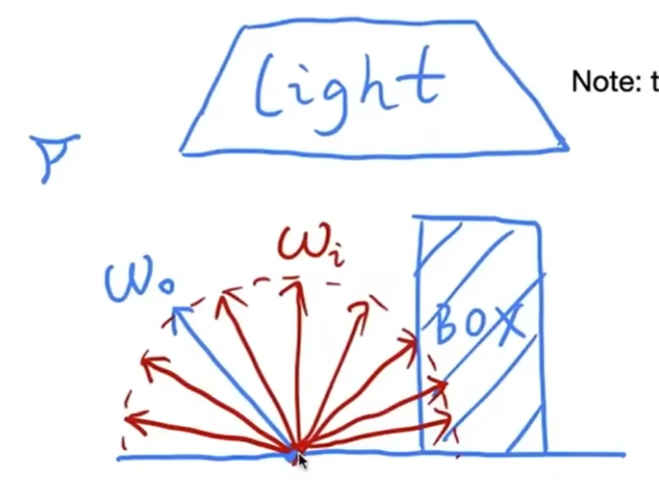

# PathTracing

渲染方程：

$$
L_o(p, w_o) = L_e(p, w_o) + \int_{\Omega^+}L_i(p, w_i)f_r(p, w_i, w_o)(n\cdot w_i)dw_i
$$

通过解渲染方程，可以得到正确的算法。

但它有以下两个难点：
1. 公式的第二项是一个定积分，比较难求，可以使用Monto Calio方法解出它的近似值。  
2. 这是一个递归公式。  

# 用 Monto Calio 方法解定积分

## 场景1[32：18]

先考虑一个简单场景：  

  

只考虑这一个着色点、只考虑直接光照、且被照射点不发光。  
有一个物体会遮住部分分、有一个较大的面光源。  
入射光线为上半球所有Wi，且均匀分布。出射光线为 Wo。  
求这个点接收到并向wo辐射的能量。  

根据渲染方程，有：

$$
L_o(p, w_o) = \int_{\Omega^+}L_i(p, w_i)f_r(p, w_i, w_o)(n\cdot w_i)dw_i
$$

由于本场景假设**只考虑直接光照**，那么\\(L_i(p, w_i)\\)只来自于光源。  

用Monto Carlio解定积分，假设使用均匀采样，将公式代入以上公式，可**将连续问题转化为离散问题**，得到：  

||采样函数|积分函数|积分结果|
|---|---|---|---|
|理论上|\\(X_k \sim p(x)\\)|\\(f(X_k)\\)|
\\[
L_o(p, w_o) \approx \frac{1}{N} \sum \frac{L_i(p, w_i)f_r(p, w_i, w_o)(n\dot w_i)dw_i}{1/2\pi}
\\]

其中wi来自采样

> &#x1F4A1; 连续问题往往比较难解。通过采样的方式把连续问题转化为离散问题，这样就只是需要考虑几个离散的点，就要好解得多。这是复杂问题简单化的一个思路。

### 场景2[42:41]

\\[
L_o(p, w_o) \approx \frac{1}{N} \sum \frac{func(w_i)}{1/2\pi}
\\]

当wi来自光源时，

\\[
fun = Li * Fr * cos
\\]

当wi来自其它物体q时，

\\[
fun = shade(q - wi) * fr * cos
\\]

[46：48] 光线路径数rays = \\(N^{#bouns}\\) 这个量级下计算量会爆炸

因此取 N = l （即 path tracing)

[49：4] path足够多，会缓解N=1带来的噪声

## ray generation [51:17]

1. 在一个像素内采样N个sample
2. sample shoot a rag
3. 如果 ray 碰中物体 p，则pixel-radiance += 1/N * shade (p, sample)
4. return pixel_radiance
 
## 如何解递归问题

人为定义 bounce 的次数，后面的cut掉，这会带来能量损失。
解决方案： Russian Roulette 俄罗斯轮盘赌
即不明确定义次数，而是以一定概率决定是否继续 bounce，最后得到的结果除以p.
其期望结果与无限 bounce 的理论结果相同
E = P * (Lo/ P) + (1-P) * 0 = Lo

## Path Tracing 的性能与效率[1:00:32]

### 分析[1：02：12]

当光源大时，N=1随机采样比较容易遇到光源
当光源小时，大多数次随机采样被“浪费”了。

解决方法：上半球均匀采样->只在光源上采样，
> 如果我来做会指使高斯分布来采样.可以控制重点

采样区域的位置和大小
在上半球积分->在光源上积分

\\[
dw = \frac{dA \cos\theta'}{||x'-x||^2}
\\]

立体角定义

## 总结 [1：11：26]

直接光照和间接光照分开处理
在光源上积分需要判断一个 sample 出的光线是否被挡住

## 其它

1. 点光源当成面积很小的光源处理
2. 怎样对一个函数均匀采样？
3. 均匀采样→重要性采样
4. 随机数质量对算法的影响
5. 把上半球采样与光源采样结合起来
6. pixel reconstruction filter
7. radiance → color, gamma 校正

------------------------------

> 本文出自CaterpillarStudyGroup，转载请注明出处。  
> https://caterpillarstudygroup.github.io/GAMES101_mdbook/