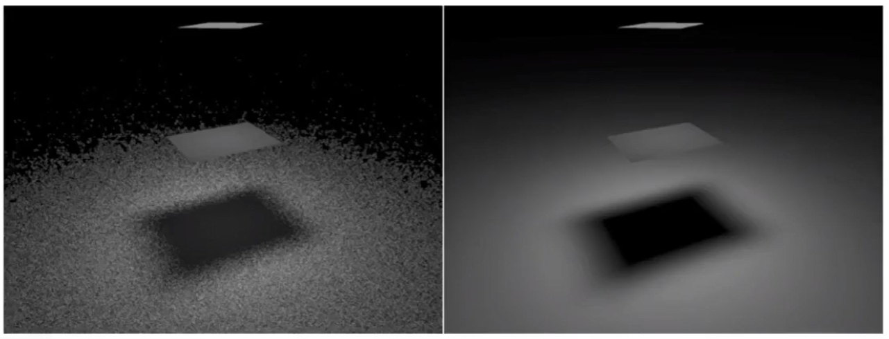
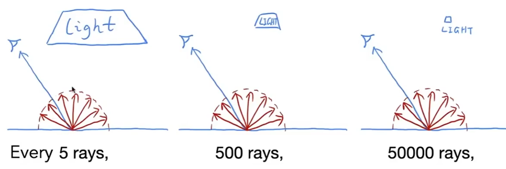
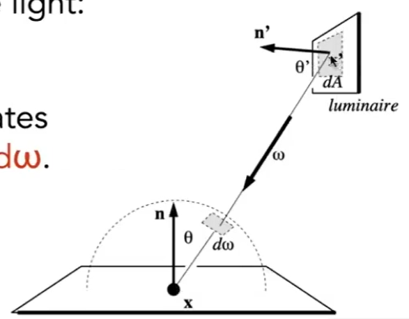
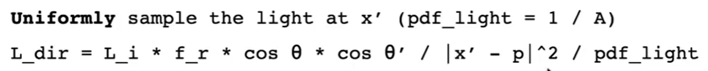
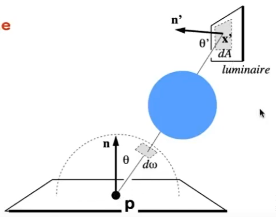
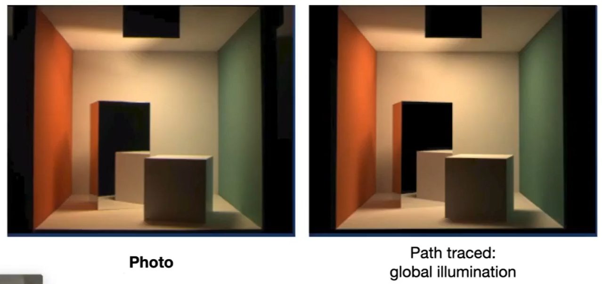

# Path Tracing 的性能与效率[1:00:32]

## 现象

  
> &#x1F446; 图中上面是光源，中间是遮挡物。左：Low SPP。右：High SPP。

SPP：sample per pixel。表示从一个像素出来的path数。SPP低，速度快，但noisy。SPP高，速度慢，但效果好。  

怎样才能在Low SPP情况下得到好的效果？

> &#x1F4A1; 具体问题具体分析。在什么情况下LOW SPP的影响会特别（不）严重。这些场景有什么特点？实验用来分析这种问题最有意义，而不是调参。  

## 分析[1：02：12]

  

由于是从着色点均匀地向外随机采样，  
当光源大时，随机采样更容易遇到光源。
当光源小时，随机采样可能要采很多次才会遇到光源。而其它大多数采样次数都被“浪费”了。

## 解决方法

解决方法：上半球均匀采样->只在光源上采样

由于MontoCalio方法不限制采样的PDF，可以定义更合理的PDF使得采样结果不浪费。那就是**只在光源上采样**。  

> &#x1F4A1; 如果我来做会指使高斯分布来采样.可以控制重点

  

右上角是光源。光源面积是A。那么在光源上采样的PDF是
：  

$$
p(x) = \frac{1}{A}
$$

但现在的**采样和积分不是针对同一个区间进行的**。采样域是光面的所有面积，积分域是x点的所有立体角。因此**通过光源位置与球面立体角的关系**，把采样域和积分域的统一。可以是（1）改PDF函数，把光源采样的PDF转化成在球面立体角采样的PDF。（2）改积分函数，把立体角上的积分转化成在光源上的积分。在视频算法中选择了后者。  

根据[立体角](BasicRadiometry.md)的定义可知：  

$$
d\omega = \frac{dA\cos\theta'}{||x'-x||^2}
$$

> &#x2753; 听上去逻辑很顺，总感觉有点怪。上面这个公式要求A的面积不能太大。如果是一个大的光源，是不是要分解成很多小的dA?  
> &#x2753; 为什么dA不能太大？

代入渲染方程可得：  

$$
L_o(x, w_o) = \int_AL_i(x, w_i)f_r(x, w_i, w_o)\frac{\cos\theta\cos\theta'}{||x'-x||^2}dA
$$

## 总结 [1：11：26]

以上优化是针对光源来做的，因此**只用于直接光照**。  

> &#x2705; 因为反射的光线可能来自任何地方，不可能对来源做枚举。  

因此这个优化算法是，直接光照和间接光照分开处理：
- 直接光照在光源上积分，间接光照仍旧在立体角上积分。  
- 直接光照不需要考虑“[Russian Roulette](PathTracing.md)”，间接光照涉及多次弹射才需要。  
在光源上积分需要判断一个 sample 出的光线是否被挡住

# 光源被挡住

  

遍历所有光源，并计算光源对x点的贡献，这里没有考虑光源被挡住的场景。  

  

解决方法：

判断xx'的连线上是否有其它物体。 

# 效果

**照片级真实感**

  

# 其它

1. 点光源当成面积很小的光源处理
2. 怎样基于一个pdf做采样？
3. 怎么选择好的pdf?均匀采样→重要性采样
4. 随机数质量对算法的影响
5. 把上半球采样与光源采样结合起来
6. pixel reconstruction filter
7. radiance → color, gamma 校正

------------------------------

> 本文出自CaterpillarStudyGroup，转载请注明出处。  
> https://caterpillarstudygroup.github.io/GAMES101_mdbook/